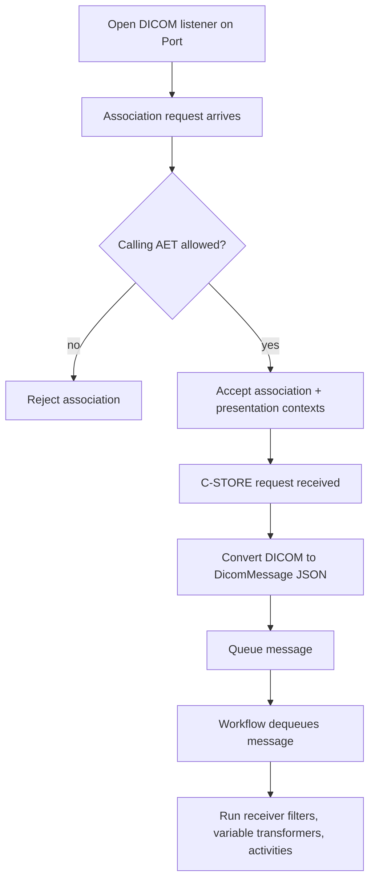

**DICOM Receiver (DicomReceiverSetting)**

## What this setting controls

`DicomReceiverSetting` defines a DICOM C-STORE listener that accepts inbound associations on a TCP port, validates calling AETs, converts each received DICOM payload into an Integration Soup message, and runs the workflow.

## Scope

This setting combines:

- DICOM listener binding (`Port`)
- calling AET allow-list control (`AcceptedCallingAETs`)
- DICOM payload JSON shaping (`MessageTypeOptions` via DICOM options)
- workflow chaining (`Filters`, `VariableTransformers`, `Activities`)

Only serialized workflow JSON fields are covered.

## Shared reference

For canonical enum numeric mappings used across workflow JSON, see [Workflow Enum and Interface Reference](../reference/workflow-enums-and-interfaces.md).

For shared message-type-option objects, see [MessageTypeOptions JSON Reference](../reference/message-type-options.md).

For Integrations code API interface contracts used by custom code, see [IMessage in Integration Soup](../api/imessage.md).

## Operational model



Important non-obvious points:

- The receiver validates calling AET only; called AET (`OurAET`) is currently not enforced in listener acceptance logic.
- DICOM inbound payloads are queued and processed asynchronously by workflow loop polling.
- This receiver is request-ingest only; it does not use receiver response fields from `IReceiverWithResponseSetting`.

## JSON shape

Typical object shape:

```json
{
  "$type": "HL7Soup.Functions.Settings.Receivers.DicomReceiverSetting, HL7SoupWorkflow",
  "Id": "8aa8e861-64c5-4d9b-a8cc-c0cb87a8a2f7",
  "Name": "DICOM Inbound",
  "WorkflowPatternName": "DICOM Inbound",
  "Disabled": false,
  "Port": 104,
  "OurAET": "HL7SOUP_SCP",
  "AcceptedCallingAETs": "MODALITY01,MODALITY02,*",
  "AssociationTimeoutSeconds": 30,
  "MessageType": 11,
  "MessageTypeOptions": {
    "$type": "HL7Soup.Workflow.MessageTypeOptions.DicomMessageTypeOptions, HL7SoupWorkflow",
    "IncludeCommonFieldsNode": true,
    "IncludeReportNode": true,
    "IncludeTagsNode": true
  },
  "ReceivedMessageTemplate": "{ \"PatientID\": \"12345\" }",
  "Filters": "00000000-0000-0000-0000-000000000000",
  "VariableTransformers": "00000000-0000-0000-0000-000000000000",
  "Transformers": "00000000-0000-0000-0000-000000000000",
  "Activities": [
    "11111111-1111-1111-1111-111111111111"
  ],
  "AddIncomingMessageToCurrentTab": true
}
```

## Listener identity and access fields

### `Port`

TCP listener port for inbound DICOM associations.

Runtime behavior:

- Listener startup fails if port is already in use.
- Startup failure prevents receiver activation.

### `AcceptedCallingAETs`

Comma-separated allow-list for association `CallingAE`.

Behavior:

- `*` allows any calling AET.
- Otherwise each token is compared case-insensitively after trimming whitespace.

Examples:

- `"*"`
- `"MODALITY01, MODALITY02"`

### `OurAET`

Serialized local AE title field.

Important non-obvious outcome:

- In current runtime association acceptance path, this value is not used to enforce called-AET matching.
- Keep it accurate for operator clarity and interoperability documentation, but do not rely on it alone for association filtering.

### `AssociationTimeoutSeconds`

Serialized timeout field for association setup.

Important non-obvious outcome:

- In current receiver implementation, this value is not actively applied to server startup or association negotiation timeout behavior.

## Message fields

### `MessageType`

Inherited message type field (default `11` = `JSON`).

Important non-obvious outcome:

- Runtime ingestion path already constructs a `DicomMessage` from inbound DICOM, regardless of this inherited field.
- Keep `MessageType` aligned with JSON expectations for downstream bindings and readability, but inbound conversion is DICOM-driven.

### `MessageTypeOptions`

Polymorphic options object used for DICOM-to-JSON shaping:

```json
{
  "$type": "HL7Soup.Workflow.MessageTypeOptions.DicomMessageTypeOptions, HL7SoupWorkflow",
  "IncludeCommonFieldsNode": true,
  "IncludeReportNode": true,
  "IncludeTagsNode": true
}
```

Effect:

- Controls which sections are included in generated DICOM JSON.

### `ReceivedMessageTemplate`

Design-time sample payload for mapping/binding assistance.

This is not the source of inbound DICOM runtime content.

## Workflow linkage fields

### `Activities`

Ordered downstream activity IDs.

### `Filters`

Receiver filter setting ID.

### `VariableTransformers`

Receiver variable-transformer setting ID.

### `Transformers`

Receiver transformer setting ID.

### `AddIncomingMessageToCurrentTab`

UI/log visibility behavior in desktop context.

### `Disabled`

If `true`, receiver is disabled.

### `WorkflowPatternName`

Workflow display/pattern name.

### `Id`

Receiver setting GUID.

### `Name`

Display name.

## Defaults for a new `DicomReceiverSetting`

Important defaults from code:

- `Port = 104`
- `OurAET = "HL7SOUP_SCP"`
- `AcceptedCallingAETs = "*"`
- `MessageType = 11` (`JSON`)
- `AssociationTimeoutSeconds = 30`

## Recommended authoring patterns

### Open lab intake endpoint

Use:

- `AcceptedCallingAETs = "*"`
- Explicit downstream filters/transformers to enforce business routing

### Controlled modality allow-list

Use:

- `AcceptedCallingAETs = "MOD1,MOD2,MOD3"`

### JSON-shape minimization

Use DICOM options to include only the required nodes, reducing payload size for downstream JSON processing.

## Pitfalls and hidden outcomes

- `OurAET` is serialized but not currently enforced in association acceptance logic.
- `AssociationTimeoutSeconds` is serialized but not currently enforced in receiver runtime flow.
- `AcceptedCallingAETs` validation is exact token match (after trim, case-insensitive); typos silently reject senders.
- If `AcceptedCallingAETs` is empty or malformed, all non-`*` associations can be rejected.
- Inbound conversion path is DICOM-based; inherited `MessageType` does not redefine how C-STORE payloads are captured.

## Examples

### Any-caller intake

```json
{
  "$type": "HL7Soup.Functions.Settings.Receivers.DicomReceiverSetting, HL7SoupWorkflow",
  "Id": "aaaaaaaa-aaaa-aaaa-aaaa-aaaaaaaaaaaa",
  "Name": "DICOM Any Caller",
  "Port": 104,
  "OurAET": "HL7SOUP_SCP",
  "AcceptedCallingAETs": "*",
  "MessageType": 11,
  "Activities": []
}
```

### Restricted-caller intake with reduced JSON nodes

```json
{
  "$type": "HL7Soup.Functions.Settings.Receivers.DicomReceiverSetting, HL7SoupWorkflow",
  "Id": "bbbbbbbb-bbbb-bbbb-bbbb-bbbbbbbbbbbb",
  "Name": "Restricted DICOM",
  "Port": 4104,
  "OurAET": "RAD_SCP",
  "AcceptedCallingAETs": "MODALITY01,MODALITY02",
  "MessageTypeOptions": {
    "$type": "HL7Soup.Workflow.MessageTypeOptions.DicomMessageTypeOptions, HL7SoupWorkflow",
    "IncludeCommonFieldsNode": true,
    "IncludeReportNode": false,
    "IncludeTagsNode": true
  },
  "Activities": []
}
```
