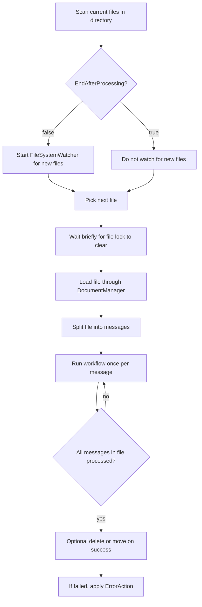

**Directory Scan Receiver (DirectoryScanReceiverSetting)**

## What this setting controls

`DirectoryScanReceiverSetting` defines a file-based receiver that scans a directory, loads matching files, splits each file into one or more inbound messages according to the configured message type, runs the workflow for each message, and optionally deletes or moves the source file after successful processing.

This document focuses on the serialized workflow JSON contract and the runtime effects of those fields.

## Scope

This setting combines:

- directory polling/watching
- file filtering
- message splitting rules for file contents
- post-processing of the source file
- error handling for failed file processing

Only serialized workflow JSON fields are covered.

## Shared reference

For canonical enum numeric mappings used across workflow JSON, see [Workflow Enum and Interface Reference](../reference/workflow-enums-and-interfaces.md).

For Integrations code API interface contracts used by custom code, see [IMessage in Integration Soup](../api/imessage.md).

## Operational model



Important non-obvious points:

- Files are scanned only in the top-level directory, not recursively.
- One source file can produce many workflow instances/messages.
- `DirectoryScannerFileName` is always available as a system variable for the currently processed file.
- `EndAfterProcessing`, not `SearchForNewFiles`, is what actually controls whether the runtime keeps watching for new files.

## JSON shape

Typical object shape:

```json
{
  "$type": "HL7Soup.Functions.Settings.Receivers.DirectoryScanReceiverSetting, HL7SoupWorkflow",
  "Id": "9a59a2ac-5dbf-444f-8f55-f884c2d73c53",
  "Name": "Inbound Directory",
  "WorkflowPatternName": "Inbound Directory",
  "Disabled": false,
  "DirectoryPath": "c:\\Temp\\Inbound",
  "DirectoryFilter": "*.hl7",
  "EndAfterProcessing": false,
  "SearchForNewFiles": true,
  "DeleteFileOnComplete": false,
  "MoveIntoDirectoryOnComplete": true,
  "DirectoryToMoveInto": "c:\\Temp\\Processed\\${Today:yyyyMMdd}",
  "ErrorAction": 2,
  "DirectoryToMoveIntoOnError": "c:\\Temp\\Error",
  "LineSeperator": 0,
  "MessageType": 1,
  "MessageTypeOptions": null,
  "ReceivedMessageTemplate": "MSH|^~\\&|SRC|FAC|DST|FAC|${ReceivedDate}||ADT^A01|1|P|2.5.1\rPID|1||12345^^^MRN",
  "Filters": "00000000-0000-0000-0000-000000000000",
  "VariableTransformers": "00000000-0000-0000-0000-000000000000",
  "Transformers": "00000000-0000-0000-0000-000000000000",
  "Activities": [
    "11111111-1111-1111-1111-111111111111"
  ],
  "AddIncomingMessageToCurrentTab": true
}
```

## Directory fields

### `DirectoryPath`

Directory to scan for inbound files.

Behavior:

- Supports global-variable placeholders at runtime.
- Scans only `TopDirectoryOnly`.
- Must resolve to a directory visible to the process hosting the workflow.

Important outcome:

- In hosted deployments, a local directory warning in the desktop editor may be irrelevant if the actual directory exists on the hosting server.

### `DirectoryFilter`

File pattern used when scanning the directory.

Examples:

- `"*.hl7"`
- `"*.txt"`
- `"*.csv"`

Behavior:

- Supports global-variable placeholders at runtime.
- If saved from the UI as blank, it is normalized to `"*.*"`.

## Scan lifecycle fields

### `EndAfterProcessing`

Controls whether the receiver stops after the current matching files are processed.

Behavior:

- `true`: load current matching files, process them, then finish
- `false`: remain active and continue watching for new files

This is the runtime switch that matters.

### `SearchForNewFiles`

Serialized UI intent for whether the receiver should keep watching for new files.

Important non-obvious outcome:

- The current runtime does not branch on this field directly.
- The runtime branches on `EndAfterProcessing`.
- In normal UI-authored JSON these two fields stay aligned, but manual JSON can make them contradictory.

Recommended rule:

- If `EndAfterProcessing = true`, also set `SearchForNewFiles = false`
- If `EndAfterProcessing = false`, also set `SearchForNewFiles = true`

## Success post-processing fields

### `DeleteFileOnComplete`

Delete the source file after all messages in the file have been processed successfully.

### `MoveIntoDirectoryOnComplete`

Move the source file after successful processing.

### `DirectoryToMoveInto`

Destination directory used when `MoveIntoDirectoryOnComplete = true`.

Behavior:

- Evaluated through workflow variable processing after the file has been processed.
- The destination directory is created if needed.
- If a file with the same name already exists at the destination, the existing destination file is deleted first.

Important outcome:

- This path can depend on variables that are set during workflow execution.

### Important success-path constraint

Manual JSON must not set both:

- `DeleteFileOnComplete = true`
- `MoveIntoDirectoryOnComplete = true`

The UI prevents this combination, but the runtime does not. If both are true, the receiver deletes the file first and then attempts to move it, which causes a failure.

## Error handling fields

### `ErrorAction`

JSON enum values:

- `0` = `StopWorkflow`
- `1` = `Retry`
- `2` = `MoveToDirectory`
- `3` = `Delete`

Behavior when a workflow instance for a file errors:

- `StopWorkflow`: request the workflow to stop
- `Retry`: leave the file in place so the workflow can be restarted and retried
- `MoveToDirectory`: move the file to `DirectoryToMoveIntoOnError`
- `Delete`: delete the file

### `DirectoryToMoveIntoOnError`

Destination directory used when `ErrorAction = 2`.

Behavior:

- Evaluated through workflow variable processing before error handling runs.
- If the destination directory does not exist, it is created.
- If a destination file already exists with the same name, it is deleted first.

Important outcome:

- Because the value is processed through workflow variables, it can depend on data extracted while processing the file.

## Message fields

### `MessageType`

Defines how each extracted message is interpreted.

For `DirectoryScanReceiverSetting`, the current UI exposes:

- `1` = `HL7`
- `4` = `XML`
- `5` = `CSV`
- `11` = `JSON`
- `13` = `Text`
- `14` = `Binary`
- `16` = `DICOM`

Effect:

- The same file can be split differently depending on message type and `MessageTypeOptions`.

### `ReceivedMessageTemplate`

Sample inbound message used for bindings and tree construction in the designer.

This does not control how the file is physically split at runtime.

### `MessageTypeOptions`

Optional object used mainly for `CSV` and `Text`.

#### CSV options

```json
{
  "$type": "HL7Soup.Workflow.MessageTypeOptions.CSVMessageTypeOption, HL7SoupWorkflow",
  "HasHeader": true,
  "Header": "",
  "HasFooter": false,
  "Footer": "",
  "Delimiter": ","
}
```

Meaningful runtime effects:

- `HasHeader = true` skips the first CSV row
- `Delimiter` controls CSV parsing/binding interpretation

#### Text options

```json
{
  "$type": "HL7Soup.Workflow.MessageTypeOptions.TextMessageTypeOption, HL7SoupWorkflow",
  "MessageDivisionType": 0,
  "Delimiter": ",",
  "HasHeader": false,
  "Header": "",
  "HasFooter": false,
  "Footer": ""
}
```

`MessageDivisionType` enum values:

- `0` = `LinePerMessage`
- `1` = `DocumentPerMessage`
- `2` = `SplitByCharacters`

Important text-mode outcomes:

- `LinePerMessage`: each non-blank line becomes a message
- `DocumentPerMessage`: the whole document becomes one message
- `SplitByCharacters`: the file is split by the first character of `Delimiter`

Non-obvious limitation:

- For `SplitByCharacters`, only the first character of `Delimiter` is used.

## Line splitting field

### `LineSeperator`

Controls how file lines are split before message construction.

JSON enum values:

- `0` = `Unspecified`
- `1` = `cr`
- `2` = `lf`
- `3` = `crlf`
- `4` = `crOrLf`
- `5` = `lfExceptWithinQuotes`
- `6` = `crExceptWithinQuotes`

Behavior:

- `Unspecified` auto-detects the separator from file content.
- The quote-aware options are useful for CSV-like files where embedded line breaks may appear inside quoted values.

Non-obvious outcome:

- Automatic detection uses more memory because the reader inspects a larger portion of the file to infer separators.

## Workflow linkage fields

### `Activities`

Ordered list of downstream activity GUIDs.

### `Filters`

GUID of the receiver filter set.

### `VariableTransformers`

GUID of the receiver-level variable transformer set.

### `AddIncomingMessageToCurrentTab`

Controls whether inbound messages are added to the current list in the desktop product.

### `Disabled`

If `true`, the setting is disabled.

### `WorkflowPatternName`

Workflow display/pattern name.

### `Id`

GUID of this receiver setting.

### `Name`

User-facing name of this receiver setting.

## Serialized but effectively unused transformer fields

### `Transformers`

Serialized because the setting implements `ISettingWithTransformers`.

### `TransformersNotAvailable`

Also serialized in practice through the shared receiver setting surface.

Important non-obvious outcome:

- The current Directory Scan receiver runtime does not execute receiver-specific `Transformers` the way some other receiver types do.
- The editor sets `TransformersNotAvailable` based on whether move-after-processing is enabled, but this does not currently correspond to active receiver-transformer execution in the runtime path.

For JSON authors, these fields should generally be treated as non-functional for `DirectoryScanReceiverSetting` unless you have verified behavior in your specific product build.

## Runtime behaviors that matter when authoring JSON

### File ordering

Current-file discovery uses one of two orderings:

- default: file creation time
- alternate shared application setting: file name order

This ordering is not configurable in `DirectoryScanReceiverSetting` JSON.

### File lock wait behavior

Before loading a file, the receiver waits a short, fixed sequence for the file lock to clear:

- 100 ms
- 100 ms
- 100 ms
- 500 ms
- 500 ms
- 500 ms

Important outcome:

- If the file is still locked after roughly 1.8 seconds, the receiver proceeds anyway and may fail.
- Large file copies into the watched directory can still race with processing.

### New-file watching and missed files

When `EndAfterProcessing = false`, the receiver uses a `FileSystemWatcher`.

Important outcomes:

- If the watcher errors, it is temporarily disabled and later re-enabled.
- There is also a periodic backfill scan for missed files, but only in scenarios where files are deleted or moved after processing.
- If processed files are left in place, the receiver cannot safely rescan the directory repeatedly without reprocessing those same files.

### Variable availability

The receiver exposes one documented system variable:

- `DirectoryScannerFileName`

Value:

- the current file name including extension, such as `myfile.hl7`

This variable is set for each message taken from the file.

## Defaults for a new `DirectoryScanReceiverSetting`

Important defaults:

- `DirectoryPath = "c:\\"`
- `DirectoryFilter = "*.hl7"`
- `SearchForNewFiles = true`
- `EndAfterProcessing = false`
- `MessageType = 1`
- `DeleteFileOnComplete = false`
- `MoveIntoDirectoryOnComplete = false`
- `ErrorAction = 0`
- `LineSeperator = 0`

## Recommended authoring patterns

### Continuous inbound drop folder

Use:

- `EndAfterProcessing = false`
- `SearchForNewFiles = true`
- `DeleteFileOnComplete = false`
- `MoveIntoDirectoryOnComplete = true`

This is the normal “hot folder” pattern.

### One-shot batch import

Use:

- `EndAfterProcessing = true`
- `SearchForNewFiles = false`

This processes the current matching files and then stops.

### Safe processed/error folder pattern

Use:

- `MoveIntoDirectoryOnComplete = true`
- `DirectoryToMoveInto = "<processed-folder>"`
- `ErrorAction = 2`
- `DirectoryToMoveIntoOnError = "<error-folder>"`

This is usually safer than leaving files in place or deleting them immediately.

### Text file as one message per document

Use:

- `MessageType = 13`
- `MessageTypeOptions.MessageDivisionType = 1`

This is appropriate for single-document text payloads.

### CSV file with header row

Use:

- `MessageType = 5`
- `MessageTypeOptions.HasHeader = true`
- `MessageTypeOptions.Delimiter = ","`

## Pitfalls and hidden outcomes

- `SearchForNewFiles` is not the real runtime switch; `EndAfterProcessing` is.
- Manual JSON that sets both `DeleteFileOnComplete` and `MoveIntoDirectoryOnComplete` to true is invalid in practice and can break post-processing.
- The receiver only scans the top directory, not subdirectories.
- A file can still be processed while it is being copied if it remains locked longer than the built-in wait sequence.
- `SplitByCharacters` text mode only uses the first delimiter character.
- If a destination file already exists in the success or error folder, it is deleted and replaced.
- Leaving processed files in place can make missed-file recovery harder because safe periodic rescans are limited.
- Receiver-specific `Transformers` serialize but are not meaningfully executed in the current runtime path.

## Examples

### Continuous HL7 drop folder

```json
{
  "$type": "HL7Soup.Functions.Settings.Receivers.DirectoryScanReceiverSetting, HL7SoupWorkflow",
  "Id": "aaaaaaaa-aaaa-aaaa-aaaa-aaaaaaaaaaaa",
  "Name": "Inbound HL7 Folder",
  "DirectoryPath": "c:\\Temp\\Inbound",
  "DirectoryFilter": "*.hl7",
  "EndAfterProcessing": false,
  "SearchForNewFiles": true,
  "MessageType": 1,
  "MoveIntoDirectoryOnComplete": true,
  "DirectoryToMoveInto": "c:\\Temp\\Processed",
  "ErrorAction": 2,
  "DirectoryToMoveIntoOnError": "c:\\Temp\\Error",
  "Activities": []
}
```

### One-shot CSV import with header row

```json
{
  "$type": "HL7Soup.Functions.Settings.Receivers.DirectoryScanReceiverSetting, HL7SoupWorkflow",
  "Id": "bbbbbbbb-bbbb-bbbb-bbbb-bbbbbbbbbbbb",
  "Name": "CSV Batch Import",
  "DirectoryPath": "c:\\Temp\\CsvInbound",
  "DirectoryFilter": "*.csv",
  "EndAfterProcessing": true,
  "SearchForNewFiles": false,
  "MessageType": 5,
  "MessageTypeOptions": {
    "$type": "HL7Soup.Workflow.MessageTypeOptions.CSVMessageTypeOption, HL7SoupWorkflow",
    "HasHeader": true,
    "Delimiter": ","
  },
  "Activities": []
}
```

### One-text-document-per-message import

```json
{
  "$type": "HL7Soup.Functions.Settings.Receivers.DirectoryScanReceiverSetting, HL7SoupWorkflow",
  "Id": "cccccccc-cccc-cccc-cccc-cccccccccccc",
  "Name": "Text Documents",
  "DirectoryPath": "c:\\Temp\\TextInbound",
  "DirectoryFilter": "*.txt",
  "EndAfterProcessing": false,
  "SearchForNewFiles": true,
  "MessageType": 13,
  "MessageTypeOptions": {
    "$type": "HL7Soup.Workflow.MessageTypeOptions.TextMessageTypeOption, HL7SoupWorkflow",
    "MessageDivisionType": 1,
    "Delimiter": ","
  },
  "Activities": []
}
```

## Useful public references

- [Integration Soup](https://www.integrationsoup.com/)
- [Workflow Designer Help](https://www.integrationsoup.com/InAppTutorials/WorkflowDesignerHelp.html)
- [Send HL7 To a Database With Activities](https://www.integrationsoup.com/hl7tutorialaddpatienttodatabasewithactivities.html)
