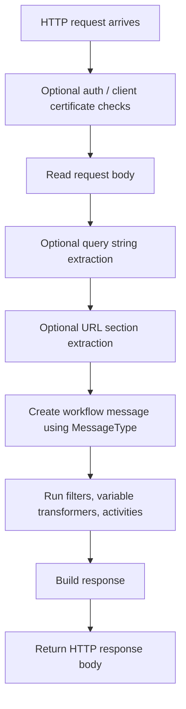

**HTTP Receiver (HttpReceiverSetting)**

## What this setting controls

`HttpReceiverSetting` defines an HTTP endpoint that receives a request body, converts it into an Integration Soup message, optionally extracts request metadata into workflow variables, runs the workflow, and optionally returns an HTTP response.

This document is intentionally about the workflow JSON contract, not the implementation classes.

## Scope

This setting is primarily a receiver definition. It also inherits common receiver fields that control:

- the inbound message type
- workflow activity chaining
- filters and transformers
- response generation

Only fields that are persisted in workflow JSON are described here.

## Shared reference

For canonical enum numeric mappings used across workflow JSON, see [Workflow Enum and Interface Reference](../reference/workflow-enums-and-interfaces.md).

For Integrations code API interface contracts used by custom code, see [IMessage in Integration Soup](../api/imessage.md).

## Operational model

At runtime the HTTP receiver behaves like this:



Important non-obvious points:

- The request body is read as text, even when `MessageType` is `Binary`.
- Query string values are only exposed if they are declared in `QueryStringParameters`.
- URL sections are positional, not named in the URL itself.
- HTTP method and client IP are always available as workflow variables: `HttpMethod` and `ClientIP`.
- `HEAD` requests are treated as a health check and return HTTP 200 with an empty body. They do not enter normal workflow processing.

## JSON shape

Typical object shape:

```json
{
  "$type": "HL7Soup.Functions.Settings.Receivers.HttpReceiverSetting, HL7SoupWorkflow",
  "Id": "6d5f4d5d-95d4-4d2d-8a67-7c9a4dcb9f77",
  "Name": "Patient API",
  "WorkflowPatternName": "Patient API",
  "Disabled": false,
  "MessageType": 11,
  "ReceivedMessageTemplate": "{ \"resourceType\": \"Patient\" }",
  "MessageTypeOptions": null,
  "ServiceName": "api/patient",
  "Port": 8080,
  "UseSsl": true,
  "UseDefaultSSLCertificate": true,
  "CertificateThumbPrint": "",
  "UseIntegrationHostServiceAddress": false,
  "Authentication": false,
  "AuthenticationUserName": "",
  "AuthenticationPassword": "",
  "RequireClientCertificate": false,
  "ClientCertificateThumbPrint": "",
  "ExtractParameters": true,
  "QueryStringParameters": {
    "siteId": {
      "VariableName": "siteId",
      "SampleVariableValue": "main",
      "SampleValueIsDefaultValue": true,
      "VariableType": 0
    }
  },
  "ExtractUrlSections": true,
  "UrlSections": [
    {
      "VariableName": "patientId",
      "SampleVariableValue": "12345",
      "SampleValueIsDefaultValue": false,
      "VariableType": 0
    }
  ],
  "ResponseMessageTemplate": "{ \"ok\": true }",
  "ReturnCustomResponse": true,
  "ReturnNoResponse": false,
  "ReponsePriority": 2,
  "Filters": "00000000-0000-0000-0000-000000000000",
  "VariableTransformers": "00000000-0000-0000-0000-000000000000",
  "Transformers": "00000000-0000-0000-0000-000000000000",
  "Activities": [
    "11111111-1111-1111-1111-111111111111",
    "22222222-2222-2222-2222-222222222222"
  ],
  "AddIncomingMessageToCurrentTab": true
}
```

## Core HTTP endpoint fields

### `ServiceName`

The path portion of the endpoint, without a leading slash.

- Example: `"api/patient"`
- Generated URL pattern when self-hosted: `http[s]://<machine>:<port>/<ServiceName>/`
- Generated URL pattern when using Integration Host: `<IntegrationHostBaseUrl>/<ServiceName>/`

Rules and effects:

- Must not start with `/`.
- Must not end with `/`.
- Reserved URL characters such as `& ; ? : @ = + $ ,` are stripped by the UI.
- Spaces are technically allowed, but should be avoided. URL generation percent-encodes spaces while URL-section parsing compares against the unescaped `ServiceName`, which can create mismatches.

### `Port`

The listening port for self-hosted mode.

- Used only when `UseIntegrationHostServiceAddress` is `false`.
- Ignored for endpoint hosting when `UseIntegrationHostServiceAddress` is `true`.
- Still serialized even when ignored.

### `UseSsl`

Controls whether the self-hosted endpoint is HTTP or HTTPS.

Effects:

- When `false`, the receiver listens over plain HTTP.
- When `true`, the self-hosted listener expects HTTPS.
- Basic authentication and self-hosted client certificate checks only run when this is `true`.

### `UseIntegrationHostServiceAddress`

Controls where the endpoint is hosted.

- `false`: the workflow registers and opens its own `HttpListener`.
- `true`: the receiver is attached to Integration Host's service address instead of opening its own listener.

Key differences:

- In Integration Host mode, `Port`, `UseSsl`, and the receiver's own URL registration are not what determine the public endpoint address.
- In Integration Host mode, `Authentication`, `AuthenticationUserName`, and `AuthenticationPassword` are not enforced by this receiver.
- In Integration Host mode, `ServiceName` must be unique among currently running external HTTP receivers.

Use this when the environment already has a central host process terminating TLS and routing requests.

## TLS and certificate fields

### `UseDefaultSSLCertificate`

Selects the certificate source for self-hosted HTTPS.

- `true`: use the Integration Soup default/generated certificate.
- `false`: use a custom certificate identified by `CertificateThumbPrint`.

### `CertificateThumbPrint`

Thumbprint of the custom server certificate used when:

- `UseSsl = true`
- `UseDefaultSSLCertificate = false`
- `UseIntegrationHostServiceAddress = false`

Practical guidance:

- For new JSON, this is the only meaningful custom server certificate field.
- If `UseDefaultSSLCertificate = false` and `CertificateThumbPrint` is empty, the setting is invalid.

### Legacy serialized certificate fields

These fields still serialize but are legacy and should be omitted in new JSON:

- `CertificateFromFile`
- `CertificatePath`
- `CertificatePassword`
- `CertificateStoreLocation`
- `CertificateStoreName`
- `CertificateX509FindType`

For the current HTTP receiver behavior, these fields do not drive listener startup. `CertificateThumbPrint` is the only custom server-certificate selector that matters.

## Authentication fields

### `Authentication`

Enables HTTP Basic authentication for the self-hosted listener.

Actual behavior:

- Enforced only when `UseSsl = true` and `UseIntegrationHostServiceAddress = false`.
- Ignored on plain HTTP.
- Ignored when requests are received through Integration Host.

### `AuthenticationUserName`

The expected Basic auth user name when `Authentication` is active.

### `AuthenticationPassword`

The expected Basic auth password when `Authentication` is active.

Non-obvious outcome:

- Manual JSON can set these fields even when they have no runtime effect. The runtime decision is based on `UseSsl` and hosting mode, not just `Authentication = true`.

## Client certificate fields

### `RequireClientCertificate`

Requires the caller to present an allowed client certificate.

Behavior differs by hosting mode:

- Self-hosted:
  - Checked only when `UseSsl = true`.
  - Ignored when `UseSsl = false`.
- Integration Host:
  - Checked whenever this flag is `true`.
  - Success depends on Integration Host actually making a client certificate available.

### `ClientCertificateThumbPrint`

Accepted client certificate thumbprint, or a comma-separated list of thumbprints.

Matching behavior:

- The runtime does a case-insensitive substring search, not exact token matching.
- Because of that, values should be complete thumbprints and separated clearly.

Important outcome:

- In Integration Host mode, the host's admin client certificate is also accepted in addition to the configured thumbprint(s).

## Message parsing fields

### `MessageType`

Defines how the inbound request body is interpreted and how the response template is typed.

For `HttpReceiverSetting`, the message types exposed by the current UI are:

- `1` = `HL7`
- `4` = `XML`
- `5` = `CSV`
- `11` = `JSON`
- `13` = `Text`
- `14` = `Binary`
- `16` = `DICOM`

Important behavior:

- The request body is always read from the HTTP stream as text before message creation.
- `Binary` affects Integration Soup message handling and response writing, but inbound capture is not raw-byte safe.

### `MessageTypeOptions`

Optional per-message-type options object.

In practice for this receiver, the main useful case is CSV:

```json
{
  "$type": "HL7Soup.Workflow.MessageTypeOptions.CSVMessageTypeOption, HL7SoupWorkflow",
  "HasHeader": true,
  "Header": "Col1,Col2",
  "HasFooter": false,
  "Footer": "",
  "Delimiter": ","
}
```

For non-CSV HTTP receiver use, this is normally omitted.

### `ReceivedMessageTemplate`

A sample inbound message used for bindings and design-time structure.

This does not change what the receiver accepts over HTTP. It exists so downstream transformers and mappings have a representative structure.

## Variable extraction fields

The receiver always provides:

- `HttpMethod`
- `ClientIP`

Additional variables can be created from query string parameters and URL sections.

### `ExtractParameters`

When `true`, declared query string parameters are mapped into workflow variables.

### `QueryStringParameters`

A JSON object keyed by incoming parameter name.

Each value is typically:

```json
{
  "VariableName": "siteId",
  "SampleVariableValue": "main",
  "SampleValueIsDefaultValue": true,
  "VariableType": 0
}
```

Meaningful fields:

- `VariableName`: should match the object key. New JSON should keep them identical.
- `SampleVariableValue`: sample/default value.
- `SampleValueIsDefaultValue`: when `true`, the workflow variable is initialized with the sample value before request values are applied.

Behavior:

- Only declared parameters are exposed. Extra query parameters are ignored.
- Empty inbound values do not overwrite an initialized default.
- If a declared parameter is missing and `SampleValueIsDefaultValue = false`, no default is applied.

### `ExtractUrlSections`

When `true`, path segments after `ServiceName` are mapped positionally into workflow variables.

### `UrlSections`

An ordered array of variable definitions:

```json
[
  {
    "VariableName": "patientId",
    "SampleVariableValue": "12345",
    "SampleValueIsDefaultValue": false,
    "VariableType": 0
  }
]
```

Behavior:

- Matching is positional.
- The first extra path segment maps to `UrlSections[0]`, the second to `UrlSections[1]`, and so on.
- Extra path segments are ignored after the last declared item.
- Missing path segments leave the variable at its default value if one was initialized, otherwise unset.
- URL sections are URL-decoded before assignment.

Recommended discipline:

- Do not reuse the same `VariableName` twice in `UrlSections`.
- Avoid mismatch between query parameter object keys and inner `VariableName`.

### `VariableType` inside parameter and URL-section objects

This field may serialize because the underlying object is a general variable descriptor. For HTTP receiver parameter and URL-section extraction it has no meaningful runtime effect and can be left at its default.

## Response fields

### `ResponseMessageTemplate`

The response body template used when `ReturnCustomResponse = true`.

Variables are processed at runtime. Receiver response transformers can then modify the generated response message.

### `ReturnCustomResponse`

Controls whether the HTTP response should be built from `ResponseMessageTemplate`.

Default for `HttpReceiverSetting` is `true`.

This is the normal HTTP receiver mode.

### `ReturnNoResponse`

When `true`, the receiver returns an empty response body instead of returning the workflow response message.

This is advanced JSON-only behavior for HTTP receiver. The current HTTP receiver dialog does not expose it and will revert it if the setting is opened and saved in the UI.

### `ReponsePriority`

Controls when the response is generated:

- `0` = `UponArrival`
- `1` = `AfterValidation`
- `2` = `AfterAllProcessing`

Behavior:

- `UponArrival`: generate the response before filters and activities complete; activities continue asynchronously.
- `AfterValidation`: run receiver filters and variable transformers first, then generate the response; activities continue asynchronously.
- `AfterAllProcessing`: wait for the workflow activities and return the final response after processing completes.

Practical effects:

- Earlier response priorities reduce HTTP wait time.
- Earlier response priorities cannot depend on later activity outputs.
- If the workflow later fails after an early response was already returned, the caller does not see that failure.

### `Transformers`

If `ReturnCustomResponse = true`, these receiver response transformers run against the generated response message after the response template is materialized.

This is how the response body can be dynamically adjusted using workflow values.

## Advanced JSON-only response modes

The inherited response fields below are persisted and honored at runtime, but the HTTP receiver UI is not designed around them. If a user opens and resaves the setting in the UI, these manual JSON choices may be reset back to the standard HTTP receiver defaults.

### `ReturnResponseFromActivity`

When `true`, the HTTP response is taken from a sender/activity response instead of `ResponseMessageTemplate`.

### `ReturnResponseFromActivityId`

GUID of the activity whose response should be returned when `ReturnResponseFromActivity = true`.

### `ReturnResponseFromActivityName`

Serialized helper text naming the selected activity. This is mainly used to improve error text if the activity is missing or filtered out.

### `ReturnApplicationAccept`

Generate an automatic accept message.

### `ReturnApplicationReject`

Generate an automatic reject message.

### `RejectMessage`

Reject text used by auto-generated reject responses.

### `ReturnApplicationError`

Generate an automatic error response.

### `ErrorMessage`

Error text used by auto-generated error responses.

Critical limitation:

- Automatic accept/reject/error generation is only meaningful for message types that actually implement it.
- For non-HL7 message types such as JSON, XML, Text, and Binary, the built-in generated accept/reject/error methods return no message body.
- In practice, if you want a non-empty HTTP response for non-HL7 traffic, use `ReturnCustomResponse = true` or `ReturnResponseFromActivity = true`.

## Workflow linkage fields

### `Activities`

Ordered list of downstream activity GUIDs.

These are the workflow steps executed after the receiver accepts the message.

### `Filters`

GUID of the receiver filter set.

If filters reject the message:

- the workflow stops at the receiver
- a reject response may be generated depending on response mode

### `VariableTransformers`

GUID of the receiver-level variable transformer set.

These run after receiver filters and before activities.

### `AddIncomingMessageToCurrentTab`

Controls whether the inbound message is added to the current message list in the desktop product.

This does not change HTTP endpoint behavior.

### `Disabled`

If `true`, the setting is disabled.

### `WorkflowPatternName`

Workflow display/pattern name persisted with the root setting.

### `Id`

GUID of this receiver setting.

### `Name`

User-facing name of this receiver setting.

## Defaults for a new `HttpReceiverSetting`

If a new setting is created in code and then serialized without changes, the important defaults are:

- `UseSsl = false`
- `Port = 8080`
- `ServiceName = "HL7Soup"`
- `Authentication = false`
- `UseDefaultSSLCertificate = true`
- `ReturnCustomResponse = true`
- `ReponsePriority = 2`
- `AddIncomingMessageToCurrentTab = true`
- `UseIntegrationHostServiceAddress = false`
- `RequireClientCertificate = false`
- `ExtractParameters = false`
- `ExtractUrlSections = false`

## Recommended authoring patterns

### Simple JSON API receiver

Use:

- `MessageType = 11`
- `ReturnCustomResponse = true`
- `ResponseMessageTemplate` with JSON content
- `UseIntegrationHostServiceAddress = true` if a central host should own TLS and routing

### Self-hosted HTTPS endpoint with fixed custom certificate

Use:

- `UseIntegrationHostServiceAddress = false`
- `UseSsl = true`
- `UseDefaultSSLCertificate = false`
- `CertificateThumbPrint = "<thumbprint>"`

Do not rely on the legacy certificate location fields.

### REST-style routing by path

Use:

- `ServiceName = "api/patient"`
- `ExtractUrlSections = true`
- `UrlSections` ordered as expected path positions

Example request:

- `/api/patient/12345/visit/ABC`

Example `UrlSections`:

- `patientId`
- `resourceType`
- `resourceId`

### Query-string-driven routing

Use:

- `ExtractParameters = true`
- `QueryStringParameters` for each allowed incoming key

This is safer than assuming arbitrary query parameters become variables automatically. They do not.

## Pitfalls and hidden outcomes

- `Port` still serializes in Integration Host mode but does not control the hosted endpoint there.
- `Authentication = true` does not protect plain HTTP.
- `Authentication = true` is ignored in Integration Host mode.
- `RequireClientCertificate = true` is ignored in self-hosted plain HTTP mode.
- `RequireClientCertificate = true` in Integration Host mode depends on Integration Host exposing the client certificate.
- `Binary` is not a raw-byte-safe inbound mode because the HTTP body is read as text first.
- Binary responses are written by base64-decoding the response message text. If the response text is not valid base64, response sending fails.
- `QueryStringParameters` only maps declared keys. Unexpected keys are dropped.
- `UrlSections` is positional. There is no route-template parser.
- Earlier `ReponsePriority` values return sooner but cannot include outputs from later activities.
- Duplicate `ServiceName` values can block startup:
  - self-hosted: port/prefix conflicts
  - Integration Host: duplicate external listener name
- Manual JSON edits for advanced response modes can be lost when the setting is reopened and saved in the HTTP receiver UI.

## Examples

### Minimal self-hosted HTTP JSON receiver

```json
{
  "$type": "HL7Soup.Functions.Settings.Receivers.HttpReceiverSetting, HL7SoupWorkflow",
  "Id": "aaaaaaaa-aaaa-aaaa-aaaa-aaaaaaaaaaaa",
  "Name": "Inbound JSON",
  "MessageType": 11,
  "ServiceName": "api/inbound",
  "Port": 8080,
  "UseSsl": false,
  "UseIntegrationHostServiceAddress": false,
  "ResponseMessageTemplate": "{ \"ok\": true }",
  "ReturnCustomResponse": true,
  "Activities": []
}
```

### Minimal Integration Host path-parameter receiver

```json
{
  "$type": "HL7Soup.Functions.Settings.Receivers.HttpReceiverSetting, HL7SoupWorkflow",
  "Id": "bbbbbbbb-bbbb-bbbb-bbbb-bbbbbbbbbbbb",
  "Name": "Hosted Patient API",
  "MessageType": 11,
  "ServiceName": "patient",
  "UseIntegrationHostServiceAddress": true,
  "ExtractUrlSections": true,
  "UrlSections": [
    {
      "VariableName": "patientId",
      "SampleVariableValue": "12345",
      "SampleValueIsDefaultValue": false,
      "VariableType": 0
    }
  ],
  "ResponseMessageTemplate": "{ \"accepted\": true }",
  "ReturnCustomResponse": true,
  "Activities": []
}
```

## Useful public references

- [Integration Soup](https://www.integrationsoup.com/)
- [Send HL7 To a Database With Activities](https://www.integrationsoup.com/hl7tutorialaddpatienttodatabasewithactivities.html)
- [Introducing the HL7 Soup Integration Host for AWS](https://hl7interfacer.blogspot.com/2022/08/introducing-hl7-soup-integration-host.html)
- [How To Register a Custom Client Certificate in AWS](https://hl7interfacer.blogspot.com/2022/08/how-to-register-custom-client.html)
