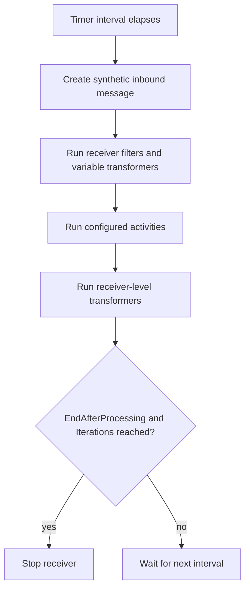

**Timer Receiver (TimerReceiverSetting)**

## What this setting controls

`TimerReceiverSetting` defines a scheduler-style receiver that creates synthetic inbound workflow messages on an interval, runs downstream activities, and optionally stops after a fixed number of iterations.

This receiver does not listen on a transport. It generates internal trigger messages.

## Scope

This setting combines:

- schedule cadence (`Interval`)
- run limit controls (`EndAfterProcessing`, `Iterations`)
- optional receiver-level transformers
- optional post-processing filter behavior (`FilterIfAnyActivityIsFiltered`)

Only serialized workflow JSON fields are covered.

## Shared reference

For canonical enum numeric mappings used across workflow JSON, see [Workflow Enum and Interface Reference](../reference/workflow-enums-and-interfaces.md).

For Integrations code API interface contracts used by custom code, see [IMessage in Integration Soup](../api/imessage.md).

## Operational model



Important non-obvious points:

- The timer creates a message object each iteration; it is not a null trigger.
- Receiver-level `Transformers` are executed for this receiver type after the standard receiver/activity processing path for each iteration.
- `FilterIfAnyActivityIsFiltered` can mark the entire workflow instance as filtered after activity execution.
- A system variable named `PostExecutionFilter` is available and defaults to `"false"`.

## JSON shape

Typical object shape:

```json
{
  "$type": "HL7Soup.Functions.Settings.Receivers.TimerReceiverSetting, HL7SoupWorkflow",
  "Id": "9f6df0dd-6d35-4b84-a7df-a2bce40e72d6",
  "Name": "Every 15 Seconds",
  "WorkflowPatternName": "Every 15 Seconds",
  "Disabled": false,
  "Interval": "00:00:15",
  "EndAfterProcessing": false,
  "Iterations": 1,
  "FilterIfAnyActivityIsFiltered": false,
  "ExecutePostProcess": true,
  "MessageType": 13,
  "MessageTypeOptions": null,
  "ReceivedMessageTemplate": "Timers do not produce messages, don't bind to them for incoming values.",
  "Filters": "00000000-0000-0000-0000-000000000000",
  "VariableTransformers": "00000000-0000-0000-0000-000000000000",
  "Transformers": "00000000-0000-0000-0000-000000000000",
  "Activities": [
    "11111111-1111-1111-1111-111111111111"
  ],
  "AddIncomingMessageToCurrentTab": true
}
```

## Schedule fields

### `Interval`

`TimeSpan` between timer triggers.

JSON is typically serialized as a .NET `TimeSpan` string, for example:

- `"00:00:10"` for 10 seconds
- `"00:05:00"` for 5 minutes

Runtime behavior:

- After each generated message, next trigger time is `now + Interval`.
- Very small intervals can produce high workflow throughput and high CPU usage.

### `EndAfterProcessing`

If `true`, stop the timer after the configured iteration count is reached.

### `Iterations`

Number of timer-generated messages to process before stopping when `EndAfterProcessing = true`.

Important outcome:

- `Iterations` is ignored while `EndAfterProcessing = false`.

## Workflow outcome fields

### `FilterIfAnyActivityIsFiltered`

If `true`, the workflow instance is marked filtered when any downstream activity ends in a filtered state.

Use this when activity-level filtering should propagate to the root receiver outcome.

### `ExecutePostProcess`

Serialized field from `IReceiverExecutesPostProcessSetting`.

Important non-obvious outcome:

- For `TimerReceiverSetting`, this flag is currently metadata-oriented and does not gate a separate timer receiver post-process step.
- The practical post-filter behavior is controlled by `FilterIfAnyActivityIsFiltered` and the `PostExecutionFilter` variable.

## Message fields

### `MessageType`

Defines the type used when the timer creates its synthetic inbound message object.

Default is:

- `13` (`Text`)

Important outcome:

- There is no external payload; the message content starts as empty text.
- Changing `MessageType` changes path semantics for downstream bindings against the timer-generated message.

### `MessageTypeOptions`

Optional message-type options object for the generated synthetic message.

Usually omitted for timer workflows.

### `ReceivedMessageTemplate`

Design-time template for binding assistance.

Important outcome:

- This is not the runtime timer payload source.
- The runtime generated message is created internally by the timer receiver.

## Receiver transformer/filter linkage fields

### `Filters`

GUID of the receiver filter set.

### `VariableTransformers`

GUID of receiver variable-transformer set.

### `Transformers`

GUID of receiver-level transformer set.

Important outcome:

- Unlike some receiver types, timer receiver runs its receiver-level `Transformers`.
- These transformers execute after the normal receiver processing path for the iteration.

### `Activities`

Ordered list of downstream activity GUIDs.

### `Disabled`

If `true`, receiver is disabled.

### `WorkflowPatternName`

Workflow display/pattern name.

### `Id`

GUID of the receiver setting.

### `Name`

Display name.

## Defaults for a new `TimerReceiverSetting`

Important defaults from code:

- `MessageType = 13` (`Text`)
- `Interval = "00:00:10"`
- `Iterations = 1`
- `EndAfterProcessing = false`
- `FilterIfAnyActivityIsFiltered = false`
- `ExecutePostProcess = true`

## Recommended authoring patterns

### Continuous scheduled polling workflow

Use:

- `EndAfterProcessing = false`
- Appropriate `Interval`

### Finite batch scheduler

Use:

- `EndAfterProcessing = true`
- `Iterations = <count>`

### Filter-propagating timer run

Use:

- `FilterIfAnyActivityIsFiltered = true`

This is useful when downstream filters should classify the whole timer run as filtered.

## Pitfalls and hidden outcomes

- Setting a very small `Interval` can create high resource usage and log volume.
- `Iterations` has no effect unless `EndAfterProcessing = true`.
- `ReceivedMessageTemplate` is design-time guidance, not timer payload input.
- Manual JSON can set unusual `MessageType` values; this changes downstream binding behavior even though timer messages have no external body.
- `ExecutePostProcess` is serialized but does not provide a separate timer-specific post-process stage by itself.

## Examples

### Every 30 seconds, run continuously

```json
{
  "$type": "HL7Soup.Functions.Settings.Receivers.TimerReceiverSetting, HL7SoupWorkflow",
  "Id": "aaaaaaaa-aaaa-aaaa-aaaa-aaaaaaaaaaaa",
  "Name": "Every 30 Seconds",
  "Interval": "00:00:30",
  "EndAfterProcessing": false,
  "MessageType": 13,
  "Activities": []
}
```

### Run exactly 5 times then stop

```json
{
  "$type": "HL7Soup.Functions.Settings.Receivers.TimerReceiverSetting, HL7SoupWorkflow",
  "Id": "bbbbbbbb-bbbb-bbbb-bbbb-bbbbbbbbbbbb",
  "Name": "Five Iterations",
  "Interval": "00:00:10",
  "EndAfterProcessing": true,
  "Iterations": 5,
  "MessageType": 13,
  "Activities": []
}
```
