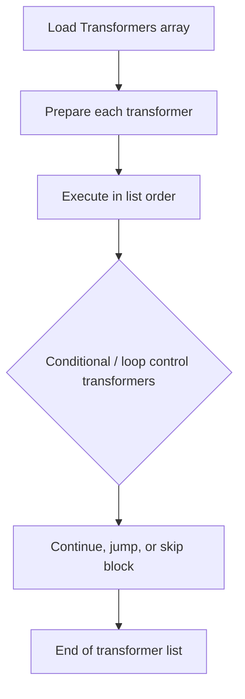

# Transformer Setting (TransformerSetting)

`TransformerSetting` is the reusable JSON object referenced by `Transformers` and `VariableTransformers` GUID fields across workflow settings.

It stores an ordered list of transformer actions.

This page documents the JSON contract and runtime behavior.

---

## Runtime model



Important non-obvious points:

- Order is the execution contract.
- `Begin Conditional` and `End Conditional` are structural controls and must be paired logically.
- `For Each` and `Next` form loop pairs; missing `Next` causes runtime errors.

---

## JSON shape

Typical object shape:

```json
{
  "$type": "HL7Soup.Functions.Settings.TransformerSetting, HL7SoupWorkflow",
  "Id": "f1aebd98-c9cc-43f1-b2df-92a397fc6b0f",
  "Name": "Receiver Variable Mapping",
  "Transformers": [
    {
      "$type": "HL7Soup.Functions.Settings.CreateVariableTransformerAction, HL7SoupWorkflow",
      "VariableName": "PatientId",
      "SampleVariableValue": "12345",
      "SampleValueIsDefaultValue": false,
      "FromPath": "PID-3.1",
      "FromSetting": "11111111-1111-1111-1111-111111111111",
      "FromDirection": 0,
      "FromType": 8
    }
  ],
  "Version": 3
}
```

---

## Top-level fields

| Field | Type | Required | Meaning |
|---|---|---|---|
| `Id` | GUID string | yes | Transformer-setting identity referenced elsewhere. |
| `Name` | string | recommended | Display name. |
| `Transformers` | array | yes | Ordered transformer action list. |
| `Version` | integer | optional | Setting version metadata. |

---

## Base transformer action fields

Most transformer action objects derive from `TransformerAction` and use these fields:

| Field | Meaning |
|---|---|
| `FromPath` | Source path/text expression. |
| `FromSetting` | Source setting GUID (omit/empty for text-variable source). |
| `FromDirection` | `0=inbound`, `1=outbound`, `2=variable`. |
| `FromType` | Source interpretation mode. |
| `FromNamespaces` | Optional XML namespace prefix map for source path resolution. |

`FromType` values used in transformer bindings:

- `7` = `TextWithVariables`
- `8` = `HL7V2Path`
- `9` = `XPath`
- `10` = `CSVPath`
- `12` = `JSONPath`

---

## Formatting-capable transformer fields

`CreateVariableTransformerAction` and `CreateMappingTransformerAction` inherit formatting fields:

| Field | Meaning |
|---|---|
| `Encoding` | Value-encoding enum (`None` and encoding transforms). |
| `TextFormat` | Case transform enum (`None`, upper/lower/title/mcname). |
| `Truncation` | Truncation strategy enum. |
| `TruncationLength` | Truncation length where applicable. |
| `PaddingLength` | Left/right padding length (implementation-defined formatting pipeline). |
| `Remove` | Remove-substring directive. |
| `Replace` / `ReplaceWith` | Replace-substring directive. |
| `Lookup` | Lookup-table name used in formatting pipeline. |
| `Format` | Final custom format string. |

---

## Supported transformer action types

### `CreateVariableTransformerAction`

`$type`: `HL7Soup.Functions.Settings.CreateVariableTransformerAction, HL7SoupWorkflow`

Key fields:

- `VariableName`
- `SampleVariableValue`
- `SampleValueIsDefaultValue`
- base source fields
- formatting fields

Use case:

- Create/update a workflow variable from a source path or literal `${}`-style text.

### `CreateMappingTransformerAction`

`$type`: `HL7Soup.Functions.Settings.CreateMappingTransformerAction, HL7SoupWorkflow`

Key fields:

- `ToPath`
- `ToSetting`
- `ToDirection`
- `ToType`
- `AllowMessageStructureToChange`
- `ToNamespaces`
- base source fields
- formatting fields

Use case:

- Map from one source into another message location.

### `BeginConditionalTransformerAction`

`$type`: `HL7Soup.Functions.Settings.BeginConditionalTransformerAction, HL7SoupWorkflow`

Key fields:

- `Filters` (array of message-filter objects)

Use case:

- Start conditional execution block.

### `EndConditionalTransformerAction`

`$type`: `HL7Soup.Functions.Settings.EndConditionalTransformerAction, HL7SoupWorkflow`

Use case:

- End conditional execution block.

### `ForEachTransformerAction`

`$type`: `HL7Soup.Functions.Settings.ForEachTransformerAction, HL7SoupWorkflow`

Use case:

- Iterate sibling/repeating values from the configured source path.

Important runtime behavior:

- Maintains `ForEachIterator` variable (1-based while iterating).
- Must be paired with a matching `NextTransformerAction`.

### `NextTransformerAction`

`$type`: `HL7Soup.Functions.Settings.NextTransformerAction, HL7SoupWorkflow`

Use case:

- Loop control jump target for `ForEach`.

### `AppendLineTransformerAction`

`$type`: `HL7Soup.Functions.Settings.AppendLineTransformerAction, HL7SoupWorkflow`

Key fields:

- `ToSetting`
- `ToDirection`
- base source fields

Use case:

- Append text/segment content to target message.

### `NotificationTransformerAction`

`$type`: `HL7Soup.Functions.Settings.NotificationTransformerAction, HL7SoupWorkflow`

Key fields:

- `Critical`
- base source fields

Use case:

- Create dashboard notifications from evaluated source text.

### `CodeTransformerAction`

`$type`: `HL7Soup.Functions.Settings.CodeTransformerAction, HL7SoupWorkflow`

Key fields:

- `Comment`
- `Code`
- `VariableNames`

Use case:

- Execute C# code in transformer stage.

### `CommentTransformerAction`

`$type`: `HL7Soup.Functions.Settings.CommentTransformerAction, HL7SoupWorkflow`

Key fields:

- `Comment`

Use case:

- Documentation/no-op marker in transformer list.

### `CreateParameterTransformerAction`

`$type`: `HL7Soup.Functions.Settings.CreateParameterTransformerAction, HL7SoupWorkflow`

Key fields:

- `ParameterName`
- `ParameterDescription`
- `IsRequired`
- base source fields

Use case:

- Create parameter-like variable values for downstream logic.

### `CustomTransformerAction`

`$type`: `HL7Soup.Functions.Settings.CustomTransformerAction, HL7SoupWorkflow`

Key fields:

- `CustomTransformerTypeName`
- `CustomTransformerName`
- `Parameters` (dictionary of parameter transformer actions)

Use case:

- Invoke custom transformer types from custom libraries.

---

## Action-order and structure rules

1. Conditionals:
   - `BeginConditional` should be followed later by matching `EndConditional`.
2. Loops:
   - Each `ForEach` requires a subsequent `Next`.
3. Grouped conditional filters:
   - In `BeginConditional.Filters`, avoid group-first/group-last/double-group patterns.

---

## Non-obvious outcomes

- Some UI helper fields can appear in JSON (for example pair metadata); they are not the primary execution contract.
- `FromSetting` + `FromDirection` mismatches silently lead to empty source values, which then cascade into wrong mappings/variables.
- `AllowMessageStructureToChange = true` writes raw structure and can alter message shape instead of writing safe encoded values.
- `ForEach` over unsupported source types throws runtime errors.

---

## Minimal examples

### Variable mapping chain

```json
{
  "$type": "HL7Soup.Functions.Settings.TransformerSetting, HL7SoupWorkflow",
  "Id": "aaaaaaaa-aaaa-aaaa-aaaa-aaaaaaaaaaaa",
  "Name": "Variable Map",
  "Transformers": [
    {
      "$type": "HL7Soup.Functions.Settings.CreateVariableTransformerAction, HL7SoupWorkflow",
      "VariableName": "Facility",
      "SampleVariableValue": "MAIN",
      "SampleValueIsDefaultValue": false,
      "FromPath": "MSH-4.1",
      "FromSetting": "bbbbbbbb-bbbb-bbbb-bbbb-bbbbbbbbbbbb",
      "FromDirection": 0,
      "FromType": 8
    }
  ]
}
```

### Conditional block

```json
{
  "$type": "HL7Soup.Functions.Settings.TransformerSetting, HL7SoupWorkflow",
  "Id": "cccccccc-cccc-cccc-cccc-cccccccccccc",
  "Name": "Conditional Example",
  "Transformers": [
    {
      "$type": "HL7Soup.Functions.Settings.BeginConditionalTransformerAction, HL7SoupWorkflow",
      "Filters": [
        {
          "$type": "HL7Soup.MessageFilters.StringMessageFilter, HL7SoupWorkflow",
          "Path": "MSH-9.2",
          "Comparer": 0,
          "Value": "A01",
          "Conjunction": 0,
          "FromType": 8,
          "FromDirection": 0,
          "FromSetting": "bbbbbbbb-bbbb-bbbb-bbbb-bbbbbbbbbbbb"
        }
      ]
    },
    {
      "$type": "HL7Soup.Functions.Settings.CreateVariableTransformerAction, HL7SoupWorkflow",
      "VariableName": "IsA01",
      "SampleVariableValue": "true",
      "SampleValueIsDefaultValue": false,
      "FromPath": "true",
      "FromType": 7,
      "FromDirection": 2
    },
    {
      "$type": "HL7Soup.Functions.Settings.EndConditionalTransformerAction, HL7SoupWorkflow"
    }
  ]
}
```

---

## Related docs

- [Filter Host (FilterHostSetting)](./filter-host-setting.md)
- [Variable Creator JSON Reference](./variable-creator.md)
- [Workflow Enum and Interface Reference](./workflow-enums-and-interfaces.md)
