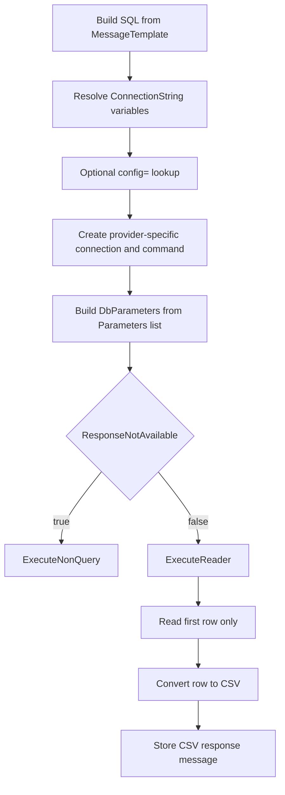

# **Database Query (DatabaseSenderSetting)**

## What this setting controls

`DatabaseSenderSetting` executes SQL against a configured database connection and can optionally return a response message.  
When a response is enabled, only the first row of the first result set is returned, and it is returned as CSV.

This page documents serialized JSON fields and their runtime impact.

## Shared reference

For canonical enum numeric mappings used across workflow JSON, see [Workflow Enum and Interface Reference](../reference/workflow-enums-and-interfaces.md).

For Integrations code API interface contracts used by custom code, see [IMessage in Integration Soup](../api/imessage.md).

## Operational model



Important non-obvious points:

- SQL is always executed as `CommandType.Text`.
- Response mode returns first row only.
- Parameter values are bound as strings after value extraction/formatting.
- Binary response columns are base64-encoded in the CSV output.

## JSON shape

```json
{
  "$type": "HL7Soup.Functions.Settings.Senders.DatabaseSenderSetting, HL7SoupWorkflow",
  "Id": "d38e42c9-3f01-4e0d-bfb6-4a0b0198587f",
  "Name": "Lookup Patient",
  "ConnectionString": "config=MainDb",
  "DataProvider": 0,
  "MessageTemplate": "SELECT PatientId, LastName FROM Patients WHERE PatientId = @PatientId",
  "MessageType": 6,
  "ResponseNotAvailable": false,
  "ResponseMessageTemplate": "PatientId,LastName",
  "ResponseMessageType": 5,
  "Parameters": [
    {
      "Name": "@PatientId",
      "Value": "${PatientId}",
      "FromType": 8,
      "FromDirection": 2
    }
  ],
  "Filters": "00000000-0000-0000-0000-000000000000",
  "Transformers": "00000000-0000-0000-0000-000000000000"
}
```

## Required vs optional keys

The safest JSON authoring pattern for AI/dev tooling is to always include:

- `Id`
- `Name`
- `ConnectionString`
- `DataProvider`
- `MessageTemplate`
- `Parameters`
- `ResponseNotAvailable`

Conditionally include:

- if `ResponseNotAvailable = false`:
  - `ResponseMessageTemplate`
  - `ResponseMessageType` (`5` for CSV)
- if `Parameters[i].FromDirection != 2`:
  - `Parameters[i].FromSetting`

Commonly present but not specific to this sender:

- `Version`
- `Filters`
- `Transformers`

## Defaults for new settings

`DatabaseSenderSetting` initializes with:

- `ConnectionString = ""`
- `MessageType = 6` (SQL)
- `ResponseMessageType = 5` (CSV)
- `ResponseNotAvailable = true`
- `Parameters = []`

Practical implication:

- if your loader applies constructor defaults before JSON assignment, omitting `MessageType` and `ResponseMessageType` can still work
- for deterministic authored JSON, include them explicitly

## Connection fields

### `ConnectionString`

Database connection string. Variables are resolved at runtime.

Special case:

- If value starts with `config=`, the remainder is treated as a named connection string in host config.

Non-obvious outcome:

- lookup occurs in the executing host process (for Integration Host, usually server-side), not in the editor.

### `DataProvider`

JSON enum values:

- `0` = `SqlClient`
- `1` = `OracleClient`
- `2` = `OleDb`
- `3` = `Odbc`
- `4` = `SqlClientOld`
- `5` = `MySql`
- `6` = `PostgreSql`
- `7` = `Sqlite`

Important outcomes:

- `OleDb` is Windows-only in current runtime path.
- Oracle parameter names are normalized (leading `:` removed for bound parameter name).

## SQL and response fields

### `MessageTemplate`

SQL text to execute.

Important outcome:

- command type is always text SQL, not stored procedure mode.

### `MessageType`

Meaningful value for this setting:

- `6` = `SQL`

### `ResponseNotAvailable`

Controls response mode:

- `true`: execute non-query (`ExecuteNonQuery`)
- `false`: execute reader (`ExecuteReader`) and return CSV response

Important naming trap:

- `ResponseNotAvailable = false` means a response is expected and returned.

### `ResponseMessageTemplate`

Design-time response schema (CSV columns in expected order).

Practical guidance:

- use comma-separated names with no spaces, for example `PatientId,LastName,FirstName`.

### `ResponseMessageType`

Meaningful value when response is enabled:

- `5` = `CSV`

## Parameter fields

### `Parameters`

List of `DatabaseSettingParameter` objects.

Typical serialized object:

```json
{
  "Name": "@PatientId",
  "Value": "${PatientId}",
  "FromType": 8,
  "FromDirection": 2,
  "FromSetting": "00000000-0000-0000-0000-000000000000",
  "Encoding": 0,
  "Format": "",
  "TextFormat": 0,
  "Truncation": 0,
  "TruncationLength": 50,
  "PaddingLength": 0,
  "Lookup": ""
}
```

### `Name`

SQL parameter placeholder name.

Provider behavior:

- most providers use `@ParamName`
- Oracle SQL uses `:ParamName`
- runtime normalizes Oracle bound parameter name by removing leading `:`

### `Value`

The source expression used to create parameter value.

### `FromDirection`

JSON enum values:

- `0` = `inbound`
- `1` = `outbound`
- `2` = `variable`

Runtime meaning:

- `2` pulls from variable/literal context
- `0` or `1` pulls from another activity message direction and requires `FromSetting`

### `FromSetting`

GUID of source activity when `FromDirection` is `0` or `1`.

### `FromType`

Supported JSON enum values:

- `8` = `TextWithVariables`
- `9` = `HL7V2Path`
- `10` = `XPath`
- `11` = `CSVPath`
- `12` = `JSONPath`

### Formatting fields

Serialized fields that shape parameter value before binding:

- `Encoding`
- `Format`
- `TextFormat`
- `Truncation`
- `TruncationLength`
- `PaddingLength`
- `Lookup`

Important outcome:

- parameters are eventually assigned as strings; formatting choices materially affect query behavior.

## Response behavior details

When `ResponseNotAvailable = false`, runtime:

- executes reader
- reads only first row
- converts row to CSV
- quotes and escapes strings
- base64-encodes byte arrays

Implications:

- multi-row and multi-result-set data are not directly surfaced
- downstream bindings rely on CSV semantics and column ordering

## Pitfalls and hidden outcomes

- First row only: additional rows are discarded.
- Command is always text SQL: no stored-procedure command mode.
- Parameter values are bound as strings: implicit DB conversions can cause subtle behavior/performance differences.
- `ResponseMessageTemplate` is schema metadata, not a projection rule.
- ODBC/OleDb drivers may behave positionally for parameters; parameter order can matter.
- `OleDb` is not portable beyond Windows in current runtime path.
- SQL and parameter values are logged in normal operation paths; sensitive data can land in logs if not controlled.

## Examples

### Insert or update with no response

```json
{
  "Id": "8f65d3f2-6b5f-4d8b-8b02-8b82c4c2b8cb",
  "Name": "Insert Patient",
  "ConnectionString": "config=MainDb",
  "DataProvider": 0,
  "MessageType": 6,
  "MessageTemplate": "INSERT INTO Patients (PatientId, LastName) VALUES (@PatientId, @LastName)",
  "Parameters": [
    {
      "Name": "@PatientId",
      "Value": "${PatientId}",
      "FromType": 8,
      "FromDirection": 2
    },
    {
      "Name": "@LastName",
      "Value": "PID-5.1",
      "FromType": 9,
      "FromDirection": 0,
      "FromSetting": "22222222-2222-2222-2222-222222222222"
    }
  ],
  "ResponseNotAvailable": true
}
```

### Single-row lookup with response

```json
{
  "Id": "6c0d3c3c-7b28-4b65-8f73-5a07a8dc1e64",
  "Name": "Lookup Patient",
  "ConnectionString": "config=MainDb",
  "DataProvider": 0,
  "MessageType": 6,
  "MessageTemplate": "SELECT PatientId, LastName, FirstName FROM Patients WHERE PatientId = @PatientId",
  "Parameters": [
    {
      "Name": "@PatientId",
      "Value": "${PatientId}",
      "FromType": 8,
      "FromDirection": 2
    }
  ],
  "ResponseNotAvailable": false,
  "ResponseMessageTemplate": "PatientId,LastName,FirstName",
  "ResponseMessageType": 5
}
```

### Oracle parameter example

```json
{
  "Id": "b8b2fba2-45b4-49a0-a215-6aa9d4b62c9c",
  "Name": "Oracle Insert",
  "ConnectionString": "config=OracleDb",
  "DataProvider": 1,
  "MessageType": 6,
  "MessageTemplate": "INSERT INTO PATIENTS (PATIENT_ID) VALUES (:PatientId)",
  "Parameters": [
    {
      "Name": ":PatientId",
      "Value": "${PatientId}",
      "FromType": 8,
      "FromDirection": 2
    }
  ],
  "ResponseNotAvailable": true
}
```

## Useful public references

- [Integration Soup](https://www.integrationsoup.com/)
- [Send HL7 To a Database With Activities](https://www.integrationsoup.com/hl7tutorialaddpatienttodatabasewithactivities.html)
- [Send HL7 to a Database](https://www.integrationsoup.com/hl7tutorialsendhl7toadatabase.html)
- [Using Variables in HL7 Soup](https://www.integrationsoup.com/hl7tutorialusingvariables.html)
- [Using Transformers](https://www.integrationsoup.com/hl7tutorialusingtransformers.html)
- [Using Filters](https://www.integrationsoup.com/hl7tutorialfilters.html)
- [HL7 Interfacer Blog](https://hl7interfacer.blogspot.com/)
