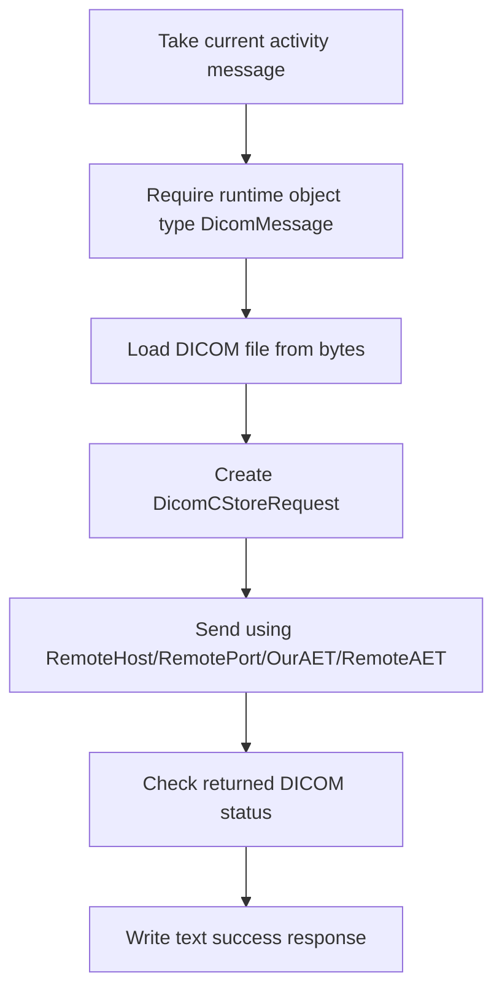

# **DICOM Sender (DicomSenderSetting)**

## What this setting controls

`DicomSenderSetting` sends a DICOM dataset to a remote DICOM SCP using a C-STORE request.

It controls:

- remote host and port
- calling and called AE titles
- message template/message type context from sender base fields

This page documents serialized JSON fields and runtime behavior.

## Shared reference

For canonical enum numeric mappings used across workflow JSON, see [Workflow Enum and Interface Reference](../reference/workflow-enums-and-interfaces.md).

For Integrations code API interface contracts used by custom code, see [IMessage in Integration Soup](../api/imessage.md).

## Runtime model



Important non-obvious behavior:

- sender validates the runtime message object type, not only `MessageType`.
- current implementation is C-STORE only.
- success response is plain text message content, not a DICOM response object.

## JSON shape

Typical serialized shape:

```json
{
  "$type": "HL7Soup.Functions.Settings.Senders.DicomSenderSetting, HL7SoupWorkflow",
  "Id": "aaaaaaaa-aaaa-aaaa-aaaa-aaaaaaaaaaaa",
  "Name": "Send to PACS",
  "Version": 3,
  "MessageType": 16,
  "MessageTypeOptions": null,
  "MessageTemplate": "${11111111-1111-1111-1111-111111111111 inbound}",
  "RemoteHost": "127.0.0.1",
  "RemotePort": 104,
  "OurAET": "HL7SOUP_SCU",
  "RemoteAET": "ANY_SCP",
  "TimeoutSeconds": 30,
  "Filters": "00000000-0000-0000-0000-000000000000",
  "Transformers": "00000000-0000-0000-0000-000000000000",
  "TransformersNotAvailable": false,
  "Disabled": false
}
```

## Connection fields

### `RemoteHost`

Remote DICOM SCP host or IP.

### `RemotePort`

Remote DICOM TCP port.

### `OurAET`

Calling AE title.

### `RemoteAET`

Called AE title.

Important outcome:

- AE title mismatch can fail association even with correct network routing.

### `TimeoutSeconds`

Serialized timeout field.

Important runtime outcome:

- not clearly applied by the current sender runtime path.

## Message fields

### `MessageType`

Meaningful value for normal operation:

- `16` = `DICOM`

### `MessageTemplate`

Activity message source before sender execution.

Critical runtime limitation:

- sender requires `workflowInstance.Message` to be an actual `DicomMessage` object.
- text/JSON/XML messages with `MessageType = 16` are still invalid at runtime.

### `MessageTypeOptions`

Serialized via sender base; no practical specialized usage in this sender runtime path.

## Response behavior

This sender is not based on `SenderWithResponseSetting`.

Runtime behavior:

- on success, sets a text response describing C-STORE success status.
- on failure, errors the workflow instance.

Practical outcome:

- downstream consumers should treat this activity response as text metadata.

## Workflow linkage fields

### `Filters`

GUID of sender filters.

### `Transformers`

GUID of sender transformers.

### `TransformersNotAvailable`

Serialized inherited activity field indicating transformer availability state.

### `Disabled`

If `true`, activity disabled.

### `Id`

Activity GUID.

### `Name`

User-facing activity name.

## UI behavior that affects JSON authors

- dialog does not expose `TimeoutSeconds`; manual JSON values tend to round-trip back to constructor default on UI save.
- dialog does not provide dedicated advanced DICOM operation mode options (sender remains C-STORE flow).

## Defaults

New `DicomSenderSetting` defaults:

- `RemoteHost = "127.0.0.1"`
- `RemotePort = 104`
- `OurAET = "HL7SOUP_SCU"`
- `RemoteAET = "ANY_SCP"`
- `TimeoutSeconds = 30`
- `MessageType = 16`

## Pitfalls and hidden outcomes

- `MessageType = 16` alone is insufficient; runtime object must truly be `DicomMessage`.
- response is text, not DICOM.
- `TimeoutSeconds` currently serializes without clear runtime enforcement in this sender.
- transformer usage that converts message object away from DICOM will break sending.

## Examples

### Basic C-STORE sender

```json
{
  "$type": "HL7Soup.Functions.Settings.Senders.DicomSenderSetting, HL7SoupWorkflow",
  "Id": "aaaaaaaa-aaaa-aaaa-aaaa-aaaaaaaaaaaa",
  "Name": "Send to PACS",
  "MessageType": 16,
  "MessageTemplate": "${11111111-1111-1111-1111-111111111111 inbound}",
  "RemoteHost": "10.0.0.25",
  "RemotePort": 104,
  "OurAET": "HL7SOUP_SCU",
  "RemoteAET": "ANY_SCP"
}
```

### Alternate AE title pairing

```json
{
  "$type": "HL7Soup.Functions.Settings.Senders.DicomSenderSetting, HL7SoupWorkflow",
  "Id": "bbbbbbbb-bbbb-bbbb-bbbb-bbbbbbbbbbbb",
  "Name": "Send to Archive Node",
  "MessageType": 16,
  "MessageTemplate": "${22222222-2222-2222-2222-222222222222 outbound}",
  "RemoteHost": "dicom.archive.local",
  "RemotePort": 11112,
  "OurAET": "HL7SOUP_SCU",
  "RemoteAET": "ARCHIVE_SCP"
}
```

## Useful public references

- [Integration Soup](https://www.integrationsoup.com/)
- [Sending DICOM Tags to a Web API or REST Service](https://www.integrationsoup.com/dicomtutorialsendtorestapi.html)
