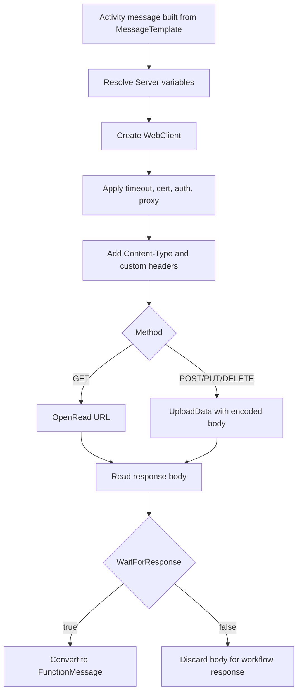

# **HTTP Sender (HttpSenderSetting)**

## What this setting controls

`HttpSenderSetting` sends the activity message to an HTTP/HTTPS endpoint using `POST`, `GET`, `PUT`, or `DELETE`.

It also controls:

- authentication credentials
- OAuth 2.0 client-credentials authentication
- client certificate use
- proxy mode
- request timeout
- custom request headers
- whether the response body is retained as the activity response

This page documents serialized JSON fields and the runtime behavior they cause.

## Shared reference

For canonical enum numeric mappings used across workflow JSON, see [Workflow Enum and Interface Reference](../reference/workflow-enums-and-interfaces.md).

For Integrations code API interface contracts used by custom code, see [IMessage in Integration Soup](../api/imessage.md).

## Runtime model



Important non-obvious behavior:

- `WaitForResponse` controls response retention, not whether the HTTP call blocks.
- The sender still receives and reads the HTTP response even when `WaitForResponse = false`.
- `GET` never sends `MessageTemplate` as a request body.
- For non-GET methods, body bytes are always created from message text using `Encoding`.
- Response conversion uses `MessageType` and `MessageTypeOptions`, not `ResponseMessageType`.
- When `AuthenticationMode = OAuth2`, token acquisition happens before the outbound request is sent.

## JSON shape

Typical serialized shape:

```json
{
  "$type": "HL7Soup.Functions.Settings.Senders.HttpSenderSetting, HL7SoupWorkflow",
  "Id": "aaaaaaaa-aaaa-aaaa-aaaa-aaaaaaaaaaaa",
  "Name": "Post Patient JSON",
  "Version": 3,
  "MessageType": 11,
  "MessageTypeOptions": null,
  "MessageTemplate": "{ \"patientId\": \"${PatientId}\" }",
  "ResponseMessageTemplate": "",
  "ResponseMessageType": 0,
  "DifferentResponseMessageType": false,
  "Server": "https://api.example.com/patients/${PatientId}",
  "Method": 0,
  "ContentType": "application/json",
  "Authentication": false,
  "AuthenticationMode": 2,
  "UserName": "",
  "Password": "",
  "UseAuthenticationCertificate": false,
  "AuthenticationCertificateThumbprint": "",
  "PreAuthenticate": false,
  "UseProxy": 0,
  "ProxyAddress": "",
  "ProxyUserName": "",
  "ProxyPassword": "",
  "UseDefaultCredentials": false,
  "TimeoutSeconds": 30,
  "Encoding": "utf-8",
  "Headers": [
    {
      "Name": "X-Correlation-Id",
      "Value": "${WorkflowInstanceId}",
      "FromType": 7,
      "FromDirection": 2,
      "FromSetting": "00000000-0000-0000-0000-000000000000"
    }
  ],
  "OAuthSettings": {
    "GrantType": 0,
    "TokenEndpoint": "https://login.example.com/oauth2/token",
    "ClientId": "hl7soup-client",
    "ClientSecret": "${ApiClientSecret}",
    "Scope": "patient.read patient.write",
    "ResourceOrAudience": "https://api.example.com/",
    "ResourceParameterType": 1,
    "ClientAuthenticationStyle": 0,
    "ExpirySkewSeconds": 60
  },
  "WaitForResponse": true,
  "Filters": "00000000-0000-0000-0000-000000000000",
  "Transformers": "00000000-0000-0000-0000-000000000000",
  "Disabled": false
}
```

## Method and endpoint fields

### `Server`

Target URL. Variables are resolved at runtime.

### `Method`

JSON enum values:

- `0` = `POST`
- `1` = `GET`
- `2` = `PUT`
- `3` = `DELETE`

Runtime outcomes:

- `GET` uses `OpenRead` and sends no body.
- `POST`, `PUT`, and `DELETE` use upload-body path.
- `DELETE` can still send a request body in this sender.

### `ContentType`

Added to request headers as `Content-Type`.

Important outcome:

- this header is added regardless of method.

## Authentication and certificate fields

### `AuthenticationMode`

Managed authentication mode for the request.

JSON enum values:

- `0` = `None`
- `1` = `Basic`
- `2` = `OAuth2`

Important runtime outcomes:

- `None`: no auth is added by the sender
- `Basic`: username/password auth path is used
- `OAuth2`: OAuth settings are used and the sender manages the `Authorization` header

### `Authentication`

Enables username/password credentials.

Important runtime outcome:

- this is the legacy/basic-auth enable switch and is relevant when `AuthenticationMode = Basic`

### `UserName`

Username when `Authentication = true`.

### `Password`

Password when `Authentication = true`.

### `OAuthSettings`

OAuth settings used when `AuthenticationMode = OAuth2`.

Current support:

- only the `ClientCredentials` grant type is supported

Observable runtime behavior:

- the workflow host acquires the token
- the sender caches the access token in memory
- the sender renews the token before expiry using `ExpirySkewSeconds`
- if the endpoint returns `401`, the sender invalidates the cached token and retries once
- tokens are not persisted across service restarts

#### `GrantType`

JSON enum values:

- `0` = `ClientCredentials`

#### `TokenEndpoint`

OAuth token endpoint URL. Supports workflow variables.

#### `ClientId`

OAuth client ID. Supports workflow variables.

#### `ClientSecret`

Reference to the client secret.

Recommended use:

- store the secret in a secure Global Variable
- reference it as `${VariableName}`

Important runtime outcomes:

- the workflow JSON stores the reference, not the secret value
- the workflow host resolves the reference and reads the secret there

#### `Scope`

Optional `scope` value to include in the token request. Supports workflow variables.

#### `ResourceOrAudience`

Optional extra token-request value used when the token endpoint expects `audience` or `resource`.

#### `ResourceParameterType`

JSON enum values:

- `0` = `None`
- `1` = `Audience`
- `2` = `Resource`

Behavior:

- `None`: no extra parameter is sent
- `Audience`: send `audience=<ResourceOrAudience>`
- `Resource`: send `resource=<ResourceOrAudience>`

#### `ClientAuthenticationStyle`

JSON enum values:

- `0` = `BasicAuthenticationHeader`
- `1` = `RequestBody`

Behavior:

- `BasicAuthenticationHeader`: token request uses `Authorization: Basic ...`
- `RequestBody`: token request sends `client_id` and `client_secret` in the form body

Important runtime outcome:

- this affects the token request only, not the activity message body

#### `ExpirySkewSeconds`

Refresh the token this many seconds before the reported expiry time.

### `UseAuthenticationCertificate`

Whether to attach a client certificate.

### `AuthenticationCertificateThumbprint`

Thumbprint used when `UseAuthenticationCertificate = true`.

Important runtime outcome:

- certificate lookup requires machine store availability; missing certificates fail the request.

### `PreAuthenticate`

Controls eager credential behavior in underlying HTTP stack.

### `UseDefaultCredentials`

Enables process/default credentials if requested by server.

## Proxy fields

### `UseProxy`

JSON enum values:

- `0` = `UseDefaultProxy`
- `1` = `ManualProxy`
- `2` = `None`

### `ProxyAddress`

Manual proxy URL when `UseProxy = 1`.

### `ProxyUserName`

Manual proxy username when `UseProxy = 1`.

### `ProxyPassword`

Manual proxy password when `UseProxy = 1`.

## Header fields

### `Headers`

Serialized as `DatabaseSettingParameter[]`.

Fields that matter at HTTP runtime:

- `Name`
- `Value`
- `FromDirection`
- `FromSetting`

Design-time fields that serialize for binding/editor compatibility:

- `FromType`
- formatting fields (`Encoding`, `Format`, `TextFormat`, `Truncation`, `Lookup`, and related fields)

Important runtime outcomes:

- header value extraction uses the binding source and value expression path, not the formatting subset used by database parameters.
- when OAuth is active, user-supplied `Authorization` headers are ignored.

### `FromDirection` (inside `Headers`)

JSON enum values:

- `0` = `inbound`
- `1` = `outbound`
- `2` = `variable`

### `FromType` (inside `Headers`)

Useful JSON enum values:

- `7` = `TextWithVariables`
- `8` = `HL7V2Path`
- `9` = `XPath`
- `10` = `CSVPath`
- `12` = `JSONPath`

## Message and response fields

### `MessageType`

For this sender, the editor allows:

- `1` = `HL7`
- `4` = `XML`
- `5` = `CSV`
- `11` = `JSON`
- `13` = `Text`
- `14` = `Binary`
- `16` = `DICOM`

Runtime outcome:

- response body is converted into this message type when retained.

### `MessageTypeOptions`

Serialized through shared sender infrastructure.

Runtime outcome:

- applied when retained response body is converted into a function message.

UI outcome:

- this sender UI does not provide a dedicated editor for complex message-type options.
- advanced JSON options can be lost on round-trip save.

### `MessageTemplate`

Request body template source for non-GET methods.

Important outcome:

- ignored for `GET`.

### `WaitForResponse`

Controls whether response body is kept in the activity response.

Behavior:

- `true`: retain response body
- `false`: do not retain response body

Important runtime outcome:

- sender still performs the HTTP request and reads the HTTP response path before deciding retention.

### `ResponseMessageTemplate`

Serialized due shared sender-with-response base.

Runtime outcome:

- does not control actual HTTP response content.

### `ResponseMessageType` and `DifferentResponseMessageType`

Serialized inherited fields that can appear in JSON.

Runtime outcome in this sender:

- response conversion uses `MessageType`, not `ResponseMessageType`.

UI outcome:

- these are not materially authored in HTTP sender dialog and may round-trip to defaults.

## Encoding and timeout fields

### `Encoding`

Encoding name used for request body bytes and most text response decoding.

Important runtime outcomes:

- invalid encoding name causes runtime error.
- for `GET` text response, decoding path uses stream-reader defaults rather than this setting.
- for non-GET text responses, decoding uses this setting.

### `TimeoutSeconds`

HTTP request timeout in seconds.

## UI behavior that affects JSON authors

- Selecting `GET` hides body/template and content-type controls, but those fields can still exist in JSON.
- Headers are saved in sorted order by name.
- Connection test uses an HTTP `HEAD` call and applies current auth/proxy/certificate settings.
- When OAuth is enabled, the connection test first acquires a token, then tests the endpoint with that token.
- If the endpoint rejects `HEAD` with `405 Method Not Allowed`, token acquisition may still have succeeded.
- If encoding text is cleared in the dialog, save path has a typo fallback (`uft-8`) which is not a valid encoding and can break runtime if persisted.
- Advanced inherited response fields (`ResponseMessageType`, `DifferentResponseMessageType`) are not the practical control path for this sender.

## Defaults

New `HttpSenderSetting` defaults:

- `ContentType = "text/plain"`
- `Method = 0` (`POST`)
- `TimeoutSeconds = 30`
- `UseProxy = 0` (`UseDefaultProxy`)
- `AuthenticationMode = 0` (`None`)
- `WaitForResponse = true`
- `OAuthSettings.GrantType = 0` (`ClientCredentials`)
- `OAuthSettings.ClientAuthenticationStyle = 0` (`BasicAuthenticationHeader`)
- `OAuthSettings.ResourceParameterType = 0` (`None`)
- `OAuthSettings.ExpirySkewSeconds = 60`

## Pitfalls and hidden outcomes

- `WaitForResponse = false` is not fire-and-forget.
- `GET` ignores message body template.
- `Binary` mode is not raw-binary-safe for outbound body. Request body still comes from text encoding path.
- `ResponseMessageTemplate` does not shape the HTTP response.
- `ResponseMessageType` can serialize but is not the runtime response conversion selector in this sender.
- Manual message-type options can be overwritten by UI round-trip.
- Certain restricted header names can fail when added via WebClient header APIs.
- OAuth is currently **client credentials only**.
- OAuth tokens are cached in memory only, not persisted across restarts.
- `ClientSecret` should normally reference a secure Global Variable, not contain the raw secret directly.

## Examples

### JSON `POST` with retained response

```json
{
  "$type": "HL7Soup.Functions.Settings.Senders.HttpSenderSetting, HL7SoupWorkflow",
  "Id": "aaaaaaaa-aaaa-aaaa-aaaa-aaaaaaaaaaaa",
  "Name": "Send JSON API",
  "Method": 0,
  "Server": "https://api.example.com/patient",
  "ContentType": "application/json",
  "MessageType": 11,
  "MessageTemplate": "{ \"patientId\": \"${PatientId}\" }",
  "Headers": [
    {
      "Name": "X-Correlation-Id",
      "Value": "${CorrelationId}",
      "FromType": 7,
      "FromDirection": 2
    }
  ],
  "WaitForResponse": true
}
```

### `GET` request (template present but not sent)

```json
{
  "$type": "HL7Soup.Functions.Settings.Senders.HttpSenderSetting, HL7SoupWorkflow",
  "Id": "bbbbbbbb-bbbb-bbbb-bbbb-bbbbbbbbbbbb",
  "Name": "Fetch Patient",
  "Method": 1,
  "Server": "https://api.example.com/patient/${PatientId}",
  "MessageType": 11,
  "MessageTemplate": "{ \"ignored\": true }",
  "WaitForResponse": true
}
```

### One-way retention mode (`WaitForResponse = false`)

```json
{
  "$type": "HL7Soup.Functions.Settings.Senders.HttpSenderSetting, HL7SoupWorkflow",
  "Id": "cccccccc-cccc-cccc-cccc-cccccccccccc",
  "Name": "Notify Endpoint",
  "Method": 0,
  "Server": "https://api.example.com/notify",
  "ContentType": "application/json",
  "MessageType": 13,
  "MessageTemplate": "{ \"event\": \"complete\" }",
  "WaitForResponse": false
}
```

### OAuth 2.0 client-credentials example

```json
{
  "$type": "HL7Soup.Functions.Settings.Senders.HttpSenderSetting, HL7SoupWorkflow",
  "Id": "dddddddd-dddd-dddd-dddd-dddddddddddd",
  "Name": "Send to FHIR API",
  "Method": 0,
  "Server": "https://api.example.com/fhir/Patient",
  "ContentType": "application/fhir+json",
  "MessageType": 11,
  "MessageTemplate": "{ \"resourceType\": \"Patient\" }",
  "AuthenticationMode": 2,
  "OAuthSettings": {
    "GrantType": 0,
    "TokenEndpoint": "https://login.example.com/oauth2/token",
    "ClientId": "hl7soup-client",
    "ClientSecret": "${FhirApiClientSecret}",
    "Scope": "patient.write",
    "ResourceOrAudience": "https://api.example.com/",
    "ResourceParameterType": 1,
    "ClientAuthenticationStyle": 0,
    "ExpirySkewSeconds": 60
  },
  "WaitForResponse": true
}
```

## Useful public references

- [Integration Soup](https://www.integrationsoup.com/)
- [Securing HL7 messages with HTTPS over SSL/TLS](https://www.integrationsoup.com/hl7tutorialsecuringhl7messageswithhttpoverssl.html)
- [Sending DICOM Tags to a Web API or REST Service](https://www.integrationsoup.com/dicomtutorialsendtorestapi.html)
