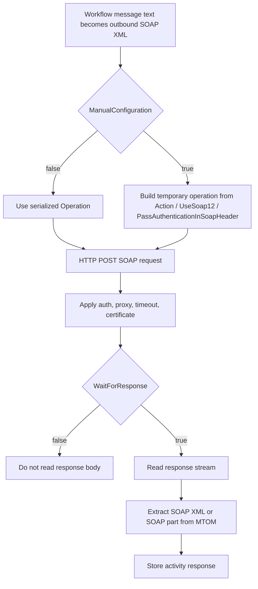

# **Web Service Sender (WebServiceSenderSetting)**

## What this setting controls

`WebServiceSenderSetting` defines a SOAP sender activity. It posts a SOAP envelope to an HTTP endpoint, optionally authenticates, optionally uses a client certificate, optionally uses a proxy, and optionally captures the SOAP response as the activity response.

This page is about the serialized workflow JSON contract and the actual runtime behavior implied by those serialized fields.

Only serialized properties are covered.

## Shared reference

For canonical enum numeric mappings used across workflow JSON, see [Workflow Enum and Interface Reference](../reference/workflow-enums-and-interfaces.md).

For Integrations code API interface contracts used by custom code, see [IMessage in Integration Soup](../api/imessage.md).

## What this activity really is

This activity is not a generic HTTP sender and it is not a generic XML sender.

At runtime it behaves like this:

1. The workflow message text is treated as the outbound SOAP XML envelope.
2. The sender chooses SOAP action, SOAP version, and authentication placement from either:
   - the serialized `Operation` object, or
   - the manual root fields, depending on `ManualConfiguration`
3. It always sends an HTTP `POST`.
4. If a response is expected, it reads the response body and extracts SOAP XML.
5. The extracted response is stored back into the workflow using the configured message type handling.

Important consequences:

- `MessageTemplate` must already produce a valid SOAP envelope.
- This sender does not generate a SOAP body from business fields for you.
- The serialized `Operation` object is not just descriptive metadata. In automatic mode it is the runtime contract.
- MTOM responses are reduced to the SOAP XML part only. Attachments are not surfaced as workflow content.

## Operational model



## JSON shape

Typical serialized shape:

```json
{
  "$type": "HL7Soup.Functions.Settings.Senders.WebServiceSenderSetting, HL7SoupWorkflow",
  "Id": "bda00408-a98e-4d92-9bc0-176e38415bcb",
  "Name": "Submit Order",
  "MessageType": 4,
  "MessageTemplate": "<s:Envelope>...</s:Envelope>",
  "ResponseMessageTemplate": "<s:Envelope>...</s:Envelope>",
  "Server": "https://partner.example.com/service.svc",
  "Wsdl": "https://partner.example.com/service.svc?wsdl",
  "ServiceName": "OrderService",
  "ManualConfiguration": false,
  "Action": "http://tempuri.org/IOrderService/SubmitOrder",
  "UseSoap12": false,
  "PassAuthenticationInSoapHeader": false,
  "Operation": {
    "Name": "SubmitOrder",
    "Action": "http://tempuri.org/IOrderService/SubmitOrder",
    "RequestSoap": "<s:Envelope>...</s:Envelope>",
    "ResponseSoap": "<s:Envelope>...</s:Envelope>",
    "IsOneWay": false,
    "UseSoap12": false,
    "PassAuthenticationInSoapHeader": false,
    "UseCertificateForAuthentication": false,
    "AuthenticationCertificate": false
  },
  "Authentication": false,
  "UserName": "",
  "Password": "",
  "UseAuthenticationCertificate": false,
  "AuthenticationCertificateThumbprint": "",
  "PreAuthenticate": false,
  "UseProxy": 0,
  "ProxyAddress": "",
  "ProxyUserName": "",
  "ProxyPassword": "",
  "TimeoutSeconds": 30,
  "UseDefaultCredentials": false,
  "WaitForResponse": true,
  "Filters": "00000000-0000-0000-0000-000000000000",
  "Transformers": "00000000-0000-0000-0000-000000000000"
}
```

## Field groups

This setting has five practical groups of fields:

- endpoint and discovery fields
- automatic-vs-manual SOAP contract fields
- authentication, certificate, proxy, and timeout fields
- message template and response handling fields
- normal activity linkage fields

The key design issue for JSON authors is that some fields are authoritative only in automatic mode, while others are authoritative only in manual mode.

## Endpoint and discovery fields

### `Server`

The actual HTTP endpoint URL used at runtime.

Runtime impact:

- the SOAP request is posted to this URL
- the runtime does not send to `Wsdl`

Non-obvious outcome:

- when the editor connects to a WSDL successfully, it can overwrite `Server` with the discovered service endpoint address
- if the discovered endpoint differs from the address you entered manually, the saved JSON may round-trip with a different `Server` value than you started with

### `Wsdl`

WSDL address used for discovery in the editor.

Runtime impact:

- none directly for sending

Practical impact:

- the editor can use this to load services, endpoints, operations, SOAP version, action, and example request/response templates
- in manual mode, the editor can still use `Wsdl` for discovery if you explicitly provide it and connect

### `ServiceName`

Discovered service name.

Runtime impact:

- minimal direct impact on sending

Practical impact:

- preserves the discovered service context in JSON
- helps the editor keep the selected service/operation relationship coherent after a discovery pass

## Automatic mode vs manual mode

### `ManualConfiguration`

This is the most important switch in the setting.

JSON meaning:

- `false`: automatic mode
- `true`: manual mode

Runtime effect:

- `false`: runtime uses the serialized `Operation` object as the effective SOAP contract
- `true`: runtime ignores most of `Operation` and builds a temporary operation from the root manual fields

This is the main precedence rule:

- automatic mode: `Operation` is authoritative
- manual mode: `Action`, `UseSoap12`, and `PassAuthenticationInSoapHeader` are authoritative

Non-obvious outcome:

- a JSON object can contain both a populated `Operation` and populated manual fields
- that does not mean both are used
- the one that matters is entirely determined by `ManualConfiguration`

## Automatic-mode contract

### `Operation`

Serialized SOAP operation descriptor.

For this sender, the meaningful JSON-level members are:

- `Name`
- `Action`
- `RequestSoap`
- `ResponseSoap`
- `IsOneWay`
- `UseSoap12`
- `PassAuthenticationInSoapHeader`

The additional serialized members:

- `UseCertificateForAuthentication`
- `AuthenticationCertificate`

may appear in JSON, but they are not the fields that control this sender's client-certificate behavior. Client certificate handling is controlled by the root setting fields instead.

### `Operation.Name`

Human-readable operation identity.

Practical impact:

- allows the editor to preserve the selected operation
- useful for AI or developer inspection of workflow JSON

### `Operation.Action`

SOAP action used in automatic mode.

Runtime impact:

- sent as the request `SOAPAction` header

Non-obvious outcome:

- if this is wrong, the service can reject the request even when the XML body looks correct
- in automatic mode, root-level `Action` is not the real source of truth

### `Operation.RequestSoap`

Generated default outbound SOAP envelope for the operation.

Practical impact:

- acts as the editor's default request template
- used to determine whether the current `MessageTemplate` is still a generated default or has been custom-edited

Important editor behavior:

- if the current request template is blank, or still matches one of the discovered defaults, changing the selected operation can replace it automatically
- if the template no longer matches a discovered default, the editor preserves it and warns that templates were not updated

### `Operation.ResponseSoap`

Generated default response SOAP envelope for the operation.

Practical impact:

- acts as the editor's default response template
- used in the same default-template detection logic as `Operation.RequestSoap`

Important limitation:

- it does not control the real response body returned by the remote service
- it is design-time structure only

### `Operation.IsOneWay`

Whether the discovered operation is treated as one-way.

Practical impact:

- drives the editor's one-way vs two-way state
- affects whether the response-template area is shown in the editor

Non-obvious outcome:

- this field is not just descriptive metadata from discovery
- it materially influences how the setting is edited and persisted
- if JSON contradicts the selected discovered operation, the editor tends to steer the saved setting back toward the discovered operation's direction

### `Operation.UseSoap12`

SOAP version in automatic mode.

JSON values:

- `false` = SOAP 1.1
- `true` = SOAP 1.2

Runtime impact:

- changes the request content type
- changes the response accept header behavior

### `Operation.PassAuthenticationInSoapHeader`

Controls where username/password authentication is placed in automatic mode.

JSON values:

- `false` = use HTTP/network credentials
- `true` = inject a WS-Security `UsernameToken` into the SOAP header

Non-obvious outcome:

- if the outbound SOAP already contains a `Security` header, the runtime does not add another one
- this means pre-authored SOAP security content can override the sender's automatic security-header injection behavior

## Manual-mode contract

These fields are runtime-significant when `ManualConfiguration = true`.

### `Action`

Manual SOAP action.

Runtime impact:

- used as the effective `SOAPAction` header in manual mode

### `UseSoap12`

Manual SOAP version selector.

JSON values:

- `false` = SOAP 1.1
- `true` = SOAP 1.2

Runtime impact:

- controls the outbound SOAP HTTP content type

### `PassAuthenticationInSoapHeader`

Manual authentication placement selector.

JSON values:

- `false` = use HTTP/network credentials
- `true` = insert username/password into the SOAP header as a WS-Security `UsernameToken`

Important outcome:

- this field only becomes authoritative when `ManualConfiguration = true`
- if `ManualConfiguration = false`, the matching field inside `Operation` is the effective source of truth

## Template behavior

### `MessageTemplate`

Outbound SOAP envelope template.

Runtime expectation:

- the workflow message text sent by the activity must be valid XML
- practically, it must be a valid SOAP envelope for the target service

Important editor behavior:

- the editor forces this sender into XML/SOAP usage
- when a new operation is selected, the request template may be replaced automatically if it still looks like a generated default
- once you customize it away from those defaults, the editor preserves it unless you explicitly reset templates

Non-obvious outcome:

- for JSON authors, this means a custom `MessageTemplate` is stable across operation changes only after it departs from the discovered defaults

### `ResponseMessageTemplate`

Design-time response template.

Practical role:

- helps the editor represent the expected response shape
- participates in default-template tracking

Important limitation:

- it does not generate the actual runtime response
- the real response always comes from the remote service

Important editor behavior:

- like `MessageTemplate`, this can be automatically refreshed when the current value still matches a discovered default
- the explicit reset action replaces both request and response templates with the selected operation's generated defaults

## Response handling

### `WaitForResponse`

Controls whether the sender waits for and stores the response.

JSON values:

- `true` = read and retain the response
- `false` = do not retain the response body

Runtime impact:

- when `false`, the sender does not process the response body as workflow content
- when `true`, the sender reads the response stream and extracts SOAP XML

Important editor behavior:

- the editor uses the selected operation's one-way/two-way nature to guide this field
- one-way selections hide the response-template panel and treat the response as absent

Non-obvious outcome:

- the sender can still serialize response-related fields even when the effective operation is one-way
- what matters operationally is whether the saved setting ultimately leaves `WaitForResponse` enabled

## MTOM and response extraction

The response handling has an important limitation that is not obvious from JSON alone.

If the service returns:

- a normal SOAP XML response, the sender stores that XML
- an MTOM multipart response, the sender extracts only the SOAP XML part

Attachments are not surfaced as workflow attachments or binary payloads by this sender.

Practical consequence:

- this activity is suitable for SOAP XML responses
- it is not a full attachment-aware MTOM processing activity

## Authentication fields

### `Authentication`

Enable username/password authentication.

### `UserName`

Username to use when authentication is enabled.

### `Password`

Password to use when authentication is enabled.

Runtime effect:

- these credentials are always taken from the root setting
- where they are applied is determined by the effective operation settings:
  - automatic mode: `Operation.PassAuthenticationInSoapHeader`
  - manual mode: `PassAuthenticationInSoapHeader`

Important outcome:

- the same username/password fields support two different wire-level behaviors:
  - HTTP/network credentials
  - SOAP-header `UsernameToken`

## Client certificate fields

### `UseAuthenticationCertificate`

Attach a client certificate to the outbound request.

### `AuthenticationCertificateThumbprint`

Thumbprint of the client certificate to use.

Runtime impact:

- the runtime looks in the Windows `LocalMachine\My` certificate store
- if the certificate cannot be found, sending fails with a certificate-not-found error

Editor crossover:

- the same certificate settings can also affect whether WSDL discovery succeeds during connection refresh

Non-obvious outcome:

- the certificate-related fields inside `Operation` are not the runtime controls for this
- the root certificate fields are

## Proxy and connection fields

### `UseProxy`

Proxy mode enum.

JSON values:

- `0` = `UseDefaultProxy`
- `1` = `ManualProxy`
- `2` = `None`

### `ProxyAddress`

Proxy URL when `UseProxy = 1`.

### `ProxyUserName`

Manual proxy username when `UseProxy = 1`.

### `ProxyPassword`

Manual proxy password when `UseProxy = 1`.

### `PreAuthenticate`

Enables pre-authentication behavior where supported by the underlying HTTP stack.

### `UseDefaultCredentials`

Use the process or logged-in user's default credentials where applicable.

### `TimeoutSeconds`

Request timeout.

Non-obvious outcome:

- these fields affect both runtime send behavior and editor discovery behavior
- if a service is only reachable through a proxy, or only reachable with auth, the saved operation metadata may depend on these fields being correct during the editor's connect/refresh pass

## Discovery and editor round-trip behavior

The editor matters for this setting because it can materially rewrite serialized values.

Behavior that matters to JSON authors:

- connection refresh can discover operations and then repopulate `Operation`
- connection refresh can overwrite `Server` with the discovered endpoint address
- connection refresh can populate `ServiceName`
- if the service initially returns unauthorized and authentication is not enabled, the editor can turn authentication on and retry discovery once
- if the discovered operation indicates SOAP-header authentication, the editor can enable that path automatically

This means that a JSON document authored manually may not round-trip unchanged after opening and re-saving in the editor.

The biggest round-trip-sensitive fields are:

- `Server`
- `ServiceName`
- `Operation`
- `MessageTemplate`
- `ResponseMessageTemplate`
- `WaitForResponse`

## Message type

### `MessageType`

For this sender, the meaningful serialized value is:

- `4` = `XML`

Practical impact:

- the editor forces this sender into XML-only usage
- broader sender infrastructure may support other message types, but this activity is effectively SOAP/XML in normal use

### `MessageTypeOptions`

This can serialize through shared sender infrastructure, but for this sender the meaningful operating mode is XML/SOAP.

## Workflow linkage fields

### `Filters`

GUID of the sender filter chain.

### `Transformers`

GUID of the sender transformer chain.

Practical impact:

- these shape the outbound workflow message before it is sent as SOAP XML

### `Disabled`

If `true`, the sender is disabled.

### `Id`

Unique identifier for the activity.

### `Name`

User-facing activity name.

## Defaults

New instances default to:

- `TimeoutSeconds = 30`
- `UseProxy = 0`
- `WaitForResponse = true`

## Recommended JSON authoring patterns

### WSDL-driven automatic mode

Use this when discovery succeeded and the serialized operation metadata is trusted.

Recommended characteristics:

- `ManualConfiguration = false`
- populated `Operation`
- `MessageType = 4`
- `MessageTemplate` aligned with the intended SOAP request shape

This is the safer mode when you want the saved JSON to remain aligned with discovered SOAP metadata.

### Fully manual SOAP mode

Use this when the WSDL is unavailable, incomplete, inaccessible, or not the contract you want to follow.

Recommended characteristics:

- `ManualConfiguration = true`
- explicit `Action`
- explicit `UseSoap12`
- explicit `PassAuthenticationInSoapHeader`
- manually curated `MessageTemplate`

In this mode, do not assume `Operation` is authoritative even if it is still populated in JSON.

### Custom templates that survive editor round-trip

If you want custom request and response templates to survive operation changes in the editor:

- customize them so they no longer match the discovered defaults
- avoid using template reset unless you intend to restore the discovered defaults

## Hidden outcomes and common traps

- `Wsdl` is for discovery, not sending.
- `Server` can be replaced by discovered endpoint metadata during editor refresh.
- In automatic mode, `Operation` is the real SOAP contract.
- In manual mode, the root manual fields are the real SOAP contract.
- `ResponseMessageTemplate` is design-time only. It does not create the actual response body.
- One-way vs two-way behavior is influenced by discovered operation metadata, not just by free-form JSON values.
- Username/password can be applied either as HTTP credentials or as a SOAP-header `UsernameToken`, depending on the effective operation settings.
- Existing SOAP security headers suppress automatic insertion of another security header.
- Client certificate lookup is fixed to the machine personal certificate store.
- MTOM attachments are discarded; only the SOAP XML part is retained.
- Discovery settings and runtime settings are coupled. Proxy, auth, certificate, and timeout choices affect both what the editor can discover and what the runtime can send.

## Examples

### WSDL-driven automatic mode

```json
{
  "$type": "HL7Soup.Functions.Settings.Senders.WebServiceSenderSetting, HL7SoupWorkflow",
  "Id": "aaaaaaaa-aaaa-aaaa-aaaa-aaaaaaaaaaaa",
  "Name": "Submit Order",
  "MessageType": 4,
  "Server": "https://partner.example.com/OrderService.svc",
  "Wsdl": "https://partner.example.com/OrderService.svc?wsdl",
  "ServiceName": "OrderService",
  "ManualConfiguration": false,
  "Operation": {
    "Name": "SubmitOrder",
    "Action": "http://tempuri.org/IOrderService/SubmitOrder",
    "RequestSoap": "<s:Envelope>...</s:Envelope>",
    "ResponseSoap": "<s:Envelope>...</s:Envelope>",
    "IsOneWay": false,
    "UseSoap12": false,
    "PassAuthenticationInSoapHeader": false
  },
  "MessageTemplate": "<s:Envelope>...</s:Envelope>",
  "WaitForResponse": true
}
```

### Fully manual SOAP mode

```json
{
  "$type": "HL7Soup.Functions.Settings.Senders.WebServiceSenderSetting, HL7SoupWorkflow",
  "Id": "bbbbbbbb-bbbb-bbbb-bbbb-bbbbbbbbbbbb",
  "Name": "Manual SOAP Call",
  "MessageType": 4,
  "Server": "https://partner.example.com/legacy",
  "ManualConfiguration": true,
  "Action": "urn:LegacyService/Submit",
  "UseSoap12": true,
  "PassAuthenticationInSoapHeader": true,
  "Authentication": true,
  "UserName": "apiuser",
  "Password": "securepassword",
  "MessageTemplate": "<s:Envelope>...</s:Envelope>",
  "WaitForResponse": true
}
```

## Useful public references

- [Integration Soup](https://www.integrationsoup.com/)
- [HL7 Interfacer Blog](https://hl7interfacer.blogspot.com/)
