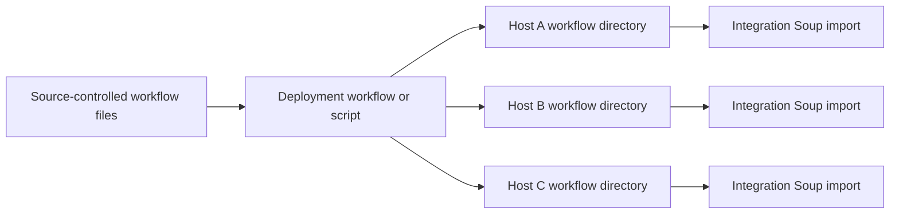

# Deployment Patterns

## What this page covers

This page explains how to deploy the same workflow files to one or more Integration Soup hosts.

The focus is operational:

- single-host rollout
- Docker rollout
- multiple servers and load-balanced sites
- practical rules that avoid partial or inconsistent deployment

---

## Multi-host deployment model

---

## Pattern 1: single host

For a single host, deployment can be very simple.

Common models:

- author directly on the host and commit from the same machine
- push to a central repository and copy approved workflow files back to the host

Import choice:

- `Automatic` is a good fit when file deployment should take effect without restart
- `On restart` is a good fit when rollout should happen only during a controlled restart window

This is usually the easiest place to start.

---

## Pattern 2: Docker

Docker changes how the workflow directory is presented to the host process, but the same black-box model still applies.

### Bind-mounted or externally managed workflow directory

This is usually the best fit when workflows change independently of the container image.

Benefits:

- workflow files can be updated without rebuilding the image
- the same mounted directory can be updated by external deployment tooling
- `Automatic` mode can react after files land in the mounted workflow directory

### Image-baked workflows

This is a good fit when:

- workflow files are released together with the container image
- image immutability is more important than changing workflows independently

Trade-off:

- updating workflows normally means building and redeploying a new image

### Avoid relying on the container writable layer

Treat workflow files as external data, not as disposable container-local state.

If workflow files only live in the container writable layer, recreating the container can discard those changes.

---

## Pattern 3: multiple servers and load-balanced sites

When several hosts serve the same workload, each host should receive the same approved workflow set.

Common model:

- one authoritative repository
- one coordinated deployment step
- one workflow directory per node

Recommended rollout approaches:

### Rolling deployment with `Automatic`

Use this when you want nodes to import updated files without waiting for a restart.

Typical sequence:

1. Drain or reduce traffic to one node if required.
2. Copy the new workflow files to that node.
3. Let the host import them.
4. Verify the node.
5. Return it to service.
6. Repeat for the remaining nodes.

### Rolling deployment with `On restart`

Use this when rollout is intentionally tied to service restart.

Typical sequence:

1. Copy the approved workflow files to the node.
2. Restart the host or container in the maintenance window.
3. Verify startup import.
4. Return the node to service.
5. Repeat for the remaining nodes.

This keeps version changes aligned with controlled restart points.

---

## Shared storage vs per-node copies

Both models are possible.

### Per-node copies

This is usually easier to reason about.

Benefits:

- each node has a clearly owned local workflow directory
- rollout order can be controlled
- storage or deployment issues stay isolated to the affected node

### Shared storage

This can reduce duplication, but it makes the workflow directory part of shared infrastructure.

Only use it when:

- the shared filesystem behaves reliably for all hosts
- operational ownership is clear
- simultaneous access patterns are understood

In most environments, per-node deployment is simpler and safer.

---

## Handling additions, updates, and deletions

Deployment processes should decide explicitly how each change type is handled.

### Additions and updates

These are usually straightforward:

- copy the new file
- overwrite the old file when appropriate
- let Integration Soup import according to its configured mode

### Deletions

Deletions need more care.

Possible strategies:

- additive deployment:
  only copy new and changed files, handle deletions separately
- authoritative deployment:
  make the target directory match the repository exactly

Authoritative deployment is powerful, but it should only be used when the target workflow directory is fully managed by source control and deployment automation.

---

## Operational recommendations

- Prefer complete-file copy or stage-then-rename rather than partial in-place writes.
- Keep one clear source of truth for current workflow files.
- Make deletion behavior an intentional design decision.
- Use `Automatic` when file arrival should trigger live import.
- Use `On restart` when rollout should happen under maintenance control.
- Verify one node before broad rollout in multi-node environments.

## Related pages

- [Workflow Directory and Source Control](workflow-directory.md)
- [GitHub Integration](github.md)
- [Generic Git Patterns](generic-git.md)
