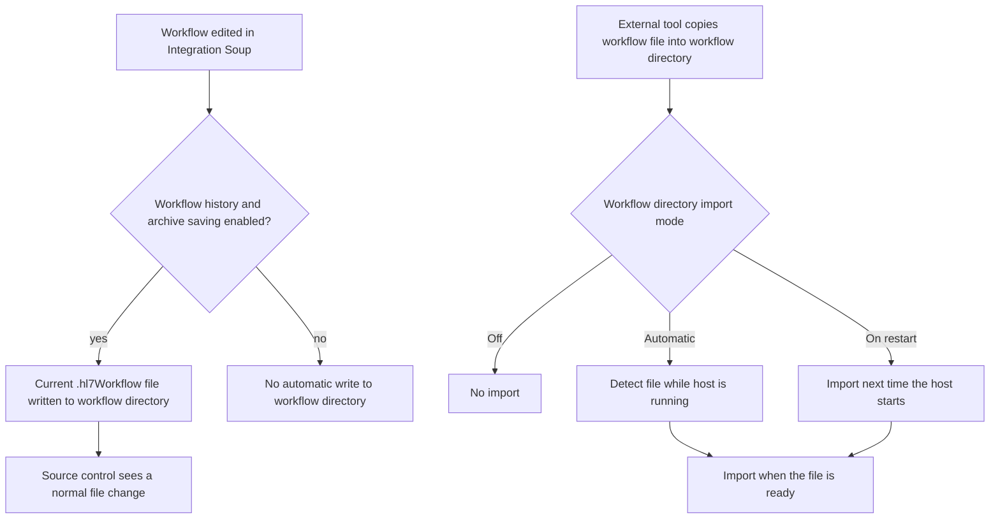

# Workflow Directory and Source Control

## What this page covers

This page documents the workflow directory as a black-box operational feature:

- where the current workflow files live
- when Integration Soup writes files there
- when Integration Soup imports files from there
- how this interacts with source control and deployment tooling

This page does not describe internal classes or code paths.

---

## Operational model



---

## What the workflow directory is

The workflow directory is the host's local folder of current workflow files.

For the standard Integration Host application name, it resolves under the host's program-data area as:

```text
%ProgramData%\popokey\HL7SoupIntegrationServer\Workflows
```

Treat this folder as the current working set of workflows for the host.

Important boundary:

- This is the folder source control and deployment tooling should work with.
- It is not the same thing as the internal workflow history archive.

## Workflow directory vs workflow history archive

These are different stores with different purposes:

- Workflow directory:
  current workflow files, one current file per workflow, suitable for source control and deployment
- Workflow history archive:
  version history used by Workflow History, stored separately, not the recommended target for source control deployment

In practice, source control normally tracks the workflow directory, not the workflow history archive.

---

## Save behavior

Integration Soup can write the current workflow file back to the workflow directory.

This happens when workflow history and archive saving is enabled.

Operationally:

- one current `.hl7Workflow` file is maintained per workflow
- the file name is normalized to the workflow ID
- saving a workflow updates that current file in the workflow directory
- historical versions are stored separately in the workflow history archive, not as versioned files in the workflow directory

This means:

- if the workflow directory is also a git working copy, a normal save appears as a normal modified file
- if the workflow directory is a sync target, external tooling can detect the updated file and publish it elsewhere

If workflow history and archive saving is not enabled, Integration Soup does not automatically export workflow edits to the workflow directory.

---

## Delete behavior

When a workflow is removed from the host, Integration Soup removes the corresponding current `.hl7Workflow` file from the workflow directory.

This means:

- source control sees a normal file deletion
- deployment tooling can propagate that deletion if the deployment process is designed to do so

Workflow history entries are managed separately from the current workflow file.

---

## Import behavior

Integration Soup can import workflow files that are placed into the workflow directory.

Accepted file types:

- `.hl7Workflow`
- `.soupworkflow`

Important runtime behavior:

- importing is local-file based only
- normal workflow validation and licensing rules still apply
- if a dropped file is not named after the workflow ID, Integration Soup can normalize the file name after reading it
- older or unchanged files are ignored
- newer files replace the currently loaded workflow with the same workflow ID
- invalid, corrupt, or partially copied files may be skipped and retried later

Dropping a file into the folder does not bypass the normal import path. It is still treated as a real workflow import.

---

## Import modes

The host supports three workflow directory import modes:

### `Off`

- no startup import
- no automatic background import

Use this when the folder is used only as an export target, or when another process stages files there but import should remain disabled.

### `On restart`

- the directory is scanned when the host starts
- files dropped in while the host is already running are not imported until the next restart

This is the default mode.

Use this when you want controlled rollout tied to service restarts.

### `Automatic`

- the directory is scanned when the host starts
- new or updated files can also be imported while the host is running
- the host detects new files locally and imports them when they are ready

Use this when external deployment tooling copies workflow files onto the machine and you want those changes to load without waiting for a restart.

---

## What this means for source control

Source control works with Integration Soup by managing files around the workflow directory.

Two common patterns are:

1. The repository working copy is the workflow directory.
2. The repository lives elsewhere and a separate sync or deployment step copies workflow files into the workflow directory.

Both patterns are valid.

The important rule is:

- Integration Soup owns local workflow import and export behavior.
- Source control tooling owns commit, push, pull, branch, review, and deployment behavior.

---

## Operational recommendations

- If you want Integration Soup saves to appear as tracked file changes, enable workflow history and archive saving.
- Use the workflow directory as the managed current-state folder.
- Prefer complete-file replacement over partial in-place writes.
- If possible, copy to a temporary file name and rename into place once the file is complete.
- Decide explicitly how deletions should be handled in your deployment process.
- Keep source control and deployment logic outside the Integration Soup host process.

## Related pages

- [GitHub Integration](github.md)
- [Generic Git Patterns](generic-git.md)
- [Deployment Patterns](deployment-patterns.md)
