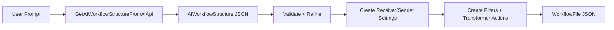

# AI Workflow Structure (AiWorkflowStructure)
**Definitive JSON Contract + Runtime API Notes**

`AiWorkflowStructure` is the AI planning contract used before a real `WorkflowFile` is built.

It is an intermediate model for:
- interpreting user intent
- describing receiver/sender behavior
- producing filter/transformer instructions
- then materializing concrete receiver/sender/filter/transformer settings

It is not the executable workflow JSON format.  
For executable workflow JSON, use [WorkflowFile](../api/workflowfile.md).

---

## Where it fits in the pipeline



---

## JSON contract (object shape)

Top-level object:

```json
{
  "ReceiverActivity": {
    "MessageSource": "TCP",
    "MessageType": "HL7",
    "ImportData": "",
    "Instructions": "",
    "PreFilter": {
      "Instruction": "",
      "ImportData": "",
      "Comment": "",
      "CodeRequired": false
    },
    "Filters": [
      {
        "Instruction": "",
        "ImportData": ""
      }
    ],
    "VariableTransformers": [
      {
        "Instruction": "",
        "ImportData": "",
        "Comment": "",
        "CodeRequired": false
      }
    ],
    "MessageTemplate": "",
    "ReturnedMessageTransformers": [
      {
        "Instruction": "",
        "ImportData": "",
        "Comment": "",
        "CodeRequired": false
      }
    ],
    "ReturnedMessageTemplate": "",
    "Id": "3f1a6d88-2d62-4f87-bcd3-60ab35717dc1"
  },
  "SenderActivities": [
    {
      "Id": "c0609ca2-1f11-4b17-b0db-cc15fb8cf24f",
      "SenderAction": "HTTP",
      "Name": "Post to API",
      "MessageType": "JSON",
      "ImportData": "",
      "Instructions": "",
      "PreFilter": {
        "Instruction": "",
        "ImportData": "",
        "Comment": "",
        "CodeRequired": false
      },
      "Filters": [
        {
          "Instruction": "",
          "ImportData": ""
        }
      ],
      "Transformers": [
        {
          "Instruction": "",
          "ImportData": "",
          "Comment": "",
          "CodeRequired": false
        }
      ],
      "MessageTemplate": "",
      "ReturnedMessageTemplate": ""
    }
  ],
  "GlobalVariables": [
    "ApiBaseUrl"
  ]
}
```

Runtime-only property (not part of the schema-driven AI response contract):

```json
{
  "ImportedFrom": "Mirth"
}
```

---

## Field definitions

## `AiWorkflowStructure`

| Property | Type | Meaning |
|---|---|---|
| `ReceiverActivity` | object | Required planning description of the source/receiver stage. |
| `SenderActivities` | array | Ordered list of sender stage plans. |
| `GlobalVariables` | array of string | Names of global variables referenced by the design/import context. |
| `ImportedFrom` | string | Runtime metadata for import context (for example `Mirth`), used for prompting and conversion hints. |

## `AiReceiverActivity`

| Property | Type | Meaning |
|---|---|---|
| `MessageSource` | string | Logical source family. |
| `MessageType` | string | Logical payload type. |
| `ImportData` | string | Raw imported source config text (verbatim). |
| `Instructions` | string | Human-language receiver requirements/config. |
| `PreFilter` | `AiTransformerSet` | Variable/setup instruction block intended before filters. |
| `Filters` | array of `AiFilterSet` | Receiver filter rule instruction groups. |
| `VariableTransformers` | array of `AiTransformerSet` | Variable creation/update instruction groups. |
| `MessageTemplate` | string | Inbound sample/template used for path and mapping context. |
| `ReturnedMessageTransformers` | array of `AiTransformerSet` | Final response-transform instruction groups. |
| `ReturnedMessageTemplate` | string | Response template intent (for return path). |
| `Id` | string (GUID) | Activity identifier hint; auto-generated if invalid/missing. |

## `AiSenderActivity`

| Property | Type | Meaning |
|---|---|---|
| `Id` | string (GUID) | Sender activity identifier hint; auto-generated if invalid/missing. |
| `SenderAction` | string | Intended sender family/action type. |
| `Name` | string | Friendly sender name. |
| `MessageType` | string | Sender payload type. |
| `ImportData` | string | Raw imported sender config text (verbatim). |
| `Instructions` | string | Human-language sender requirements/config. |
| `PreFilter` | `AiTransformerSet` | Variable/setup instruction block intended before sender filters. |
| `Filters` | array of `AiFilterSet` | Sender filter rule instruction groups. |
| `Transformers` | array of `AiTransformerSet` | Sender transform/mapping instruction groups. |
| `MessageTemplate` | string | Outbound message template intent. |
| `ReturnedMessageTemplate` | string | Sender response template intent. |

## `AiFilterSet`

| Property | Type | Meaning |
|---|---|---|
| `Instruction` | string | Filter intent text. |
| `ImportData` | string | Raw imported filter config text. |

## `AiTransformerSet`

| Property | Type | Meaning |
|---|---|---|
| `Instruction` | string | Transformation intent text. |
| `ImportData` | string | Raw imported transform config text. |
| `Comment` | string | Optional user-facing heading/summary. |
| `CodeRequired` | boolean | Indicates this set should be treated as code-oriented. |

---

## Pseudo-enum value conventions

These are string conventions used by prompts and validation, not strongly typed C# enums in this contract.

`ReceiverActivity.MessageSource`:
- `TCP`
- `HTTP`
- `SOAP`
- `Database`
- `Timer`
- `File`

`ReceiverActivity.MessageType` and `SenderActivities[].MessageType`:
- `HL7`
- `XML`
- `CSV`
- `SQL`
- `JSON`
- `Binary`

`SenderActivities[].SenderAction` canonical set used by repair/validation flow:
- `TCP`
- `Database`
- `File`
- `HTTP`
- `SOAP`
- `Dicom`
- `Code`

---

## API surface

Primary API call that returns this structure:

```csharp
Task<string> GetAIWorkflowStructureFromAiApi(
    string userPrompt,
    string systemPrompt,
    string model)
```

Companion validation call used during iterative correction:

```csharp
Task<string> GetAiWorkflowStructureValidationResultFromAiApi(
    string userPrompt,
    string systemPrompt,
    string model)
```

Key behavior:
- The structure API is schema-driven.
- The validation API can request repairs and clarification loops.
- The final result is deserialized into `AiWorkflowStructure`, then converted to concrete settings and `WorkflowFile`.

---

## Non-obvious runtime outcomes

- `ImportedFrom` is intentionally excluded from the schema used by `GetAIWorkflowStructureFromAiApi`; treat it as runtime/import context metadata.
- `GlobalVariables` is captured in this structure, but this stage does not directly create global variable definitions in host storage.
- IDs are normalized with GUID generation when missing/invalid (`EnsureIdIsValid`), so caller-provided IDs are hints, not guaranteed final IDs.
- `PreFilter` participates in prompt context, but there is no direct one-to-one materialization step that creates a dedicated pre-filter setting object from this field.
- Schema generation for this call suppresses properties named `Filters` and `Transformers`; those fields may still exist in JSON, but they are not strongly enforced by the schema in this API step.
- Receiver/sender transformer description enrichment currently updates the first set (`[0]`) in the dedicated description-refinement pass; additional sets are not rewritten in that pass.
- Sender response template propagation is not force-applied in the same way as receiver template assignment; rely on sender-setting generation and transformer instructions for response behavior.

---

## Authoring guidance for AI agents

1. Treat this as a planning contract, not as final executable workflow JSON.
2. Keep `MessageSource`, `MessageType`, and `SenderAction` canonical to reduce repair iterations.
3. Put connection/config requirements in `Instructions`; keep field-level mapping logic in transformer `Instruction` blocks.
4. Include message templates when pathing/mapping precision matters.
5. Use stable activity names and IDs to improve downstream setting and transformer generation.
6. After structure generation, always run validation/refinement before generating concrete settings.

---

## Related docs

- [WorkflowFile](../api/workflowfile.md)
- [CodeContext](../api/codingcontext.md)
- [Paths For AI](../reference/pathsforai.md)
- [Filter Host (FilterHostSetting)](../reference/filter-host-setting.md)
- [Transformer Setting (TransformerSetting)](../reference/transformer-setting.md)
- [Variable Creator JSON Reference](../reference/variable-creator.md)
