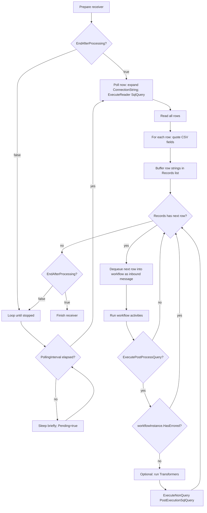

# Database Receiver (DatabaseReceiverSetting)

_Date: 2026-02-27 (Pacific/Auckland). Audience: AI agents and developers who author or edit Integration Soup workflow JSON._

## Executive summary

**Database Receiver** (shown in UI as **Database Reader**) is a polling receiver that repeatedly executes a SQL query (`SqlQuery`) against a configured database connection and turns **each returned row** into one inbound workflow message (default: **CSV**). It is commonly used to treat a database table (or view) as a lightweight “message queue”: select unprocessed rows → run workflow per row → optionally mark the row processed via a post-execution update query.

Non-obvious behaviors that matter when authoring JSON:

- **All rows from the poll query are buffered into memory** as strings (`Records`) before processing them one-by-one. Large result sets can spike memory and cause long “catch-up” bursts.
- Each row is emitted as a **CSV line**, where every field is **double-quoted**, internal quotes are escaped (`"` → `""`), and fields whose runtime type is `byte[]` are **base64 encoded**.
- The optional post-execution SQL (`PostExecutionSqlQuery`) runs **only when `ExecutePostProcessQuery` is true** and **only if the workflow did not error**. This prevents marking a row “processed” when downstream activities fail—but it also means partially-successful workflows can cause duplicates on retry.
- `ConnectionString` is expanded using **global variables**, and supports `config=...` indirection for polling. However, the post-execution update uses a different connection-string path (see pitfalls).
- Provider quirks matter: **Oracle uses `:`** and parameter name normalization; **OleDb/Odbc may be positional**, while the UI sorts parameters alphabetically when saving; **SqlClient vs SqlClientOld** is controlled by `Version` and `Upgrade()` behavior.

Assumptions and limits of this guide:

- **MessageTypes numeric values** (e.g., CSV, SQL) are not fully defined in the provided code. Relevant numeric values are listed; unused are explicitly marked **unspecified**.
- The guide focuses on **JSON-level serialized properties** that are created and persisted by the Database Receiver editor and used by runtime execution.

## Serialized JSON contract

### Canonical JSON shape for DatabaseReceiverSetting

This canonical example includes the receiver’s common workflow fields plus Database Receiver–specific fields. It is intentionally explicit to avoid ambiguity when JSON is authored outside the UI.

```json
{
  "Id": "11111111-1111-1111-1111-111111111111",
  "Name": "Database Reader",
  "Version": 3,

  "Disabled": false,
  "Filters": "00000000-0000-0000-0000-000000000000",
  "Activities": [
    "22222222-2222-2222-2222-222222222222"
  ],
  "WorkflowPatternName": "Database Reader",
  "LastModified": "0001-01-01T00:00:00",

  "MessageType": 5,
  "MessageTypeOptions": null,
  "ReceivedMessageTemplate": "PatientId,LastName,FirstName,Dob",

  "VariableTransformers": "00000000-0000-0000-0000-000000000000",

  "ConnectionString": "config=MainDb",
  "DataProvider": 0,

  "SqlQuery": "SELECT PatientId, LastName, FirstName, Dob FROM Patients WHERE Processed = 0",
  "Parameters": [],

  "EndAfterProcessing": false,
  "PollingInterval": "00:00:10",

  "ExecutePostProcessQuery": true,
  "Transformers": "00000000-0000-0000-0000-000000000000",
  "TransformersNotAvailable": false,

  "PostExecutionSqlQuery": "UPDATE Patients SET Processed = 1 WHERE PatientId = @PatientId",
  "PostExecutionParameters": [
    {
      "Name": "@PatientId",
      "Value": "[1]",
      "FromDirection": 0,
      "FromType": 11,
      "FromSetting": "11111111-1111-1111-1111-111111111111"
    }
  ]
}
```

Notes that matter for correctness:

- `MessageType` is forced to CSV by the UI, and runtime output is a quoted CSV line per row. If you set a non-CSV message type in JSON, you are likely to break downstream bindings.
- `ReceivedMessageTemplate` is a **binding aid**, not runtime output. The UI normalizes it (removes whitespace and brackets) and uses it to build binding trees.
- `Parameters` apply to `SqlQuery`. `PostExecutionParameters` apply to `PostExecutionSqlQuery`.

### Canonical JSON shape for DatabaseSettingParameter

Database Receiver uses the same parameter object type as Database Query (sender). It is used in **two lists**:

- `Parameters`: applied to `SqlQuery` (poll/read query)
- `PostExecutionParameters`: applied to `PostExecutionSqlQuery` (post-update query)

Example: parameter sourced from workflow variables (text with `${...}` placeholders):

```json
{
  "Name": "@StartDate",
  "Value": "${StartDate}",
  "FromDirection": 2,
  "FromType": 8,

  "Encoding": 0,
  "TextFormat": 0,
  "Truncation": 0,
  "TruncationLength": 50,
  "PaddingLength": 0,
  "Lookup": null,
  "Format": null
}
```

Example: parameter bound to the receiver’s current inbound row-message (typical for post-update):

```json
{
  "Name": "@PatientId",
  "Value": "[1]",
  "FromDirection": 0,
  "FromType": 11,
  "FromSetting": "11111111-1111-1111-1111-111111111111"
}
```

### Complete serialized field list

This is the practical “JSON surface area” that Database Receiver creates, reads, and/or depends on. The “Required” column is from the perspective of producing a setting that is valid in UI and safe at runtime.

#### DatabaseReceiverSetting fields

| Field | Type | Default | Required | Notes |
|---|---|---|---|---|
| `Id` | GUID string | none | yes | Receiver activity ID. Must remain stable for bindings; used for `FromSetting` references. |
| `Name` | string | none | yes | UI name; also used as fallback for `WorkflowPatternName` if empty. |
| `Version` | int | (set by base/host) | strongly recommended | Impacts `Upgrade()` behavior (notably SqlClient migration). Use `3`+ unless intentionally preserving legacy behavior. |
| `Disabled` | bool | `false` | recommended | Disabled settings may be allowed to persist even if invalid. |
| `Filters` | GUID string | `00000000-...` | recommended | Filter setting ID for receiver. |
| `Activities` | array of GUID strings | `[]` | recommended | Activities executed for each received row-message. |
| `WorkflowPatternName` | string | `""` (but returns `Name` at runtime if empty) | optional | Used for grouping/UX; still persisted. |
| `LastModified` | date string | `0001-01-01T00:00:00` | optional | Present in the code surface; often not relied on in runtime logic. |
| `MessageType` | int enum | CSV (numeric **unspecified** here) | yes | UI forces CSV; the receiver constructs messages with this type. |
| `MessageTypeOptions` | object or null | null | optional | Used only for message parsing (e.g., CSV header/delimiter). Misuse can break row messages. |
| `ReceivedMessageTemplate` | string | null/empty | yes (UI) | “Result Fields” helper for binding; normalized by UI (no whitespace/brackets). |
| `VariableTransformers` | GUID string | `00000000-...` | optional | Variable mapping location; not used directly in receiver runtime loop, but affects workflow variables overall. |
| `ConnectionString` | string | `""` | yes | Supports `config=...` and global variable expansion (details below). |
| `DataProvider` | int enum | `0` (`SqlClient`) | yes | Determines DB driver and parameter conventions. |
| `SqlQuery` | string | null/empty | yes | Polling query. Executed via `ExecuteReader()` as `CommandType.Text`. |
| `Parameters` | array of `DatabaseSettingParameter` | `[]` | recommended | Parameters applied to `SqlQuery`. UI derives these from the SQL text. |
| `EndAfterProcessing` | bool | `false` | recommended | If true: poll once on start and exit after processing any returned rows. |
| `PollingInterval` | timespan string | `"00:00:10"` | recommended | Only used when `EndAfterProcessing=false`. Defines time between polls, not time between rows. |
| `ExecutePostProcessQuery` | bool | `false` | conditional | If true: post-update runs after each row is processed (only if workflow succeeded). |
| `PostExecutionSqlQuery` | string | null/empty | conditional | SQL executed after row processing (when enabled). Executed via `ExecuteNonQuery()`. |
| `PostExecutionParameters` | array of `DatabaseSettingParameter` | `[]` (often null unless set) | conditional | Parameters applied to `PostExecutionSqlQuery`. Typically bound to receiver inbound message. |
| `Transformers` | GUID string | `00000000-...` | conditional | Only used when post-process is enabled; executed before post-update SQL. |
| `TransformersNotAvailable` | bool | `false` | conditional | UI sets true when post-execution is disabled; runtime checks this flag before running transformers. |
| `ExecutePostProcess` | bool | aliases `ExecutePostProcessQuery` | avoid authoring directly | Compatibility alias: setter updates `ExecutePostProcessQuery`. If both appear in JSON, last-write wins during deserialization. |

#### DatabaseSettingParameter fields

This list reflects the full parameter object that can be persisted and influences runtime behavior.

| Field | Type | Default | Required | Notes |
|---|---|---|---|---|
| `Name` | string | none | yes | Parameter token, including prefix (`@Param`, `:Param` for Oracle). UI often stores names lowercased. |
| `Value` | string | none | yes | Source expression: literal text with `${...}` when variable-based, or a path when activity-bound. |
| `FromType` | int enum (`MessageTypes`) | `TextWithVariables` | yes | **Path selector**, not “message type.” Must be `8–12` (see mappings). |
| `FromDirection` | int enum | `2` (variable) | yes | `0=inbound`, `1=outbound`, `2=variable`. |
| `FromSetting` | GUID string | `00000000-...` | conditional | Required if `FromDirection` is `0` or `1`; should be empty/omitted if `2`. |
| `FromNamespaces` | object or null | null | optional | Used for XML namespaces in other contexts; not used by Database Receiver execution shown here. |
| `IsValid` | bool | `true` | optional | UI validation marker; JSON authors can omit. |
| `AllowBinding` | bool | `true` | optional | UI hint controlling whether binding UI is exposed; not used by execution. |
| `Start` / `End` | int | `0` | optional | Present but not used by Database Receiver execution shown here. |
| `Encoding` | int enum | `0` (None) | optional | Formatting; numeric mapping **unspecified** here. |
| `TextFormat` | int enum | `0` (None) | optional | Formatting; numeric mapping **unspecified** here. |
| `Truncation` | int enum | `0` (None) | optional | Formatting; numeric mapping **unspecified** here. |
| `TruncationLength` | int | `50` | optional | Used when truncation applies. |
| `PaddingLength` | int | `0` | optional | Optional padding. |
| `Format` | string or null | null | optional | Formatting string applied by `Variable.ProcessFormat`. |
| `Lookup` | string or null | null | optional | Optional lookup key for mapping. |
| `Replace` / `ReplaceWith` / `Remove` | string | null | optional | Present but treated as non-core formatting knobs; not surfaced in the included parameter UI excerpts. |

## Binding semantics and enum mappings

### Explicit parameter binding rules

Database Receiver resolves parameter values using:

1. `TransformerAction.GetTheValue(workflowInstance, param.Value, param.FromSetting, param.FromDirection, null)`
2. `Variable.ProcessFormat(value, param)` (formatting layer)
3. Assign to DB parameter: `DbParameter.Value = value` (**string**)

Practical rules for JSON authors:

- If `FromDirection = 2` (**variable**):
  - `Value` is treated as literal text that may include `${VariableName}` placeholders.
  - `FromSetting` must be empty/omitted.
  - `FromType` should be `8` (**TextWithVariables**).
- If `FromDirection = 0` (**inbound**) or `1` (**outbound**):
  - `FromSetting` must be the GUID of the source setting whose message you bind to.
  - `Value` must be a valid path expression for the source message type.
  - `FromType` must be the correct *path-type enum* (HL7 path, XPath, CSVPath, JSONPath), not the message’s base type.

### FromType vs MessageType: do not confuse them

- Receiver’s `MessageType` describes **what kind of inbound message object** the database row becomes (forced to CSV in UI).
- Parameter’s `FromType` describes **how to interpret the `Value` expression** (TextWithVariables vs a path language).

Known `FromType` numeric mappings (authoritative from the parameter’s own description):

| FromType numeric | Meaning | When to use |
|---:|---|---|
| `8` | `TextWithVariables` | `Value` is literal text and/or `${...}` expansions |
| `9` | `HL7V2Path` | `Value` is an HL7 v2 path like `PID-5.1` |
| `10` | `XPath` | `Value` is an XPath expression |
| `11` | `CSVPath` | `Value` targets CSV fields like `[1]` |
| `12` | `JSONPath` | `Value` is a JSONPath-like expression |

Other `MessageTypes` numeric values (e.g., CSV, SQL, HL7, XML, JSON) exist in the product but are **unspecified** in the provided code excerpt. If you must set `MessageType` numerically in JSON, confirm against your authoritative enum source.

### MessageSourceDirection mapping (used by FromDirection)

The numeric mapping is explicit in the parameter’s documentation:

| FromDirection numeric | Name | Meaning |
|---:|---|---|
| `0` | `inbound` | Bind to a setting’s inbound/received message (for senders, this is commonly the response) |
| `1` | `outbound` | Bind to a sender’s outbound/sent message |
| `2` | `variable` | Use literal text and workflow variable expansion |

**Receiver-specific binding rule:** if the source setting is a **receiver**, you generally bind to `FromDirection=0` only (you bind to what it received).

### DataProviders mapping and differences

Numeric mapping is determined by enum declaration order:

| DataProvider numeric | Name | DB driver | Provider quirks relevant to JSON |
|---:|---|---|---|
| `0` | `SqlClient` | `Microsoft.Data.SqlClient` | Preferred “new” SQL Server provider. |
| `1` | `OracleClient` | `Oracle.ManagedDataAccess.Client` | Uses `:` tokens in SQL text; command sets `BindByName = true`; parameter names are normalized (leading `:` removed for the actual parameter object). |
| `2` | `OleDb` | `System.Data.OleDb` | **Windows-only** on modern .NET; may behave positionally depending on provider/driver. |
| `3` | `Odbc` | `System.Data.Odbc` | Often positional depending on driver; parameter order can matter. |
| `4` | `SqlClientOld` | `System.Data.SqlClient` | Legacy SQL Server provider; can be forced by `Upgrade()` for older versions. |
| `5` | `MySql` | `MySqlConnector` | Named parameters typically use `@`. |
| `6` | `PostgreSql` | `Npgsql` | Named parameters typically use `@`. |
| `7` | `Sqlite` | `Microsoft.Data.Sqlite` | Named parameters typically use `@`. |

Provider-specific parameter rules:

- **Oracle**
  - SQL text uses `:ParamName`
  - JSON `DatabaseSettingParameter.Name` should include `:` (e.g., `":PatientId"`)
  - Runtime normalizes by stripping the leading `:` before assigning the provider parameter name.
- **OleDb / Odbc**
  - Some drivers bind parameters by **position**, not name.
  - The UI **sorts parameters alphabetically by Name** when saving, which can break positional-placeholder semantics.
  - If you must use OleDb/Odbc, validate your driver’s behavior and keep placeholder usage consistent.

## Runtime behavior and flow

### ConnectionString behavior and expansion rules

Database Receiver uses **global variable expansion** for the connection string:

- Connection string is transformed by: `ReplaceVariablePlaceHoldersWithGlobalVaraibleValues(...)`
- Polling query additionally supports `config=...` indirection:
  - If `ConnectionString` starts with `config=Name`, it is looked up in the running process’ `<connectionStrings>` configuration; the *server process* is what matters in Integration Host deployments.

Important distinction:

- **Global variables** are expanded in `ConnectionString`.
- **Workflow variables** (per workflow instance/message) are used heavily elsewhere (SQL/query templates and parameter values), but are not applied directly to the connection string in the receiver implementation shown.

### SQL execution methods and semantics

Database Receiver runs two kinds of SQL:

- Poll query: `SqlQuery` executed with **`ExecuteReader()`** (`CommandType.Text`).
- Post-execution query: `PostExecutionSqlQuery` executed with **`ExecuteNonQuery()`** (`CommandType.Text`).

Both queries are treated as **plain text** (`CommandType.Text`), not stored procedures. If you need a stored procedure, you must invoke it in SQL text form appropriate to your provider.

### How row messages are formed

For each row returned by the poll query:

- A CSV line is constructed with:
  - **double quotes around every field**
  - internal quotes escaped (`"` → `""`)
  - comma delimiter
- If a field’s runtime type is `byte[]`, it is base64-encoded and then quoted.

This receiver emits **one inbound workflow message per row**. It does **not** return multi-row data in one message.

Multiple result sets are not handled explicitly; treat the receiver as consuming the **first result set** only.

### Poll scheduling and EndAfterProcessing semantics

- `EndAfterProcessing = true`
  - Polls **once immediately** during prepare.
  - Processes all rows returned (if any).
  - If zero rows returned, it logs that there were no results and exits.
- `EndAfterProcessing = false`
  - Polls repeatedly.
  - `PollingInterval` determines time between polls, **not** time between messages. When a poll returns many rows, they will be processed back-to-back until exhausted.

### Post-execution update semantics

If `ExecutePostProcessQuery = true`:

- Post-execution runs **after** the workflow processes a row-message.
- It runs **only if** `workflowInstance.HasErrored` is false.
- If `Transformers` is set and `TransformersNotAvailable` is false:
  - Transformers execute **before** the post-execution SQL, allowing variables to be set/updated for the update query.

### Logging and error behavior

Logging includes:

- Debug logs of:
  - the SQL executed
  - a `Parameters:` block with parameter names and values truncated to 200 characters
- Message Log entries for:
  - received row messages
  - post-execution SQL text and parameter logs

Error handling:

- Database Receiver does not wrap poll/update execution in local try/catch in the provided implementation.
- Provider exceptions (connection failure, SQL syntax, parameter mismatch) typically propagate to the receiver/host error handling mechanisms.

### Mermaid runtime flowchart



## UI persistence rules, upgrading, and ID swapping

### UI-driven persistence rules that shape JSON

When settings are saved via the Database Receiver editor:

- **Parameters are derived from SQL text**
  - The UI scans `SqlQuery` and `PostExecutionSqlQuery` via regex for `@word` or `:word` tokens (Oracle uses `:`).
  - Detected parameter names are normalized to lowercase when discovered.
  - Parameters removed from the SQL text are removed from the list (UI keeps a temporary “deleted” cache during the editing session only, so re-adding a parameter can restore its old binding without reauthoring—until you close the dialog).
- **Parameters are sorted alphabetically**
  - On save, both `Parameters` and `PostExecutionParameters` are written as `OrderBy(Name)`.
  - This is dangerous for positional providers (OleDb/Odbc) if the driver binds by position.
- **ReceivedMessageTemplate is normalized**
  - The UI strips whitespace, brackets, repeated spaces, and space-before-comma patterns.
  - It is required by validation and used for binding UI, even though the runtime does not emit it.
- **Post-execution toggles transformer availability**
  - The UI sets `TransformersNotAvailable` to the inverse of the post-execution checkbox.
  - Runtime respects `TransformersNotAvailable` and will skip transformers even if a transformer ID is present.

### Upgrade and migration behavior

DatabaseReceiverSetting implements `Upgrade()`:

- If `Version < 3` and `DataProvider == SqlClient (0)`, it converts to `SqlClientOld (4)`.

Implications:

- If you want the new SQL client (`Microsoft.Data.SqlClient`), ensure:
  - `Version >= 3`
  - `DataProvider = 0`
- If you import older workflows and do not update `Version`, you can accidentally remain on legacy provider behavior.

### SwapActivityIds and FromSetting GUID stability

DatabaseReceiverSetting implements `SwapActivityIds(old→new)` and will:

- Rewrite `FromSetting` for every parameter in `Parameters` and `PostExecutionParameters`
- Rewrite activity references inside parameter `Value` strings (if present)

Practical JSON authoring rules:

- Treat every `FromSetting` GUID as a hard reference. If you duplicate or regenerate IDs, you must rewrite every dependent `FromSetting`.
- Prefer binding via parameters rather than embedding “magic IDs” directly inside SQL strings; parameters participate in ID swapping.

## Non-obvious pitfalls and security concerns

### ConnectionString `config=...` inconsistency between poll and post-update

Polling query connection string path:

- global variables expanded
- **then** `config=...` is resolved to an app-config connection string

Post-execution update connection string path:

- global variables expanded
- **but** `config=...` is not explicitly resolved at that call site

If your receiver uses `ConnectionString: "config=MainDb"` and post-execution updates are enabled, validate that post updates work in your deployment. If they don’t, a safe mitigation is to ensure `ConnectionString` is already the fully expanded provider connection string (or confirm your wider codebase resolves `config=` elsewhere before it reaches the receiver).

### OleDb/Odbc positional binding risk due to parameter sorting

Because the UI saves parameters alphabetically, positional drivers can bind the wrong value to the wrong placeholder. If you must use OleDb/Odbc:

- keep parameter usage simple and consistent
- test after any UI edit/save round-trip
- consider eliminating repeated placeholders and minimizing dependence on order

### Binary nulls can crash row encoding

Row encoding treats fields whose declared runtime type is `byte[]` as binary and casts `reader.GetValue(i)` to `byte[]`. If the actual value is `DBNull`, this can throw.

Mitigation: ensure binary columns are non-null in the select, or coalesce them to empty binary.

### Large result sets and memory spikes

The receiver reads all rows and stores each row as a CSV string in memory before processing. If your query can return thousands of rows with wide columns:

- memory usage can jump sharply
- processing becomes “bursty” (rapid processing until empty; then wait)
- post-update executes once per row (DB writes scale linearly)

Mitigation: limit poll query result sizes (e.g., TOP / LIMIT), and implement row-claiming semantics in SQL if needed.

### Duplicate processing and idempotency

The receiver marks rows processed only **after** workflow success. This is a good “don’t lose data” default, but can produce duplicates if:

- some downstream side effects occurred before a later activity errors
- post-execution update fails
- multiple receiver instances race on the same unprocessed dataset

Mitigation: design downstream actions to be idempotent and/or claim rows atomically in the database.

### Sensitive data leakage in logs

The receiver logs:

- executed SQL text
- parameter names and values (truncated, but still sensitive)
- received row messages (full CSV row)

In PHI/PII environments, treat this as high risk unless logs are protected and sanitized.

## Common JSON patterns

### Polling read with post-update “mark processed”

Use when you want the receiver to poll forever, processing rows as they appear.

```json
{
  "Id": "11111111-1111-1111-1111-111111111111",
  "Name": "Poll Unprocessed Patients",
  "Version": 3,

  "ConnectionString": "config=MainDb",
  "DataProvider": 0,

  "MessageType": 5,
  "ReceivedMessageTemplate": "PatientId,LastName,FirstName,Dob",

  "SqlQuery": "SELECT PatientId, LastName, FirstName, Dob FROM Patients WHERE Processed = 0",
  "Parameters": [],

  "EndAfterProcessing": false,
  "PollingInterval": "00:00:10",

  "ExecutePostProcessQuery": true,
  "PostExecutionSqlQuery": "UPDATE Patients SET Processed = 1 WHERE PatientId = @PatientId",
  "PostExecutionParameters": [
    {
      "Name": "@PatientId",
      "Value": "[1]",
      "FromDirection": 0,
      "FromType": 11,
      "FromSetting": "11111111-1111-1111-1111-111111111111"
    }
  ],

  "Transformers": "00000000-0000-0000-0000-000000000000",
  "TransformersNotAvailable": false
}
```

### One-shot “run once and exit” batch processing

Use when you want to drain whatever is currently in the DB and then stop (e.g., a scheduled job style workflow).

```json
{
  "Id": "11111111-1111-1111-1111-111111111111",
  "Name": "Drain Queue Once",
  "Version": 3,

  "ConnectionString": "config=MainDb",
  "DataProvider": 0,

  "MessageType": 5,
  "ReceivedMessageTemplate": "Id,Payload",

  "SqlQuery": "SELECT Id, Payload FROM Queue WHERE Processed = 0",
  "Parameters": [],

  "EndAfterProcessing": true,
  "PollingInterval": "00:00:10",

  "ExecutePostProcessQuery": true,
  "PostExecutionSqlQuery": "UPDATE Queue SET Processed = 1 WHERE Id = @Id",
  "PostExecutionParameters": [
    {
      "Name": "@Id",
      "Value": "[1]",
      "FromDirection": 0,
      "FromType": 11,
      "FromSetting": "11111111-1111-1111-1111-111111111111"
    }
  ]
}
```

### Oracle example with `:` parameters

```json
{
  "Id": "11111111-1111-1111-1111-111111111111",
  "Name": "Oracle Poll",
  "Version": 3,

  "ConnectionString": "config=OracleDb",
  "DataProvider": 1,

  "MessageType": 5,
  "ReceivedMessageTemplate": "PatientId,LastName",

  "SqlQuery": "SELECT PATIENT_ID, LAST_NAME FROM PATIENTS WHERE PROCESSED = 0 AND PATIENT_ID = :PatientId",
  "Parameters": [
    {
      "Name": ":PatientId",
      "Value": "${PatientId}",
      "FromDirection": 2,
      "FromType": 8
    }
  ],

  "EndAfterProcessing": false,
  "PollingInterval": "00:00:10",

  "ExecutePostProcessQuery": true,
  "PostExecutionSqlQuery": "UPDATE PATIENTS SET PROCESSED = 1 WHERE PATIENT_ID = :PatientId",
  "PostExecutionParameters": [
    {
      "Name": ":PatientId",
      "Value": "[1]",
      "FromDirection": 0,
      "FromType": 11,
      "FromSetting": "11111111-1111-1111-1111-111111111111"
    }
  ]
}
```

## External Resources appendix

These links are intended to be copied into your `.md` as an “External Resources” section. They prioritize IntegrationSoup.com and the HL7 Interfacer blog.

### IntegrationSoup.com core database receiver references

- https://www.integrationsoup.com/HL7TutorialCreateHL7FromDatabaseRecords.html  
- https://www.integrationsoup.com/HL7TutorialAddPatientToDatabaseWithActivities.html  
- https://www.integrationsoup.com/HL7TutorialAddPatientToDatabase.html  
- https://www.integrationsoup.com/DICOMTutorialExtractToDatabase.html  
- https://www.integrationsoup.com/IntegrationHostGettingStarted.html  
- https://www.integrationsoup.com/IntegrationHostGettingStartedPart2.html  
- https://www.integrationsoup.com/HL7TutorialIntegrationHostWorkflowDesigner.html  
- https://www.integrationsoup.com/InAppTutorials/WorkflowDesignerHelp.html  

### Supporting concepts that interact with Database Receiver JSON authoring

- https://www.integrationsoup.com/HL7TutorialTransformers.html  
- https://www.integrationsoup.com/HL7TutorialCustomTransformers.html  
- https://www.integrationsoup.com/InAppTutorials/WhatAreVariables.html  
- https://www.integrationsoup.com/IntegrationHostConfigureAzureVault.html  
- https://www.integrationsoup.com/tutorials.html  

### HL7 Interfacer blog (behavior notes and patterns)

- https://hl7interfacer.blogspot.com/  
- https://hl7interfacer.blogspot.com/2016/11/setting-encoding-in-hl7-soup.html  
- https://hl7interfacer.blogspot.com/2022/11/loop-over-hl7-obx-fields-and-add.html