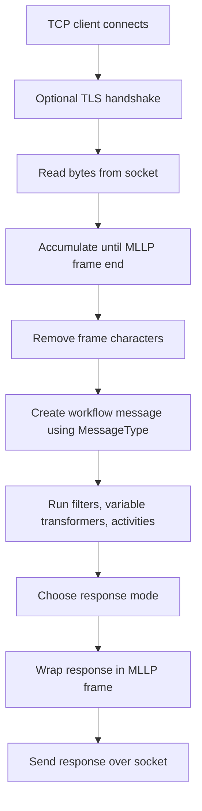

**MLLP Receiver (MLLPReceiverSetting)**

## What this setting controls

`MLLPReceiverSetting` defines a TCP listener that receives inbound messages framed using MLLP, converts them into an Integration Soup message, runs the workflow, and optionally sends an acknowledgment or custom response back over the same socket.

This document is about the persisted workflow JSON contract and the runtime effects of those fields.

## Scope

This setting combines:

- TCP listener configuration
- MLLP framing behavior
- optional TLS/client-certificate behavior
- inbound message typing
- workflow response behavior

Only serialized workflow JSON fields are covered.

## Operational model



Important non-obvious points:

- The receiver is still an MLLP socket listener even when `MessageType` is not HL7.
- Outbound responses are wrapped in MLLP framing whenever a response is sent.
- With `KeepConnectionOpen = true`, one connected client can hold the active connection open for multiple messages.
- With `KeepConnectionOpen = false`, the listener applies `ConnectionTimeoutMilliseconds` to receive and send operations.

## JSON shape

Typical object shape:

```json
{
  "$type": "HL7Soup.Functions.Settings.Receivers.MLLPReceiverSetting, HL7SoupWorkflow",
  "Id": "c1ed58b0-3e14-45fe-8997-2f81537d857f",
  "Name": "Inbound ADT Listener",
  "WorkflowPatternName": "Inbound ADT Listener",
  "Disabled": false,
  "Server": "0.0.0.0",
  "Port": 22222,
  "KeepConnectionOpen": true,
  "ConnectionTimeoutMilliseconds": 4000,
  "UseSsl": false,
  "UseDefaultSSLCertificate": true,
  "CertificateThumbPrint": "",
  "AuthenticationType": 0,
  "ClientCertificateThumbPrint": "",
  "MessageType": 1,
  "ReceivedMessageTemplate": "MSH|^~\\&|SRC|FAC|DST|FAC|${ReceivedDate}||ADT^A01|1|P|2.5.1\rPID|1||12345^^^MRN",
  "MessageTypeOptions": null,
  "ResponseMessageTemplate": "",
  "ReturnApplicationAccept": true,
  "ReturnApplicationError": false,
  "ErrorMessage": "",
  "ReturnApplicationReject": false,
  "RejectMessage": "",
  "ReturnCustomResponse": false,
  "ReturnNoResponse": false,
  "ReponsePriority": 2,
  "ReturnResponseFromActivity": false,
  "ReturnResponseFromActivityId": "00000000-0000-0000-0000-000000000000",
  "Filters": "00000000-0000-0000-0000-000000000000",
  "VariableTransformers": "00000000-0000-0000-0000-000000000000",
  "Transformers": "00000000-0000-0000-0000-000000000000",
  "Activities": [
    "11111111-1111-1111-1111-111111111111"
  ],
  "AddIncomingMessageToCurrentTab": true
}
```

## Listener fields

### `Server`

The local bind address or host name used by the TCP listener.

Common values:

- `"0.0.0.0"`: bind to all IPv4 interfaces
- `"127.0.0.1"`: localhost only
- a specific local IP address: bind only to that adapter
- a host name or global-variable expression that resolves to an address

Runtime behavior:

- Global variables are resolved before binding.
- If the value is not already an IP address, DNS resolution is used and the first resolved address is chosen.

Important outcome:

- `"0.0.0.0"` is the broadest bind and is the normal server-style choice.
- `"127.0.0.1"` only accepts local senders on the same machine.
- If a host name resolves to multiple addresses, only one resolved address is used.

### `Port`

The TCP port to listen on.

If the port/address is already in use, startup fails with a friendly port-conflict error.

## Connection behavior fields

### `KeepConnectionOpen`

Controls whether the receiver keeps the same TCP connection open across multiple messages.

Behavior:

- `true`: one client can send multiple framed messages on the same connection
- `false`: each message exchange is expected to complete on a shorter-lived connection

Important outcome:

- When `true`, an active client connection can monopolize the current handler until it disconnects or the workflow is stopped.
- When `false`, the listener is more suitable for many shorter connections and timeout enforcement.

### `ConnectionTimeoutMilliseconds`

Maximum time to wait for receive/send operations when `KeepConnectionOpen = false`.

Default:

- `4000`

Behavior:

- Applied as both receive timeout and send timeout on the accepted socket.
- Used to close clients that keep the connection open too long without completing the exchange.

Important outcome:

- This timeout is effectively ignored when `KeepConnectionOpen = true`.
- The current UI does not expose this field directly, but the value is preserved if it already exists in JSON.

## TLS and certificate fields

### `UseSsl`

Enables TLS on the MLLP connection.

Despite the name, this is TLS-on-socket behavior for the MLLP listener, not HTTP-style SSL.

Behavior:

- `false`: plain TCP/MLLP
- `true`: perform TLS handshake before reading framed messages

### `UseDefaultSSLCertificate`

Controls the server certificate source when `UseSsl = true`.

- `true`: use the Integration Soup default/generated certificate
- `false`: load a custom certificate identified by `CertificateThumbPrint`

### `CertificateThumbPrint`

Server certificate thumbprint used when:

- `UseSsl = true`
- `UseDefaultSSLCertificate = false`

If no valid certificate can be loaded, listener startup fails.

### `AuthenticationType`

JSON enum values:

- `0` = `None`
- `1` = `Basic`
- `2` = `Certificate`

Actual runtime meaning in this receiver:

- `None`: no client certificate required
- `Certificate`: require a client certificate and validate its thumbprint
- `Basic`: serialized, but not meaningfully implemented by this MLLP receiver

Important outcome:

- `AuthenticationType = 1` should not be used for new JSON. The runtime only has meaningful behavior for `None` and `Certificate`.

### `ClientCertificateThumbPrint`

Expected thumbprint for the client certificate when `AuthenticationType = 2`.

Behavior:

- Validation uses case-insensitive substring matching, not strict token parsing.
- A missing or mismatched client certificate causes TLS authentication failure.

Practical guidance:

- Use full thumbprints.
- Avoid relying on partial matches.

## Message fields

### `MessageType`

Defines how the de-framed payload is interpreted inside Integration Soup and how custom responses are typed.

For `MLLPReceiverSetting`, the message types exposed by the current UI are:

- `1` = `HL7`
- `4` = `XML`
- `5` = `CSV`
- `11` = `JSON`
- `13` = `Text`
- `14` = `Binary`
- `16` = `DICOM`

Important outcome:

- MLLP transport is separate from message syntax. A non-HL7 payload can still be carried over MLLP.
- Only HL7 has meaningful built-in automatic AA/AE/AR generation.

### `MessageTypeOptions`

Optional message-type-specific options.

The most relevant case is CSV:

```json
{
  "$type": "HL7Soup.Workflow.MessageTypeOptions.CSVMessageTypeOption, HL7SoupWorkflow",
  "HasHeader": true,
  "Header": "Col1,Col2",
  "HasFooter": false,
  "Footer": "",
  "Delimiter": ","
}
```

For most MLLP workflows, this is omitted.

### `ReceivedMessageTemplate`

Sample inbound message used for bindings and design-time message structure.

This does not control socket framing or listener acceptance rules.

## MLLP framing fields

These fields are serialized and honored at runtime, but they are advanced JSON-only fields and are not exposed as normal editable options in the current MLLP receiver UI.

### `FrameStart`

Start-of-message framing characters.

Default:

```json
[11]
```

### `FrameEnd`

End-of-message framing characters.

Default:

```json
[28, 13]
```

Runtime use:

- The receiver buffers data until it finds `FrameStart` followed by `FrameEnd`.
- The response is wrapped using the same framing configuration.

Important outcome:

- Changing framing in JSON changes both inbound parsing and outbound response framing.
- Any sender using different framing will fail to interoperate.

## Response fields

The MLLP receiver supports more response modes in the UI than the HTTP receiver, and most of them are persisted directly in JSON.

### `ReturnApplicationAccept`

Generate an automatic application accept response.

For HL7 traffic this is the normal ACK-style behavior.

### `ReturnApplicationError`

Force an application error response.

### `ErrorMessage`

Error text used by `ReturnApplicationError`.

### `ReturnApplicationReject`

Force an application reject response.

### `RejectMessage`

Reject text used by `ReturnApplicationReject`.

### `ReturnCustomResponse`

Generate the response from `ResponseMessageTemplate`, optionally modified by receiver response transformers.

### `ResponseMessageTemplate`

The custom response template used when `ReturnCustomResponse = true`.

Variables are resolved at runtime.

### `ReturnNoResponse`

Do not send any MLLP response at all.

Important outcome:

- This is technically supported, but it is not normal HL7 interoperability behavior.
- The UI exposes it as `No Response`.

### `ReponsePriority`

JSON enum values:

- `0` = `UponArrival`
- `1` = `AfterValidation`
- `2` = `AfterAllProcessing`

Behavior:

- `UponArrival`: response is generated before filters and activities finish; processing continues asynchronously
- `AfterValidation`: response is generated after receiver filters and variable transformers, but before activities finish
- `AfterAllProcessing`: response is generated after activity processing completes

Important outcome:

- `ReturnResponseFromActivity` effectively requires final activity completion, so the UI forces it to `AfterAllProcessing`.

### `Transformers`

Receiver response transformers.

These are only meaningful when `ReturnCustomResponse = true`.

## Response-from-activity fields

### `ReturnResponseFromActivity`

When `true`, the MLLP receiver returns the response produced by a downstream sender/activity instead of generating its own response body.

### `ReturnResponseFromActivityId`

GUID of the activity whose response should be returned.

### `ReturnResponseFromActivityName`

Helper name used mainly for validation/error messaging if the activity is missing or filtered out.

Important outcome:

- If the chosen activity does not execute, the receiver generates a reject-style failure response instead of returning the activity result.

## Workflow linkage fields

### `Activities`

Ordered list of downstream workflow activity GUIDs.

### `Filters`

GUID of the receiver filter set.

If the receiver filters reject the message, the workflow stops at the receiver and the response logic switches to reject/error handling as appropriate.

### `VariableTransformers`

GUID of the receiver-level variable transformer set.

These run after filters and before activities.

### `AddIncomingMessageToCurrentTab`

Controls whether the inbound message is added to the current list in the desktop product.

This does not change TCP/MLLP behavior.

### `Disabled`

If `true`, the setting is disabled.

### `WorkflowPatternName`

Workflow display/pattern name.

### `Id`

GUID of this receiver setting.

### `Name`

User-facing name of this receiver setting.

## Defaults for a new `MLLPReceiverSetting`

Important defaults:

- `Server = "0.0.0.0"`
- `Port = 22222`
- `KeepConnectionOpen = true`
- `ConnectionTimeoutMilliseconds = 4000`
- `UseSsl = false`
- `UseDefaultSSLCertificate = true`
- `CertificateThumbPrint = ""`
- `AuthenticationType = 0`
- `ReturnCustomResponse = false`
- `ReturnApplicationAccept = false` at base-setting level, but the MLLP UI normally drives new HL7 workflows toward automatic HL7 response behavior
- `AddIncomingMessageToCurrentTab = true`
- `TransformersNotAvailable = true` unless custom response mode is used

## Recommended authoring patterns

### Standard HL7 ACK listener

Use:

- `MessageType = 1`
- `ReturnApplicationAccept = true`
- `ReturnCustomResponse = false`
- `ReturnNoResponse = false`

This is the normal HL7 MLLP pattern.

### MLLP listener with sender-derived response

Use:

- `ReturnResponseFromActivity = true`
- `ReturnResponseFromActivityId = "<sender-guid>"`
- `ReponsePriority = 2`

Use this when the real response body should come from a downstream sender result rather than the receiver itself.

### TLS with client certificate authentication

Use:

- `UseSsl = true`
- `UseDefaultSSLCertificate = true` or `false` with a valid `CertificateThumbPrint`
- `AuthenticationType = 2`
- `ClientCertificateThumbPrint = "<thumbprint>"`

Do not use `AuthenticationType = 1`.

### Short-lived socket pattern

Use:

- `KeepConnectionOpen = false`
- `ConnectionTimeoutMilliseconds = <sensible limit>`

This reduces the risk of idle clients tying up the handler.

## Pitfalls and hidden outcomes

- `AuthenticationType = 1` (`Basic`) serializes but is not meaningfully enforced by this receiver.
- Automatic AA/AE/AR generation is only useful for HL7 payloads. For JSON/XML/Text/Binary/DICOM message types, built-in generated responses may be empty.
- `ReturnNoResponse = true` is usually a protocol-level interoperability problem for HL7 senders expecting an ACK.
- `KeepConnectionOpen = true` can allow one client connection to dominate the active handler for multiple messages.
- `ConnectionTimeoutMilliseconds` only matters when `KeepConnectionOpen = false`.
- `FrameStart` and `FrameEnd` are JSON-level advanced fields. Changing them breaks compatibility with standard MLLP senders unless both sides agree.
- TLS handshake failures are surfaced as protocol-level errors and can also occur when a plain TCP client connects to a TLS-enabled listener.
- Client certificate matching is based on substring search against the configured thumbprint text, not strict structured parsing.
- If `Server` is a host name that resolves to multiple addresses, binding chooses one resolved address rather than all of them.
- Response transformers are only meaningful for custom response mode.

## Minimal examples

### Minimal HL7 listener with automatic ACK

```json
{
  "$type": "HL7Soup.Functions.Settings.Receivers.MLLPReceiverSetting, HL7SoupWorkflow",
  "Id": "aaaaaaaa-aaaa-aaaa-aaaa-aaaaaaaaaaaa",
  "Name": "Inbound HL7",
  "Server": "0.0.0.0",
  "Port": 22222,
  "MessageType": 1,
  "ReturnApplicationAccept": true,
  "ReturnCustomResponse": false,
  "ReturnNoResponse": false,
  "Activities": []
}
```

### TLS listener with client certificate validation

```json
{
  "$type": "HL7Soup.Functions.Settings.Receivers.MLLPReceiverSetting, HL7SoupWorkflow",
  "Id": "bbbbbbbb-bbbb-bbbb-bbbb-bbbbbbbbbbbb",
  "Name": "Secure HL7",
  "Server": "0.0.0.0",
  "Port": 22222,
  "MessageType": 1,
  "UseSsl": true,
  "UseDefaultSSLCertificate": true,
  "AuthenticationType": 2,
  "ClientCertificateThumbPrint": "0123456789ABCDEF0123456789ABCDEF01234567",
  "ReturnApplicationAccept": true,
  "Activities": []
}
```

### JSON-over-MLLP custom response listener

```json
{
  "$type": "HL7Soup.Functions.Settings.Receivers.MLLPReceiverSetting, HL7SoupWorkflow",
  "Id": "cccccccc-cccc-cccc-cccc-cccccccccccc",
  "Name": "JSON over MLLP",
  "Server": "127.0.0.1",
  "Port": 23000,
  "KeepConnectionOpen": false,
  "ConnectionTimeoutMilliseconds": 5000,
  "MessageType": 11,
  "ReturnCustomResponse": true,
  "ResponseMessageTemplate": "{ \"accepted\": true }",
  "Activities": []
}
```

## Useful public references

- [Integration Soup](https://www.integrationsoup.com/)
- [TCP Keeping Connection Open](https://www.integrationsoup.com/InAppTutorials/TCPKeepingConnectionOpen.html)
- [Send HL7 To a Database With Activities](https://www.integrationsoup.com/hl7tutorialaddpatienttodatabasewithactivities.html)
