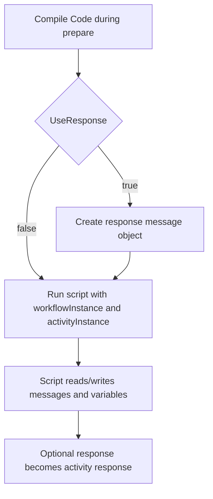

# **Code Sender (CodeSenderSetting)**

## What this setting controls

`CodeSenderSetting` defines a custom C# script activity. It runs code inside the workflow, can inspect and modify the current activity message state, and can create workflow variables for later activities.

This document is about the serialized workflow JSON contract and the runtime effects of those fields.

## Operational model



Important non-obvious points:

- Compilation happens during prepare, not per message.
- Script failures during prepare block the activity before normal message processing.
- Variables set by code are only discoverable in the binding UI if their names are listed in `VariableNames`.
- `ResponseMessageTemplate` and `ResponseMessageType` affect the initial response object that code sees when `UseResponse = true`.

## JSON shape

```json
{
  "$type": "HL7Soup.Functions.Settings.Senders.CodeSenderSetting, HL7SoupWorkflow",
  "Id": "be167fbf-18d0-468d-a56d-50a676fd1c76",
  "Name": "Run Custom Logic",
  "MessageType": 1,
  "MessageTemplate": "${11111111-1111-1111-1111-111111111111 inbound}",
  "ResponseMessageTemplate": "MSH|^~\\&|SRC|FAC|DST|FAC|${ReceivedDate}||ACK^A01|1|P|2.5.1\rMSA|AA|1",
  "ResponseMessageType": 1,
  "UseResponse": true,
  "Code": "workflowInstance.SetVariable(\"MyVariable\", \"42\");",
  "VariableNames": [
    "MyVariable"
  ],
  "Filters": "00000000-0000-0000-0000-000000000000",
  "Transformers": "00000000-0000-0000-0000-000000000000"
}
```

## Script fields

### `Code`

The C# script to compile and execute.

Runtime context exposes:

- `workflowInstance`
- `activityInstance`

Important outcomes:

- Compile errors fail during prepare.
- Runtime exceptions fail the current workflow instance and return a script-oriented stack trace.
- The product preloads Integration Soup message references and several common .NET data-access namespaces.

### `VariableNames`

List of variable names that this code activity may create.

Important outcomes:

- This is primarily declaration metadata for bindings and designer discoverability.
- Runtime does not enforce this list.
- If the script sets variables that are not listed here, downstream JSON authors may not see them in the normal binding tree.

## Message fields

### `MessageType`

The current editor allows:

- `1` = `HL7`
- `4` = `XML`
- `5` = `CSV`
- `11` = `JSON`
- `13` = `Text`
- `14` = `Binary`
- `16` = `DICOM`

### `MessageTemplate`

Initial message for the activity.

### `UseResponse`

Controls whether a response message object is created before the script runs.

### `ResponseMessageTemplate`

Template used to create the response object when `UseResponse = true`.

### `ResponseMessageType`

Type of the response message when `UseResponse = true`.

Important behavior:

- If `ResponseMessageType` is explicitly set, runtime uses it.
- If it is `Unknown` and `ResponseMessageTemplate` is blank, runtime falls back to the activity `MessageType`.
- If it is `Unknown` and `ResponseMessageTemplate` is not blank, runtime attempts to infer the type from the template text.

## Workflow linkage fields

### `Filters`

GUID of sender filters.

### `Transformers`

GUID of sender transformers.

These run before the script and shape the activity message the script receives.

### `Disabled`

If `true`, the activity is disabled.

### `Id`

GUID of this sender setting.

### `Name`

User-facing name of this sender setting.

## Defaults for a new `CodeSenderSetting`

- `UseResponse = false`
- `VariableNames = []`
- `Code` starts with a sample script

## Pitfalls and hidden outcomes

- `VariableNames` is discoverability metadata, not enforcement.
- Leaving `ResponseMessageType` as `Unknown` makes response creation depend on inference.
- `UseResponse = true` does not guarantee a useful response unless the code actually populates it correctly.
- The sample code shown in the product is HL7-oriented, but the activity can work with other message types if the script uses the appropriate interfaces.

## Useful public references

- [Integration Soup](https://www.integrationsoup.com/)
- [Using Variables in HL7 Soup](https://www.integrationsoup.com/hl7tutorialusingvariables.html)
- [Using Transformers](https://www.integrationsoup.com/hl7tutorialusingtransformers.html)
