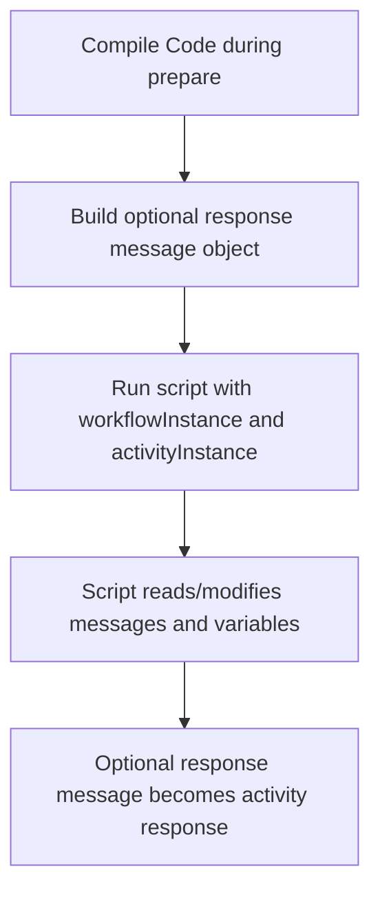

**Code Sender (CodeSenderSetting)**

## What this setting controls

`CodeSenderSetting` defines a custom C# script activity that runs inside the workflow, can read and modify the current activity message state, and can set workflow variables.

This document focuses on the serialized workflow JSON contract and the runtime effects of those fields.

## Operational model



Important non-obvious points:

- The script is compiled once during prepare, not recompiled for every message.
- Compilation failure blocks the activity before normal processing begins.
- Variables created via `workflowInstance.SetVariable(...)` are only discoverable in bindings if their names are listed in `VariableNames`.

## JSON shape

```json
{
  "$type": "HL7Soup.Functions.Settings.Senders.CodeSenderSetting, HL7SoupWorkflow",
  "Id": "c89d5cd5-6cc1-4dcf-8f39-e0aef7adb6dd",
  "Name": "Run Custom Logic",
  "MessageType": 1,
  "MessageTemplate": "${11111111-1111-1111-1111-111111111111 inbound}",
  "ResponseMessageTemplate": "MSH|^~\\&|SRC|FAC|DST|FAC|${ReceivedDate}||ACK^A01|1|P|2.5.1\rMSA|AA|1",
  "ResponseMessageType": 1,
  "UseResponse": true,
  "Code": "workflowInstance.SetVariable(\"MyVariable\", \"42\");",
  "VariableNames": [
    "MyVariable"
  ],
  "Filters": "00000000-0000-0000-0000-000000000000",
  "Transformers": "00000000-0000-0000-0000-000000000000"
}
```

## Core script fields

### `Code`

The C# script to compile and execute.

The script runs with a context exposing:

- `workflowInstance`
- `activityInstance`

### `VariableNames`

List of variable names that the code may create.

Practical meaning:

- This is how the workflow editor/binding tree knows which variables to show from this activity.
- The runtime does not restrict the script to only these names.

## Message fields

### `MessageType`

Type of the outbound/current activity message that the script expects to work with.

The current sender UI supports:

- `1` = `HL7`
- `4` = `XML`
- `5` = `CSV`
- `11` = `JSON`
- `13` = `Text`
- `14` = `Binary`
- `16` = `DICOM`

### `MessageTemplate`

Initial outbound/current message for the activity.

### `UseResponse`

Controls whether the activity should create and expose a response message object for the script to work with.

### `ResponseMessageTemplate`

Template text used to create the response message object when `UseResponse = true`.

### `ResponseMessageType`

Message type of the response message when `UseResponse = true`.

Important behavior:

- If this is `Unknown` and `ResponseMessageTemplate` is blank, runtime creates an empty response object using the activity `MessageType`.
- If this is `Unknown` and `ResponseMessageTemplate` is not blank, runtime tries to determine the type from the template text.

## Workflow linkage fields

### `Filters`

GUID of sender filters.

### `Transformers`

GUID of sender transformers.

### `Disabled`

If `true`, the activity is disabled.

### `Id`

GUID of this sender setting.

### `Name`

User-facing name of this sender setting.

## Defaults for a new `CodeSenderSetting`

- `UseResponse = false`
- `VariableNames = []`
- `Code` starts with a sample script template

## Pitfalls and hidden outcomes

- `VariableNames` is not enforcement. It is declaration metadata for discoverability.
- If the script sets a variable but `VariableNames` does not include it, downstream JSON authors may miss that variable.
- `UseResponse = true` does not automatically make the response valid; the script still has to populate it correctly.
- Leaving `ResponseMessageType` as `Unknown` can make behavior depend on template auto-detection.

## Minimal example

```json
{
  "$type": "HL7Soup.Functions.Settings.Senders.CodeSenderSetting, HL7SoupWorkflow",
  "Id": "aaaaaaaa-aaaa-aaaa-aaaa-aaaaaaaaaaaa",
  "Name": "Set Variable",
  "MessageType": 13,
  "MessageTemplate": "${11111111-1111-1111-1111-111111111111 inbound}",
  "UseResponse": false,
  "Code": "workflowInstance.SetVariable(\"RoutingKey\", \"LAB\");",
  "VariableNames": [
    "RoutingKey"
  ]
}
```

## Useful public references

- [Integration Soup](https://www.integrationsoup.com/)
- [Using Variables in HL7 Soup](https://www.integrationsoup.com/hl7tutorialusingvariables.html)
