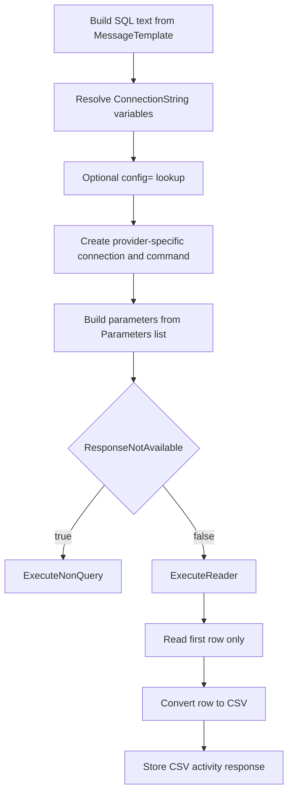

# **Database Query (DatabaseSenderSetting)**

## What this setting controls

`DatabaseSenderSetting` executes SQL against a configured database connection and optionally returns the first row of the first result set as a CSV response message.

This document is about the serialized workflow JSON contract and the runtime effects of those fields.

## Operational model



Important non-obvious points:

- The activity always executes `CommandType.Text`.
- If a response is enabled, only the first row of the first result set is returned.
- Response rows are converted to CSV regardless of the underlying database provider.
- Parameter values are created as strings after binding and formatting.

## JSON shape

```json
{
  "$type": "HL7Soup.Functions.Settings.Senders.DatabaseSenderSetting, HL7SoupWorkflow",
  "Id": "d38e42c9-3f01-4e0d-bfb6-4a0b0198587f",
  "Name": "Lookup Patient",
  "ConnectionString": "config=MainDb",
  "DataProvider": 0,
  "MessageTemplate": "SELECT PatientId, LastName FROM Patients WHERE PatientId = @PatientId",
  "MessageType": 6,
  "ResponseNotAvailable": false,
  "ResponseMessageTemplate": "PatientId,LastName",
  "ResponseMessageType": 5,
  "Parameters": [
    {
      "Name": "@PatientId",
      "Value": "${PatientId}",
      "FromType": 8,
      "FromDirection": 2
    }
  ],
  "Filters": "00000000-0000-0000-0000-000000000000",
  "Transformers": "00000000-0000-0000-0000-000000000000"
}
```

## Connection fields

### `ConnectionString`

Database connection string.

Behavior:

- Variables are processed at runtime.
- If the value starts with `config=`, the remainder is treated as a named connection string in the host application's configuration.

Important outcomes:

- In Integration Host scenarios, the config lookup happens in the server-side host process, not in the editor.
- Missing config names fail at runtime with a configuration error.

### `DataProvider`

JSON enum values:

- `0` = `SqlClient`
- `1` = `OracleClient`
- `2` = `OleDb`
- `3` = `Odbc`
- `4` = `SqlClientOld`
- `5` = `MySql`
- `6` = `PostgreSql`
- `7` = `Sqlite`

Important outcomes:

- `OleDb` is only supported on Windows in the current runtime path.
- Oracle parameter names are normalized so the command parameter does not keep the leading `:`.

## SQL and response fields

### `MessageTemplate`

SQL text to execute.

Important outcome:

- The activity always runs this as text SQL, not as a stored procedure command type.

### `MessageType`

For this setting, the meaningful JSON value is:

- `6` = `SQL`

### `ResponseNotAvailable`

Controls whether the activity expects and returns a query result.

Behavior:

- `true`: execute with `ExecuteNonQuery()`
- `false`: execute with `ExecuteReader()` and build a CSV response

### `ResponseMessageTemplate`

When a response is enabled, this is the design-time schema for the CSV response.

Practical usage:

- List the expected result fields in order, comma-separated, no spaces.

### `ResponseMessageType`

When a response is enabled, the meaningful JSON value is:

- `5` = `CSV`

## Parameter fields

### `Parameters`

List of `DatabaseSettingParameter` objects.

Typical parameter object:

```json
{
  "Name": "@PatientId",
  "Value": "${PatientId}",
  "FromType": 8,
  "FromDirection": 2,
  "FromSetting": "00000000-0000-0000-0000-000000000000",
  "Encoding": 0,
  "TextFormat": 0,
  "Truncation": 0,
  "TruncationLength": 50,
  "PaddingLength": 0,
  "Lookup": ""
}
```

### `Name`

SQL parameter name.

Important outcome:

- For Oracle, the editor and SQL text use `:ParamName`, but runtime strips the leading `:` when creating the actual `DbParameter`.

### `Value`

Source expression for the parameter value.

### `FromType`

Useful JSON enum values:

- `8` = `TextWithVariables`
- `9` = `HL7V2Path`
- `10` = `XPath`
- `11` = `CSVPath`
- `12` = `JSONPath`

### `FromDirection`

JSON enum values:

- `0` = `inbound`
- `1` = `outbound`
- `2` = `variable`

### `FromSetting`

GUID of the source activity when `FromDirection` is not `2`.

### Formatting fields

Serialized fields that materially affect runtime parameter value shaping:

- `Encoding`
- `Format`
- `TextFormat`
- `Truncation`
- `TruncationLength`
- `PaddingLength`
- `Lookup`

Important outcome:

- These are applied to the bound string value before it becomes the database parameter value.

## Response row behavior that matters

When `ResponseNotAvailable = false`, runtime:

- reads only the first row
- converts each column to CSV
- quotes string values
- escapes embedded quotes
- base64-encodes binary column values

Important outcomes:

- Multi-row results are not returned.
- Multiple result sets are not exposed.
- Binary columns become base64 text inside the CSV response.

## Workflow linkage fields

### `Filters`

GUID of sender filters.

### `Transformers`

GUID of sender transformers.

### `Disabled`

If `true`, the activity is disabled.

### `Id`

GUID of this sender setting.

### `Name`

User-facing name of this sender setting.

## Defaults for a new `DatabaseSenderSetting`

- `ConnectionString = ""`
- `MessageType = 6`
- `ResponseMessageType = 5`
- `ResponseNotAvailable = true`
- `Parameters = []`

## Pitfalls and hidden outcomes

- Only the first row is returned.
- Response mode always returns CSV, not JSON or XML.
- Parameter values are formatted and then assigned as strings.
- `ResponseMessageTemplate` is metadata for the workflow, not a SQL projection rule.
- `OleDb` is not portable beyond Windows in the current runtime path.

## Useful public references

- [Integration Soup](https://www.integrationsoup.com/)
- [Send HL7 To a Database With Activities](https://www.integrationsoup.com/hl7tutorialaddpatienttodatabasewithactivities.html)
- [Using Variables in HL7 Soup](https://www.integrationsoup.com/hl7tutorialusingvariables.html)
