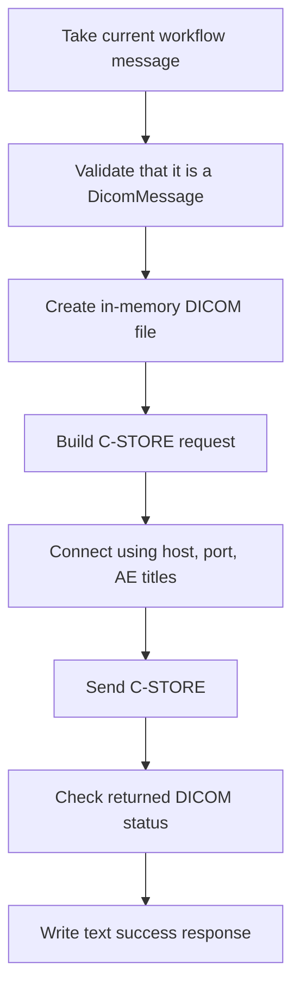

# **DICOM Sender (DicomSenderSetting)**

## What this setting controls

`DicomSenderSetting` defines a DICOM C-STORE sender. It expects the current workflow message to already be a DICOM message object, opens an association to a remote SCP, sends the dataset, and records a text success response if the send succeeds.

This document is about the serialized workflow JSON contract and the runtime effects of those fields.

## Operational model



Important non-obvious points:

- The sender checks the actual runtime message object type, not only `MessageType`.
- This sender currently performs C-STORE only.
- The activity response is plain text, not a DICOM response dataset.

## JSON shape

```json
{
  "$type": "HL7Soup.Functions.Settings.Senders.DicomSenderSetting, HL7SoupWorkflow",
  "Id": "74ab1db4-f8d5-46ce-8f3e-8cae7cc71420",
  "Name": "Send to PACS",
  "MessageType": 16,
  "MessageTemplate": "${11111111-1111-1111-1111-111111111111 inbound}",
  "RemoteHost": "127.0.0.1",
  "RemotePort": 104,
  "OurAET": "HL7SOUP_SCU",
  "RemoteAET": "ANY_SCP",
  "TimeoutSeconds": 30,
  "Filters": "00000000-0000-0000-0000-000000000000",
  "Transformers": "00000000-0000-0000-0000-000000000000"
}
```

## Connection fields

### `RemoteHost`

Remote DICOM SCP host name or IP address.

### `RemotePort`

Remote DICOM port.

### `OurAET`

Calling AE Title used by this sender.

### `RemoteAET`

Called AE Title expected by the remote SCP.

Important outcome:

- AE Title mismatches can cause association failure even when network access is otherwise correct.

### `TimeoutSeconds`

Serialized timeout field for this activity.

Important outcome:

- In the current runtime path, this value is not visibly applied to the underlying send call. It still belongs in the JSON contract, but it should not be treated as a guaranteed transport timeout in the current implementation.

## Message fields

### `MessageType`

For this sender, the meaningful JSON value is:

- `16` = `DICOM`

### `MessageTemplate`

Template for the current activity message.

Critical limitation:

- The runtime requires the actual message object to be a DICOM message object.
- If the workflow passes text, XML, JSON, or any other non-DICOM object, the sender fails even if `MessageType = 16`.

## Response behavior

This sender does not inherit the configurable response-template surface used by `ISenderWithResponseSetting`.

Actual runtime behavior:

- On success, it creates a plain text response message describing the success status.
- On failure, it errors the workflow instance.

Important outcome:

- Downstream activities should treat this sender's response as text, not as DICOM.

## Workflow linkage fields

### `Filters`

GUID of sender filters.

### `Transformers`

GUID of sender transformers.

These can shape the activity input before send, but they do not by themselves guarantee the result is a real DICOM message object.

### `Disabled`

If `true`, the activity is disabled.

### `Id`

GUID of this sender setting.

### `Name`

User-facing name of this sender setting.

## Defaults for a new `DicomSenderSetting`

- `RemoteHost = "127.0.0.1"`
- `RemotePort = 104`
- `OurAET = "HL7SOUP_SCU"`
- `RemoteAET = "ANY_SCP"`
- `TimeoutSeconds = 30`
- `MessageType = 16`

## Pitfalls and hidden outcomes

- `MessageType = 16` is not enough by itself. The runtime message object must actually be DICOM.
- This sender currently performs only C-STORE.
- The success response is text.
- `TimeoutSeconds` serializes but is not clearly enforced by the current runtime path.

## Examples

### Basic DICOM C-STORE sender

```json
{
  "$type": "HL7Soup.Functions.Settings.Senders.DicomSenderSetting, HL7SoupWorkflow",
  "Id": "aaaaaaaa-aaaa-aaaa-aaaa-aaaaaaaaaaaa",
  "Name": "Send to PACS",
  "MessageType": 16,
  "MessageTemplate": "${11111111-1111-1111-1111-111111111111 inbound}",
  "RemoteHost": "10.0.0.25",
  "RemotePort": 104,
  "OurAET": "HL7SOUP_SCU",
  "RemoteAET": "ANY_SCP",
  "TimeoutSeconds": 30
}
```

## Useful public references

- [Integration Soup](https://www.integrationsoup.com/)
- [Sending DICOM Tags to a Web API or REST Service](https://www.integrationsoup.com/dicomtutorialsendtorestapi.html)
