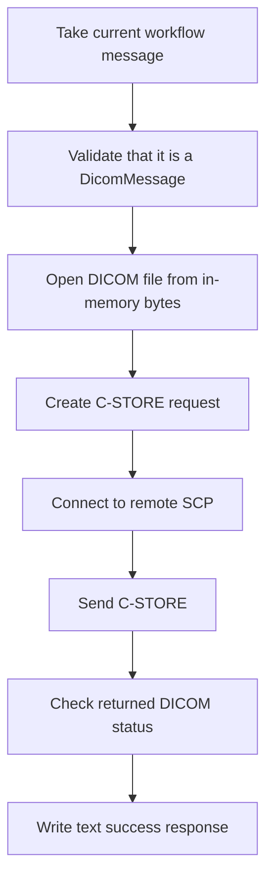

**DICOM Sender (DicomSenderSetting)**

## What this setting controls

`DicomSenderSetting` defines a DICOM C-STORE sender that takes the current workflow message as a DICOM object, opens a DICOM association to a remote SCP, and transmits the dataset.

This document focuses on the serialized workflow JSON contract and the runtime effects of those fields.

## Operational model



Important non-obvious points:

- The activity expects the runtime message object to already be a DICOM message.
- The sender currently performs a C-STORE operation only.
- A successful send returns a text response message, not a DICOM dataset.

## JSON shape

```json
{
  "$type": "HL7Soup.Functions.Settings.Senders.DicomSenderSetting, HL7SoupWorkflow",
  "Id": "4919e338-7090-4f77-97cf-b6fe54665ecb",
  "Name": "Send DICOM Study",
  "MessageType": 16,
  "MessageTemplate": "${11111111-1111-1111-1111-111111111111 inbound}",
  "RemoteHost": "127.0.0.1",
  "RemotePort": 104,
  "OurAET": "HL7SOUP_SCU",
  "RemoteAET": "ANY_SCP",
  "TimeoutSeconds": 30,
  "Filters": "00000000-0000-0000-0000-000000000000",
  "Transformers": "00000000-0000-0000-0000-000000000000"
}
```

## Connection fields

### `RemoteHost`

Remote DICOM SCP host name or IP address.

### `RemotePort`

Remote DICOM port.

### `OurAET`

Calling AE Title used by this sender.

### `RemoteAET`

Called AE Title of the remote receiver.

### `TimeoutSeconds`

Serialized timeout value for the activity.

Important non-obvious outcome:

- In the current runtime path this value is not meaningfully applied to the send call.

## Message fields

### `MessageType`

For this sender, new JSON should use:

- `16` = `DICOM`

### `MessageTemplate`

Outbound/current activity message template.

Critical limitation:

- The runtime checks the actual message object type, not just the numeric `MessageType`.
- If the workflow passes a non-DICOM message object, send fails even if `MessageType = 16`.

## Response behavior

Actual runtime behavior:

- On success, it writes a plain text response message
- On failure, it errors the workflow instance

## Workflow linkage fields

### `Filters`

GUID of sender filters.

### `Transformers`

GUID of sender transformers.

### `Disabled`

If `true`, the activity is disabled.

### `Id`

GUID of this sender setting.

### `Name`

User-facing name of this sender setting.

## Defaults for a new `DicomSenderSetting`

- `RemoteHost = "127.0.0.1"`
- `RemotePort = 104`
- `OurAET = "HL7SOUP_SCU"`
- `RemoteAET = "ANY_SCP"`
- `TimeoutSeconds = 30`
- `MessageType = 16`

## Pitfalls and hidden outcomes

- `MessageType = 16` is not enough by itself. The message object must actually be a `DicomMessage`.
- The sender currently performs C-STORE only.
- The success response is text, not a DICOM object.
- `TimeoutSeconds` serializes but is not clearly enforced by the current runtime send path.

## Minimal example

```json
{
  "$type": "HL7Soup.Functions.Settings.Senders.DicomSenderSetting, HL7SoupWorkflow",
  "Id": "aaaaaaaa-aaaa-aaaa-aaaa-aaaaaaaaaaaa",
  "Name": "Send to PACS",
  "MessageType": 16,
  "MessageTemplate": "${11111111-1111-1111-1111-111111111111 inbound}",
  "RemoteHost": "pacs.example.local",
  "RemotePort": 104,
  "OurAET": "HL7SOUP_SCU",
  "RemoteAET": "PACS_AE"
}
```

## Useful public references

- [Integration Soup](https://www.integrationsoup.com/)
- [Sending DICOM Tags to a Web API or REST Service](https://www.integrationsoup.com/dicomtutorialsendtorestapi.html)
