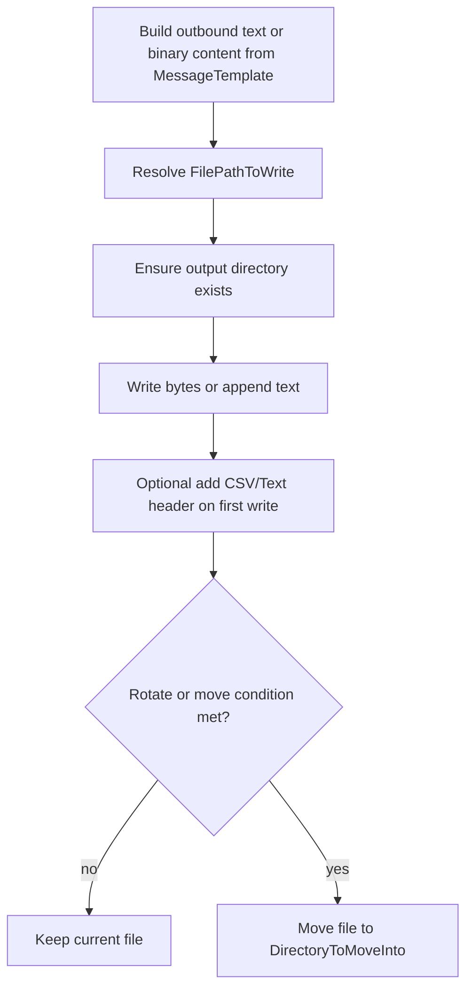

# **File Writer (FileWriterSenderSetting)**

## What this setting controls

`FileWriterSenderSetting` writes the activity message to disk. It can append multiple messages to the same file, optionally add CSV/Text headers, and optionally move completed files into another directory when rotation conditions are met.

This document is about the serialized workflow JSON contract and the runtime effects of those fields.

## Operational model



Important non-obvious points:

- `MaxRecordsPerFile` only matters when `MoveIntoDirectoryOnComplete = true`.
- If move is disabled, the sender keeps appending to the same resolved file path.
- A runtime change in `FilePathToWrite` also forces a move of the prior file when move is enabled.
- DICOM messages are written as raw DICOM bytes even though this is a generic file writer.

## JSON shape

```json
{
  "$type": "HL7Soup.Functions.Settings.Senders.FileWriterSenderSetting, HL7SoupWorkflow",
  "Id": "4e79a1be-2b77-430f-858c-aa74d2db00b7",
  "Name": "Write HL7 File",
  "MessageType": 1,
  "MessageTemplate": "${11111111-1111-1111-1111-111111111111 inbound}",
  "MessageTypeOptions": null,
  "FilePathToWrite": "C:\\Output\\${WorkflowInstanceId}.hl7",
  "MoveIntoDirectoryOnComplete": true,
  "DirectoryToMoveInto": "C:\\Archive\\HL7",
  "MaxRecordsPerFile": 1,
  "Filters": "00000000-0000-0000-0000-000000000000",
  "Transformers": "00000000-0000-0000-0000-000000000000"
}
```

## Core file-path fields

### `FilePathToWrite`

Full file path, including file name.

Behavior:

- Variables are processed at runtime.
- The writer ensures the parent directory exists.

Important outcomes:

- The editor warns if this looks like a directory path rather than a file.
- If this value changes between messages because of variables, the previous file is moved immediately when move mode is enabled.

### `MoveIntoDirectoryOnComplete`

Enables file rotation and move behavior.

When `true`, the current file is moved when:

- `MaxRecordsPerFile` is reached
- the resolved output file path changes
- the workflow/activity closes

### `DirectoryToMoveInto`

Target directory for moved files.

Behavior:

- Variables are processed at runtime.
- The directory is created if it does not exist.

Important outcome:

- The writer only moves into a directory, not into an arbitrary file name. The moved file keeps its own file name and is made unique if needed.

### `MaxRecordsPerFile`

Maximum number of messages written to a file before a move or rotation.

Critical behavior:

- This only has practical effect when `MoveIntoDirectoryOnComplete = true`.
- If move is false, the sender continues appending to the current file regardless of this number.

## Message fields

### `MessageType`

The editor allows:

- `1` = `HL7`
- `4` = `XML`
- `5` = `CSV`
- `11` = `JSON`
- `13` = `Text`
- `14` = `Binary`
- `16` = `DICOM`

Important outcomes:

- `Binary` expects the activity message text to be base64 and writes decoded bytes.
- If the runtime message object is a DICOM message, the writer uses its raw DICOM bytes directly.
- For non-binary text modes, content is appended as text using the product's shared encoding.

### `MessageTemplate`

Content template to write.

### `MessageTypeOptions`

Relevant mainly for `CSV` and `Text`.

For this sender, the meaningful serialized use is the header.

#### CSV example

```json
{
  "$type": "HL7Soup.Workflow.MessageTypeOptions.CSVMessageTypeOption, HL7SoupWorkflow",
  "Header": "PatientId,LastName,FirstName"
}
```

#### Text example

```json
{
  "$type": "HL7Soup.Workflow.MessageTypeOptions.TextMessageTypeOption, HL7SoupWorkflow",
  "Header": "Batch Start"
}
```

Important outcome:

- The header is written only if the target file does not already exist.

## Text-write behavior that matters

### HL7 newline behavior

For `HL7`, a newline is only appended when `MaxRecordsPerFile > 1`.

### Other text message types

For non-HL7 text-based message types, runtime appends `Environment.NewLine` after each message.

### Write retry behavior

If appending text throws an `IOException`, the sender waits briefly and retries once.

## Workflow linkage fields

### `Filters`

GUID of sender filters.

### `Transformers`

GUID of sender transformers.

### `Disabled`

If `true`, the activity is disabled.

### `Id`

GUID of this sender setting.

### `Name`

User-facing name of this sender setting.

## Defaults for a new `FileWriterSenderSetting`

- `FilePathToWrite = ""`
- `MaxRecordsPerFile = 5000`
- `DirectoryToMoveInto = "c:\\"`
- `MoveIntoDirectoryOnComplete = false`

## Pitfalls and hidden outcomes

- `MaxRecordsPerFile` does not rotate files unless move mode is enabled.
- A variable-driven file-path change causes the previous file to be moved immediately in move mode.
- `Binary` expects base64 text.
- DICOM messages are written as raw bytes through a special runtime path.
- `DirectoryToMoveInto` must be treated as a directory, not as a full destination file path.

## Examples

### HL7 append with processed-folder rollover

```json
{
  "$type": "HL7Soup.Functions.Settings.Senders.FileWriterSenderSetting, HL7SoupWorkflow",
  "Id": "aaaaaaaa-aaaa-aaaa-aaaa-aaaaaaaaaaaa",
  "Name": "Write HL7 Batch",
  "FilePathToWrite": "c:\\temp\\out\\batch.hl7",
  "MessageType": 1,
  "MessageTemplate": "${11111111-1111-1111-1111-111111111111 inbound}",
  "MoveIntoDirectoryOnComplete": true,
  "DirectoryToMoveInto": "c:\\temp\\processed",
  "MaxRecordsPerFile": 1000
}
```

### Binary file write from base64 content

```json
{
  "$type": "HL7Soup.Functions.Settings.Senders.FileWriterSenderSetting, HL7SoupWorkflow",
  "Id": "bbbbbbbb-bbbb-bbbb-bbbb-bbbbbbbbbbbb",
  "Name": "Write PDF Bytes",
  "FilePathToWrite": "c:\\temp\\out\\result.pdf",
  "MessageType": 14,
  "MessageTemplate": "${PdfBase64}",
  "MoveIntoDirectoryOnComplete": false
}
```

## Useful public references

- [Integration Soup](https://www.integrationsoup.com/)
- [HL7 Tutorials](https://www.integrationsoup.com/hl7tutorials.html)
