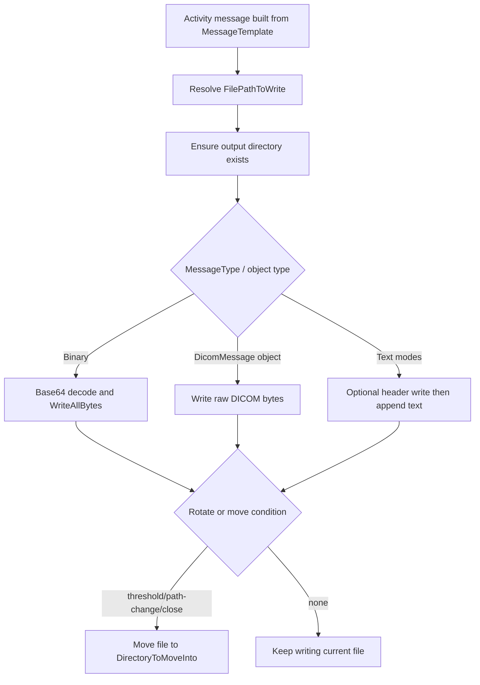

# **File Writer (FileWriterSenderSetting)**

## What this setting controls

`FileWriterSenderSetting` writes the activity message to disk.

It supports:

- writing to a resolved file path
- optional multi-record file grouping
- optional move/rotation into a target directory
- optional CSV/Text header writes
- binary and DICOM byte-write paths

This page documents serialized JSON fields and the runtime behavior they produce.

## Runtime model



Important non-obvious behavior:

- `MaxRecordsPerFile` only causes practical rotation when move mode is enabled.
- Binary and DICOM write paths overwrite file bytes; they do not append.
- If resolved output file path changes between messages, previous file is moved immediately in move mode.
- Header rows are written only when file does not yet exist.

## JSON shape

Typical serialized shape:

```json
{
  "$type": "HL7Soup.Functions.Settings.Senders.FileWriterSenderSetting, HL7SoupWorkflow",
  "Id": "aaaaaaaa-aaaa-aaaa-aaaa-aaaaaaaaaaaa",
  "Name": "Write HL7 Batch",
  "Version": 3,
  "MessageType": 1,
  "MessageTypeOptions": null,
  "MessageTemplate": "${11111111-1111-1111-1111-111111111111 inbound}",
  "FilePathToWrite": "c:\\temp\\out\\batch.hl7",
  "MoveIntoDirectoryOnComplete": true,
  "DirectoryToMoveInto": "c:\\temp\\processed",
  "MaxRecordsPerFile": 1000,
  "Filters": "00000000-0000-0000-0000-000000000000",
  "Transformers": "00000000-0000-0000-0000-000000000000",
  "Disabled": false
}
```

## File-path and rotation fields

### `FilePathToWrite`

Resolved output file path (including file name).

Runtime behavior:

- variables are resolved per message.
- parent directory is created if missing.

### `MoveIntoDirectoryOnComplete`

Enables move/rotation behavior.

When `true`, file move is triggered by:

- reaching `MaxRecordsPerFile`
- resolved output file path changing between messages
- activity close

### `DirectoryToMoveInto`

Target directory for moved files.

Runtime behavior:

- resolved per message
- directory is created if missing
- destination filename is made unique if needed

### `MaxRecordsPerFile`

Record count threshold before move/rotation.

Critical behavior:

- meaningful only with `MoveIntoDirectoryOnComplete = true`
- with move disabled, sender keeps appending or overwriting same path behavior based on write mode

## Message fields

### `MessageType`

Editor allows:

- `1` = `HL7`
- `4` = `XML`
- `5` = `CSV`
- `11` = `JSON`
- `13` = `Text`
- `14` = `Binary`
- `16` = `DICOM`

Runtime write modes:

- `Binary`: decode text as base64 and write bytes.
- runtime `DicomMessage` object: write raw DICOM bytes directly.
- other message types: append text using global encoding.

### `MessageTemplate`

Activity message source before write.

### `MessageTypeOptions`

Most relevant for:

- `CSVMessageTypeOption.Header`
- `TextMessageTypeOption.Header`

Runtime behavior:

- header written once only when target file does not already exist.

## Text write details

### HL7 newline behavior

For `HL7` text writes, newline is appended only when `MaxRecordsPerFile > 1`.

### Other text message types

For non-HL7 text types, newline is appended after each written message.

### Retry behavior

If text append throws `IOException`, sender waits briefly and retries once.

## Workflow linkage fields

### `Filters`

GUID of sender filters.

### `Transformers`

GUID of sender transformers.

### `Disabled`

Disables activity execution when `true`.

### `Id`

Activity GUID.

### `Name`

User-facing activity name.

## UI behavior that affects JSON authors

- UI validates `MaxRecordsPerFile > 0`.
- UI warns when file path appears to be a directory-only path.
- Header editor is shown only for `CSV` and `Text`.
- On save, `MessageTypeOptions` is actively authored for CSV/Text header mode and otherwise tends to round-trip as null/default for this sender.

## Defaults

New `FileWriterSenderSetting` defaults:

- `FilePathToWrite = ""`
- `MaxRecordsPerFile = 5000`
- `DirectoryToMoveInto = "c:\\"`
- `MoveIntoDirectoryOnComplete = false`

## Pitfalls and hidden outcomes

- `MaxRecordsPerFile` does not rotate files unless move mode is on.
- Binary writes overwrite file bytes; they do not append binary records.
- DICOM object writes also overwrite file bytes in current implementation.
- `DirectoryToMoveInto` is treated as directory creation target; passing a file-like path creates a directory with that name.
- Path changes caused by variables can trigger unexpected early file moves.

## Examples

### HL7 append with processed-folder rollover

```json
{
  "$type": "HL7Soup.Functions.Settings.Senders.FileWriterSenderSetting, HL7SoupWorkflow",
  "Id": "aaaaaaaa-aaaa-aaaa-aaaa-aaaaaaaaaaaa",
  "Name": "Write HL7 Batch",
  "FilePathToWrite": "c:\\temp\\out\\batch.hl7",
  "MessageType": 1,
  "MessageTemplate": "${11111111-1111-1111-1111-111111111111 inbound}",
  "MoveIntoDirectoryOnComplete": true,
  "DirectoryToMoveInto": "c:\\temp\\processed",
  "MaxRecordsPerFile": 1000
}
```

### CSV output with header and rotation

```json
{
  "$type": "HL7Soup.Functions.Settings.Senders.FileWriterSenderSetting, HL7SoupWorkflow",
  "Id": "bbbbbbbb-bbbb-bbbb-bbbb-bbbbbbbbbbbb",
  "Name": "Write CSV Export",
  "FilePathToWrite": "c:\\temp\\out\\export.csv",
  "MessageType": 5,
  "MessageTypeOptions": {
    "$type": "HL7Soup.Workflow.MessageTypeOptions.CSVMessageTypeOption, HL7SoupWorkflow",
    "Header": "PatientId,LastName,FirstName"
  },
  "MessageTemplate": "${22222222-2222-2222-2222-222222222222 outbound}",
  "MoveIntoDirectoryOnComplete": true,
  "DirectoryToMoveInto": "c:\\temp\\archive",
  "MaxRecordsPerFile": 5000
}
```

### Binary write from base64 text payload

```json
{
  "$type": "HL7Soup.Functions.Settings.Senders.FileWriterSenderSetting, HL7SoupWorkflow",
  "Id": "cccccccc-cccc-cccc-cccc-cccccccccccc",
  "Name": "Write PDF Bytes",
  "FilePathToWrite": "c:\\temp\\out\\result.pdf",
  "MessageType": 14,
  "MessageTemplate": "${PdfBase64}",
  "MoveIntoDirectoryOnComplete": false
}
```

## Useful public references

- [Integration Soup](https://www.integrationsoup.com/)
- [HL7 Tutorials](https://www.integrationsoup.com/hl7tutorials.html)
