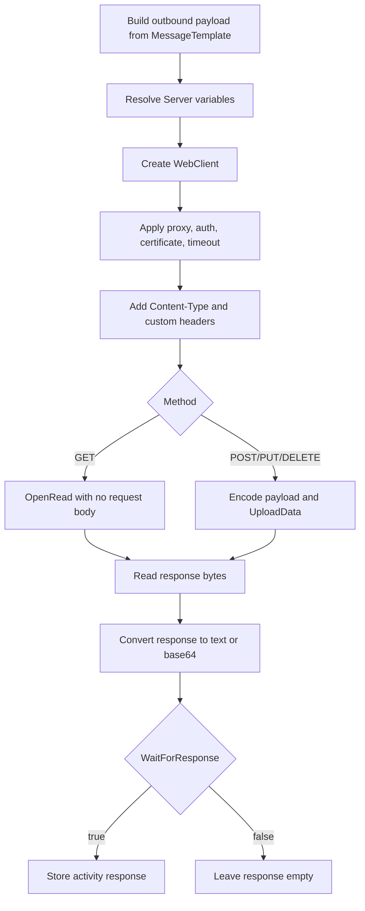

# **HTTP Sender (HttpSenderSetting)**

## What this setting controls

`HttpSenderSetting` defines an outbound HTTP or HTTPS request. It sends the activity message to a URL, optionally adds authentication, client certificates, proxy settings, and custom headers, and optionally captures the HTTP response body as the activity response.

This document is about the serialized workflow JSON contract and the runtime effects of those fields.

## Operational model



Important non-obvious points:

- `WaitForResponse` controls whether the response body is retained for workflow use, not whether the HTTP call itself is synchronous.
- `GET` does not send the activity payload at all, even if `MessageTemplate` is populated.
- For `Binary`, the response body is converted to base64 text before it becomes the activity response.
- For non-binary responses, bytes are decoded with `Encoding`, not by inspecting the server's charset header.

## JSON shape

Typical object shape:

```json
{
  "$type": "HL7Soup.Functions.Settings.Senders.HttpSenderSetting, HL7SoupWorkflow",
  "Id": "4e7b3753-8762-46a8-9f32-14676cd1453d",
  "Name": "Post Patient JSON",
  "MessageType": 11,
  "MessageTemplate": "{ \"patientId\": \"${PatientId}\" }",
  "ResponseMessageTemplate": "{ \"status\": \"ok\" }",
  "Server": "https://api.example.com/patients/${PatientId}",
  "Method": 0,
  "ContentType": "application/json",
  "Authentication": false,
  "UserName": "",
  "Password": "",
  "UseAuthenticationCertificate": false,
  "AuthenticationCertificateThumbprint": "",
  "PreAuthenticate": false,
  "UseProxy": 0,
  "ProxyAddress": "",
  "ProxyUserName": "",
  "ProxyPassword": "",
  "TimeoutSeconds": 30,
  "UseDefaultCredentials": false,
  "Headers": [
    {
      "Name": "X-Correlation-Id",
      "Value": "${WorkflowInstanceId}",
      "FromType": 8,
      "FromDirection": 2
    }
  ],
  "Encoding": "utf-8",
  "WaitForResponse": true,
  "Filters": "00000000-0000-0000-0000-000000000000",
  "Transformers": "00000000-0000-0000-0000-000000000000"
}
```

## Target and request fields

### `Server`

Target URL.

Behavior:

- Variables are processed at runtime.
- The editor allows binding/variable insertion here.

### `Method`

JSON enum values:

- `0` = `POST`
- `1` = `GET`
- `2` = `PUT`
- `3` = `DELETE`

Important outcomes:

- `GET` does not send a request body.
- `DELETE` in this sender still uses the upload path and can send a body.
- The editor hides the outbound message editor and content-type controls when `GET` is selected, but those serialized fields can still remain in JSON.

### `ContentType`

Value sent as the HTTP `Content-Type` header.

Important outcome:

- It is always added to the request headers by runtime, even if it is not meaningful for the chosen method.

## Authentication and transport fields

### `Authentication`

Enables username/password credentials on the request.

### `UserName`

Username used when `Authentication = true`.

### `Password`

Password used when `Authentication = true`.

### `UseAuthenticationCertificate`

Attach a client certificate to the request.

### `AuthenticationCertificateThumbprint`

Client certificate thumbprint used when `UseAuthenticationCertificate = true`.

### `PreAuthenticate`

Controls whether credentials are sent eagerly on later requests.

### `UseDefaultCredentials`

Use the process/default credentials if the server requests them.

## Proxy fields

### `UseProxy`

JSON enum values:

- `0` = `UseDefaultProxy`
- `1` = `ManualProxy`
- `2` = `None`

### `ProxyAddress`

Proxy URL when `UseProxy = 1`.

### `ProxyUserName`

Manual proxy username when `UseProxy = 1`.

### `ProxyPassword`

Manual proxy password when `UseProxy = 1`.

## Header fields

### `Headers`

Serialized as a list of `DatabaseSettingParameter` objects.

For HTTP headers, the fields that matter are:

- `Name`
- `Value`
- `FromType`
- `FromDirection`
- `FromSetting`

Typical header object:

```json
{
  "Name": "Authorization",
  "Value": "Bearer ${AccessToken}",
  "FromType": 8,
  "FromDirection": 2
}
```

Important outcomes:

- Runtime only uses `Name`, `Value`, `FromDirection`, and `FromSetting` when building the header value. The extra formatting fields from `DatabaseSettingParameter` are not part of the HTTP-header runtime path.
- The editor still stores `FromType` and uses it for binding correctness and repair when reopening the activity.
- Headers are sorted by parameter name when saved from the editor.

### `FromType` inside header objects

For this setting, the useful JSON enum values are:

- `8` = `TextWithVariables`
- `9` = `HL7V2Path`
- `10` = `XPath`
- `11` = `CSVPath`
- `12` = `JSONPath`

### `FromDirection` inside header objects

JSON enum values:

- `0` = `inbound`
- `1` = `outbound`
- `2` = `variable`

## Message fields

### `MessageType`

Defines how the activity message and any retained response are interpreted inside Integration Soup.

For `HttpSenderSetting`, the editor allows:

- `1` = `HL7`
- `4` = `XML`
- `5` = `CSV`
- `11` = `JSON`
- `13` = `Text`
- `14` = `Binary`
- `16` = `DICOM`

### `MessageTemplate`

Outbound request body template.

Important outcome:

- When `Method = GET`, this serialized field is not sent.

### `ResponseMessageTemplate`

Serialized because this activity inherits sender response support, but it does not control the actual HTTP response. It mainly exists for design-time bindings/highlighting.

## Encoding and timeout fields

### `Encoding`

Name of the text encoding used for request-body conversion and non-binary response decoding.

Important outcomes:

- The editor limits normal selection to a small preferred list.
- If omitted or invalid, runtime falls back to UTF-8.
- Response decoding does not inspect the server's declared charset; it uses this setting.

### `TimeoutSeconds`

HTTP timeout in seconds.

## Response retention field

### `WaitForResponse`

Controls whether the response body is kept as the activity response message.

Behavior:

- `true`: capture the response body
- `false`: perform the request, but leave the activity response empty

Important outcome:

- The request still waits for the HTTP server to respond. This is not asynchronous/fire-and-forget transport.

## Workflow linkage fields

### `Filters`

GUID of sender filters.

### `Transformers`

GUID of sender transformers.

These shape the outbound message before the HTTP call.

### `Disabled`

If `true`, the activity is disabled.

### `Id`

GUID of this sender setting.

### `Name`

User-facing name of this sender setting.

## Defaults for a new `HttpSenderSetting`

- `ContentType = "text/plain"`
- `Method = 0`
- `TimeoutSeconds = 30`
- `UseProxy = 0`
- `WaitForResponse = true`

## Pitfalls and hidden outcomes

- `WaitForResponse = false` does not make the HTTP call asynchronous.
- `GET` ignores `MessageTemplate`.
- `DELETE` can still carry a body in this sender.
- Non-binary responses are decoded with `Encoding`, not the server's charset header.
- Header objects serialize like database parameters, but most of the database-formatting fields are not used by the HTTP sender runtime.
- `ResponseMessageTemplate` serializes but does not drive the actual HTTP response body.

## Useful public references

- [Integration Soup](https://www.integrationsoup.com/)
- [Securing HL7 messages with HTTPS over SSL/TLS](https://www.integrationsoup.com/hl7tutorialsecuringhl7messageswithhttpoverssl.html)
- [Sending DICOM Tags to a Web API or REST Service](https://www.integrationsoup.com/dicomtutorialsendtorestapi.html)
