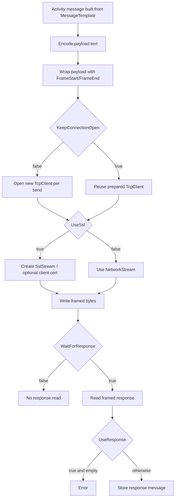

# **MLLP Sender (MLLPSenderSetting)**

## What this setting controls

`MLLPSenderSetting` sends framed TCP payloads using MLLP semantics, optionally over TLS, and can optionally read and enforce response behavior.

It controls:

- host/port destination
- MLLP frame delimiters
- connection lifecycle (per-message vs keep-open)
- TLS usage and optional client certificate
- timeout
- response waiting/response strictness

This page documents serialized JSON fields and the runtime behavior they produce.

## Runtime model



Important non-obvious behavior:

- TLS server certificate validation is permissive (warnings are logged, connection still proceeds).
- `UseResponse` does not suppress response capture when `WaitForResponse = true`; it mainly controls strict empty-response failure.
- Response decoding uses global message encoding path, not the serialized `Encoding` setting.
- `FrameStart`/`FrameEnd` are runtime-significant and can break interoperability if changed from standard MLLP values.

## JSON shape

Typical serialized shape:

```json
{
  "$type": "HL7Soup.Functions.Settings.Senders.MLLPSenderSetting, HL7SoupWorkflow",
  "Id": "aaaaaaaa-aaaa-aaaa-aaaa-aaaaaaaaaaaa",
  "Name": "Send to HIS",
  "Version": 3,
  "MessageType": 1,
  "MessageTypeOptions": null,
  "MessageTemplate": "${11111111-1111-1111-1111-111111111111 inbound}",
  "ResponseMessageTemplate": "",
  "ResponseMessageType": 0,
  "DifferentResponseMessageType": false,
  "Server": "127.0.0.1",
  "Port": 22222,
  "FrameStart": [
    "\u000b"
  ],
  "FrameEnd": [
    "\u001c",
    "\r"
  ],
  "TimeoutSeconds": 5,
  "UseSsl": false,
  "AuthenticationType": 0,
  "AuthenticationCertificateThumbprint": "",
  "Encoding": "utf-8",
  "KeepConnectionOpen": false,
  "WaitForResponse": true,
  "UseResponse": false,
  "Filters": "00000000-0000-0000-0000-000000000000",
  "Transformers": "00000000-0000-0000-0000-000000000000",
  "Disabled": false
}
```

## Connection and framing fields

### `Server`

Remote host or IP.

### `Port`

Remote TCP port.

### `FrameStart`

Start frame character sequence.

Standard MLLP default:

```json
["\u000b"]
```

### `FrameEnd`

End frame character sequence.

Standard MLLP default:

```json
["\u001c", "\r"]
```

Important runtime outcome:

- response framing parser depends on these values.

### `KeepConnectionOpen`

Controls socket lifecycle:

- `false`: open/close connection per send
- `true`: prepare one client and reuse

Important runtime outcomes:

- helps avoid socket exhaustion under high throughput.
- if reused socket is closed by remote side, later sends can fail until activity lifecycle restarts.

## TLS and authentication fields

### `UseSsl`

Enables TLS stream.

### `AuthenticationType`

JSON enum values:

- `0` = `None`
- `1` = `Basic`
- `2` = `Certificate`

Runtime meaning:

- `2` with thumbprint uses client certificate during TLS auth.
- `1` serializes but is not meaningfully implemented in this sender path.

### `AuthenticationCertificateThumbprint`

Thumbprint used when `AuthenticationType = 2`.

Important runtime outcomes:

- certificate must exist in expected store.
- permission/store access failures can surface as Win32 errors.

## Timeout and encoding fields

### `TimeoutSeconds`

Read timeout base value.

Non-obvious runtime behavior:

- when value is left at `5`, runtime may substitute legacy app-level default timeout values depending on host mode settings.

### `Encoding`

Used for outbound payload encoding.

Important runtime outcomes:

- invalid encoding name causes send failure.
- response decoding path does not reliably use this field; it follows global message-encoding path.

## Message and response fields

### `MessageType`

Editor allows:

- `1` = `HL7`
- `4` = `XML`
- `5` = `CSV`
- `11` = `JSON`
- `13` = `Text`
- `14` = `Binary`
- `16` = `DICOM`

### `MessageTypeOptions`

Serialized through shared sender base.

Runtime outcome:

- used when converting captured response text into the activity response message.

### `MessageTemplate`

Outbound payload source.

### `WaitForResponse`

Whether to read a response from remote side.

### `UseResponse`

Response strictness flag used by sender logic.

Practical behavior matrix:

- `WaitForResponse = false`, `UseResponse = false`: no response read.
- `WaitForResponse = true`, `UseResponse = false`: response is read and still stored if present.
- `WaitForResponse = true`, `UseResponse = true`: response is read, stored, and empty response becomes error.
- `WaitForResponse = false`, `UseResponse = true`: inconsistent JSON state; sender does not read response because `WaitForResponse` gates response read.

### `ResponseMessageTemplate`

Serialized inherited field, primarily design-time.

Runtime outcome:

- does not shape the socket response.

### `ResponseMessageType` and `DifferentResponseMessageType`

Serialized inherited fields.

Runtime outcome in this sender:

- response conversion uses `MessageType`, not `ResponseMessageType`.

## UI behavior that affects JSON authors

- UI exposes three response modes:
  - do not wait
  - wait only
  - wait and require usable response
- UI exposes certificate authentication only as none/certificate; basic auth mode is not practical from dialog.
- Encoding fallback in save path has a typo (`uft-8`) if encoding is blank; this can create invalid JSON values.
- Advanced inherited response-type fields are not the practical control path and can round-trip to defaults.

## Defaults

New `MLLPSenderSetting` defaults:

- `Server = "127.0.0.1"`
- `Port = 22222`
- `TimeoutSeconds = 5`
- `KeepConnectionOpen = false`
- `UseSsl = false`
- `AuthenticationType = 0`
- `WaitForResponse = true`
- `UseResponse = false`

## Pitfalls and hidden outcomes

- `AuthenticationType = 1` (`Basic`) serializes but is not meaningfully implemented.
- TLS certificate validation does not enforce strict trust.
- Changing `FrameStart`/`FrameEnd` away from standard MLLP breaks compatibility unless both ends agree.
- `UseResponse` does not mean “store vs do not store”; `WaitForResponse` is the primary read gate.
- Empty response errors occur only when both wait and strict-use mode are enabled.
- Keep-open sockets can become stale if remote side drops connections.

## Examples

### Standard HL7 send expecting ACK content

```json
{
  "$type": "HL7Soup.Functions.Settings.Senders.MLLPSenderSetting, HL7SoupWorkflow",
  "Id": "aaaaaaaa-aaaa-aaaa-aaaa-aaaaaaaaaaaa",
  "Name": "Send ADT",
  "Server": "127.0.0.1",
  "Port": 22222,
  "MessageType": 1,
  "MessageTemplate": "MSH|^~\\&|...\\rPID|...\\r",
  "WaitForResponse": true,
  "UseResponse": true
}
```

### TLS send with client certificate and standard framing

```json
{
  "$type": "HL7Soup.Functions.Settings.Senders.MLLPSenderSetting, HL7SoupWorkflow",
  "Id": "bbbbbbbb-bbbb-bbbb-bbbb-bbbbbbbbbbbb",
  "Name": "Secure Send",
  "Server": "mllp.partner.local",
  "Port": 2575,
  "UseSsl": true,
  "AuthenticationType": 2,
  "AuthenticationCertificateThumbprint": "0123456789ABCDEF0123456789ABCDEF01234567",
  "FrameStart": [
    "\u000b"
  ],
  "FrameEnd": [
    "\u001c",
    "\r"
  ],
  "MessageType": 1,
  "MessageTemplate": "MSH|^~\\&|...\\rPID|...\\r",
  "WaitForResponse": true
}
```

## Useful public references

- [Integration Soup](https://www.integrationsoup.com/)
- [TCP Keeping Connection Open](https://www.integrationsoup.com/InAppTutorials/TCPKeepingConnectionOpen.html)
