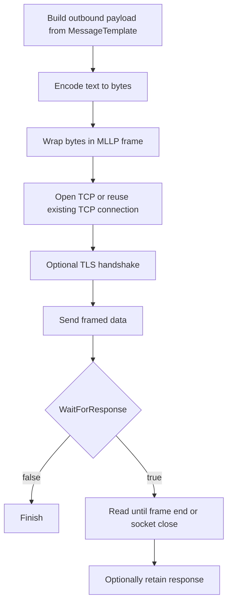

# **MLLP Sender (MLLPSenderSetting)**

## What this setting controls

`MLLPSenderSetting` defines a TCP sender that frames the outbound message using MLLP, sends it to a remote endpoint, and optionally waits for and captures the response.

This document is about the serialized workflow JSON contract and the runtime effects of those fields.

## Operational model



Important non-obvious points:

- This is still an MLLP sender even when `MessageType` is not HL7.
- `WaitForResponse` and `UseResponse` are separate settings.
- `KeepConnectionOpen` materially changes socket lifecycle and throughput behavior.
- TLS server certificate validation is permissive: invalid certificates generate warnings but are still accepted.

## JSON shape

```json
{
  "$type": "HL7Soup.Functions.Settings.Senders.MLLPSenderSetting, HL7SoupWorkflow",
  "Id": "4c9688d0-a346-453b-8242-70ff96fe1c64",
  "Name": "Send to HIS",
  "MessageType": 1,
  "MessageTemplate": "${11111111-1111-1111-1111-111111111111 inbound}",
  "ResponseMessageTemplate": "",
  "Server": "127.0.0.1",
  "Port": 22222,
  "FrameStart": [11],
  "FrameEnd": [28, 13],
  "TimeoutSeconds": 5,
  "UseSsl": false,
  "AuthenticationType": 0,
  "AuthenticationCertificateThumbprint": "",
  "Encoding": "utf-8",
  "WaitForResponse": true,
  "UseResponse": false,
  "KeepConnectionOpen": false,
  "Filters": "00000000-0000-0000-0000-000000000000",
  "Transformers": "00000000-0000-0000-0000-000000000000"
}
```

## Connection fields

### `Server`

Remote host name or IP address.

### `Port`

Remote TCP port.

### `KeepConnectionOpen`

Controls whether the sender reuses one TCP connection across sends.

Behavior:

- `false`: open a new connection per send
- `true`: open once in prepare and keep it for later sends

Important outcomes:

- This can avoid Windows ephemeral-port exhaustion under high throughput.
- If the remote side closes the connection unexpectedly, later sends can fail until the activity/workflow is recreated.

### `TimeoutSeconds`

Read timeout for waiting on a response.

## TLS and authentication fields

### `UseSsl`

Enables TLS on the socket.

### `AuthenticationType`

JSON enum values:

- `0` = `None`
- `1` = `Basic`
- `2` = `Certificate`

Actual runtime meaning:

- `0`: no client certificate
- `2`: present a client certificate identified by `AuthenticationCertificateThumbprint`
- `1`: serialized, but not meaningfully implemented by this sender

### `AuthenticationCertificateThumbprint`

Thumbprint of the client certificate used when `AuthenticationType = 2`.

## Message fields

### `MessageType`

For this sender, the editor allows:

- `1` = `HL7`
- `4` = `XML`
- `5` = `CSV`
- `11` = `JSON`
- `13` = `Text`
- `14` = `Binary`
- `16` = `DICOM`

### `MessageTemplate`

Outbound payload template.

### `ResponseMessageTemplate`

Serialized because this activity inherits response support, but it does not determine the actual TCP response. It is primarily design-time metadata.

### `Encoding`

Outbound text encoding name.

Important outcomes:

- If omitted, runtime falls back to UTF-8.
- Response decoding uses the runtime message-encoding path rather than strictly this serialized field alone.

## Response fields

### `WaitForResponse`

Controls whether the sender waits for a remote response.

### `UseResponse`

Controls whether the returned response must be meaningful workflow data.

Important outcome:

- If `UseResponse = true` and the remote side responds with an empty message or closes without a response, the activity errors.

## Advanced framing fields

These fields serialize and are honored by runtime, but are effectively advanced JSON-level settings.

### `FrameStart`

Default:

```json
[11]
```

### `FrameEnd`

Default:

```json
[28, 13]
```

Important outcome:

- These affect both send framing and response parsing.

## Workflow linkage fields

### `Filters`

GUID of sender filters.

### `Transformers`

GUID of sender transformers.

### `Disabled`

If `true`, the activity is disabled.

### `Id`

GUID of this sender setting.

### `Name`

User-facing name of this sender setting.

## Defaults for a new `MLLPSenderSetting`

- `Server = "127.0.0.1"`
- `Port = 22222`
- `TimeoutSeconds = 5`
- `KeepConnectionOpen = false`
- `UseSsl = false`
- `AuthenticationType = 0`
- `WaitForResponse = true`
- `UseResponse = false`

## Pitfalls and hidden outcomes

- `AuthenticationType = 1` (`Basic`) serializes but is not meaningfully implemented.
- TLS certificate validation is permissive.
- `WaitForResponse = false` is usually wrong for normal HL7 interoperability.
- `UseResponse = true` turns empty responses into workflow errors.
- `ResponseMessageTemplate` serializes but does not control the actual socket response.

## Examples

### Standard HL7 send expecting ACK

```json
{
  "$type": "HL7Soup.Functions.Settings.Senders.MLLPSenderSetting, HL7SoupWorkflow",
  "Id": "aaaaaaaa-aaaa-aaaa-aaaa-aaaaaaaaaaaa",
  "Name": "Send ADT",
  "Server": "127.0.0.1",
  "Port": 22222,
  "MessageType": 1,
  "MessageTemplate": "MSH|^~\\&|...\\rPID|...\\r",
  "WaitForResponse": true,
  "UseResponse": true
}
```

### TLS MLLP send with client certificate

```json
{
  "$type": "HL7Soup.Functions.Settings.Senders.MLLPSenderSetting, HL7SoupWorkflow",
  "Id": "bbbbbbbb-bbbb-bbbb-bbbb-bbbbbbbbbbbb",
  "Name": "Secure Send",
  "Server": "mllp.partner.local",
  "Port": 2575,
  "UseSsl": true,
  "AuthenticationType": 2,
  "AuthenticationCertificateThumbprint": "0123456789ABCDEF0123456789ABCDEF01234567",
  "MessageType": 1,
  "MessageTemplate": "MSH|^~\\&|...\\rPID|...\\r",
  "WaitForResponse": true
}
```

## Useful public references

- [Integration Soup](https://www.integrationsoup.com/)
- [TCP Keeping Connection Open](https://www.integrationsoup.com/InAppTutorials/TCPKeepingConnectionOpen.html)
