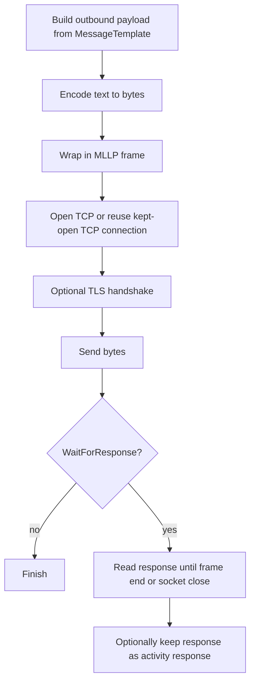

**MLLP Sender (MLLPSenderSetting)**

## What this setting controls

`MLLPSenderSetting` defines a TCP client sender that wraps the outbound message in MLLP framing, sends it to a remote TCP endpoint, and optionally waits for and captures a framed response.

This document is about the serialized workflow JSON contract and the runtime effects of those fields.

## Operational model



Important non-obvious points:

- MLLP framing is applied even when `MessageType` is not HL7.
- `WaitForResponse` and `UseResponse` are different decisions.
- `KeepConnectionOpen = true` reuses one TCP connection across sends for that activity instance.
- TLS server certificate validation logs warnings but still accepts invalid certificates.

## JSON shape

```json
{
  "$type": "HL7Soup.Functions.Settings.Senders.MLLPSenderSetting, HL7SoupWorkflow",
  "Id": "8e0cb789-b554-4f6f-a8ea-c9eb2dfe4a70",
  "Name": "Send HL7 to HIS",
  "MessageType": 1,
  "MessageTemplate": "${11111111-1111-1111-1111-111111111111 inbound}",
  "Server": "127.0.0.1",
  "Port": 22222,
  "KeepConnectionOpen": false,
  "TimeoutSeconds": 5,
  "UseSsl": false,
  "AuthenticationType": 0,
  "AuthenticationCertificateThumbprint": "",
  "Encoding": "utf-8",
  "WaitForResponse": true,
  "UseResponse": false,
  "ResponseMessageTemplate": "",
  "Filters": "00000000-0000-0000-0000-000000000000",
  "Transformers": "00000000-0000-0000-0000-000000000000"
}
```

## Connection fields

### `Server`

Remote host name or IP address of the MLLP server.

### `Port`

Remote TCP port.

### `KeepConnectionOpen`

Controls whether the sender reuses the same TCP connection across sends.

Behavior:

- `false`: open a new connection for each send
- `true`: open once in prepare phase and reuse until the activity closes

Important outcome:

- This can significantly reduce socket churn and avoid the Windows ephemeral-port exhaustion problem during high-volume sending.

### `TimeoutSeconds`

Read timeout used when waiting for the response.

### `Encoding`

Text encoding used to convert the outbound text payload to bytes.

Practical guidance:

- New JSON should normally use `"utf-8"`.
- If omitted, runtime falls back to UTF-8.

Important outcome:

- The runtime reads response data back using the shared runtime encoding path rather than strictly from this serialized property.

## TLS and authentication fields

### `UseSsl`

Enables TLS on the socket before sending framed data.

### `AuthenticationType`

JSON enum values:

- `0` = `None`
- `1` = `Basic`
- `2` = `Certificate`

Actual runtime meaning for this sender:

- `None`: no client certificate is added
- `Certificate`: load and present a client certificate identified by `AuthenticationCertificateThumbprint`
- `Basic`: serialized, but not meaningfully implemented by this MLLP sender

### `AuthenticationCertificateThumbprint`

Client certificate thumbprint used when `AuthenticationType = 2`.

## Message fields

### `MessageType`

Defines how the activity interprets its outbound message and how any captured response is parsed.

The sender UI supports:

- `1` = `HL7`
- `4` = `XML`
- `5` = `CSV`
- `11` = `JSON`
- `13` = `Text`
- `14` = `Binary`
- `16` = `DICOM`

### `MessageTemplate`

Outbound payload template.

### `ResponseMessageTemplate`

Serialized because the activity inherits response support, but it does not drive the actual socket response. It is mainly a design-time artifact.

## Response control fields

### `WaitForResponse`

Controls whether the sender waits for a response from the remote endpoint.

### `UseResponse`

Controls whether the received response should be treated as meaningful workflow data.

Important combinations:

- `WaitForResponse = false`, `UseResponse = false`
- `WaitForResponse = true`, `UseResponse = false`
- `WaitForResponse = true`, `UseResponse = true`

Avoid:

- `WaitForResponse = false`, `UseResponse = true`

## Advanced framing fields

These fields serialize and are honored by runtime, but are advanced JSON-only fields.

### `FrameStart`

Default:

```json
[11]
```

### `FrameEnd`

Default:

```json
[28, 13]
```

## Workflow linkage fields

### `Filters`

GUID of the sender filter set.

### `Transformers`

GUID of the sender transformer set.

### `Disabled`

If `true`, the activity is disabled.

### `Id`

GUID of this sender setting.

### `Name`

User-facing name of this sender setting.

## Defaults for a new `MLLPSenderSetting`

- `Server = "127.0.0.1"`
- `Port = 22222`
- `TimeoutSeconds = 5`
- `KeepConnectionOpen = false`
- `UseSsl = false`
- `AuthenticationType = 0`
- `WaitForResponse = true`
- `UseResponse = false`

## Pitfalls and hidden outcomes

- `AuthenticationType = 1` (`Basic`) serializes but is not meaningfully implemented.
- Invalid remote TLS certificates are still accepted after a warning.
- `UseResponse = true` treats an empty response as an error.
- `WaitForResponse = false` usually breaks normal HL7 ACK expectations.
- `Encoding` controls outbound conversion, but response decoding is not controlled only by this field.

## Minimal example

```json
{
  "$type": "HL7Soup.Functions.Settings.Senders.MLLPSenderSetting, HL7SoupWorkflow",
  "Id": "aaaaaaaa-aaaa-aaaa-aaaa-aaaaaaaaaaaa",
  "Name": "Send ADT",
  "MessageType": 1,
  "MessageTemplate": "${11111111-1111-1111-1111-111111111111 inbound}",
  "Server": "10.0.0.20",
  "Port": 2575,
  "WaitForResponse": true,
  "UseResponse": true
}
```

## Useful public references

- [Integration Soup](https://www.integrationsoup.com/)
- [TCP Keeping Connection Open](https://www.integrationsoup.com/InAppTutorials/TCPKeepingConnectionOpen.html)
