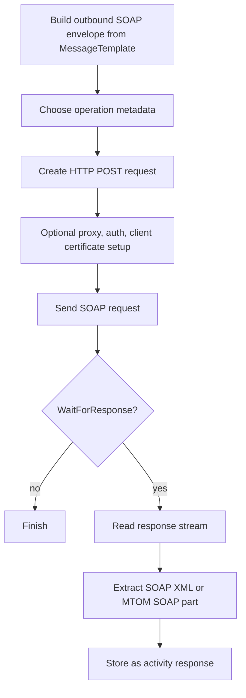

**Web Service Sender (WebServiceSenderSetting)**

## What this setting controls

`WebServiceSenderSetting` defines a SOAP client sender that posts a SOAP envelope to a remote web service endpoint, optionally authenticates, optionally uses a client certificate, and optionally captures the SOAP response body for downstream workflow use.

This document focuses on the serialized workflow JSON contract and the runtime effects of those fields.

## Operational model



Important non-obvious points:

- This sender is always HTTP POST SOAP, not arbitrary REST.
- `MessageTemplate` must already be a valid SOAP envelope.
- `Operation` is a serialized object, not just a name.
- `Wsdl` is for discovery; `Server` is the actual runtime target.

## JSON shape

```json
{
  "$type": "HL7Soup.Functions.Settings.Senders.WebServiceSenderSetting, HL7SoupWorkflow",
  "Id": "6c0dfd57-f35d-4860-98e1-5d8008265140",
  "Name": "Call Lab Service",
  "MessageType": 4,
  "MessageTemplate": "<s:Envelope>...</s:Envelope>",
  "ResponseMessageTemplate": "<s:Envelope>...</s:Envelope>",
  "Server": "https://partner.example.com/service.svc",
  "Wsdl": "https://partner.example.com/service.svc?wsdl",
  "ServiceName": "LabService",
  "Action": "http://tempuri.org/ILabService/SubmitOrder",
  "UseSoap12": false,
  "PassAuthenticationInSoapHeader": false,
  "Operation": {
    "Name": "SubmitOrder",
    "Action": "http://tempuri.org/ILabService/SubmitOrder",
    "RequestSoap": "<s:Envelope>...</s:Envelope>",
    "ResponseSoap": "<s:Envelope>...</s:Envelope>",
    "IsOneWay": false,
    "UseSoap12": false,
    "PassAuthenticationInSoapHeader": false
  },
  "ManualConfiguration": false,
  "Authentication": false,
  "UserName": "",
  "Password": "",
  "UseAuthenticationCertificate": false,
  "AuthenticationCertificateThumbprint": "",
  "PreAuthenticate": false,
  "UseProxy": 0,
  "ProxyAddress": "",
  "ProxyUserName": "",
  "ProxyPassword": "",
  "TimeoutSeconds": 30,
  "UseDefaultCredentials": false,
  "WaitForResponse": true,
  "Filters": "00000000-0000-0000-0000-000000000000",
  "Transformers": "00000000-0000-0000-0000-000000000000"
}
```

## Target and operation fields

### `Server`

Actual endpoint URL used for the SOAP POST.

### `Wsdl`

WSDL URL used for discovery and operation loading.

### `ServiceName`

Name of the discovered SOAP service.

### `ManualConfiguration`

Controls where runtime gets the operation metadata.

Behavior:

- `false`: use the serialized `Operation` object
- `true`: use `Action`, `UseSoap12`, and `PassAuthenticationInSoapHeader`

### `Operation`

Serialized operation descriptor.

Meaningful fields:

- `Name`
- `Action`
- `RequestSoap`
- `ResponseSoap`
- `IsOneWay`
- `UseSoap12`
- `PassAuthenticationInSoapHeader`

### `Action`

SOAP action used when `ManualConfiguration = true`.

### `UseSoap12`

Used directly only in manual mode.

- `false`: SOAP 1.1
- `true`: SOAP 1.2

### `PassAuthenticationInSoapHeader`

Used directly only in manual mode.

- `false`: HTTP/network credentials
- `true`: inject WS-Security UsernameToken into the SOAP header if needed

## Authentication and transport fields

### `Authentication`

Enables username/password authentication.

### `UserName`

User name for authentication.

### `Password`

Password for authentication.

### `UseAuthenticationCertificate`

Attach a client certificate to the HTTP request.

### `AuthenticationCertificateThumbprint`

Client certificate thumbprint looked up in `LocalMachine\\My`.

### `PreAuthenticate`

Controls whether auth information is sent eagerly.

### `UseDefaultCredentials`

Use process/default user credentials if requested by the server.

### `UseProxy`

JSON enum values:

- `0` = `UseDefaultProxy`
- `1` = `ManualProxy`
- `2` = `None`

### `ProxyAddress`

Proxy URL when `UseProxy = 1`.

### `ProxyUserName`

Proxy user name when `UseProxy = 1`.

### `ProxyPassword`

Proxy password when `UseProxy = 1`.

### `TimeoutSeconds`

HTTP request timeout.

## Message fields

### `MessageType`

For this sender, new JSON should use:

- `4` = `XML`

### `MessageTemplate`

Outbound SOAP envelope text.

### `ResponseMessageTemplate`

Design-time sample response envelope. Runtime response content comes from the remote service.

## Response field

### `WaitForResponse`

Controls whether the sender waits for and captures the SOAP response.

## Workflow linkage fields

### `Filters`

GUID of sender filters.

### `Transformers`

GUID of sender transformers.

### `Disabled`

If `true`, the activity is disabled.

### `Id`

GUID of this sender setting.

### `Name`

User-facing name of this sender setting.

## Defaults for a new `WebServiceSenderSetting`

- `TimeoutSeconds = 30`
- `UseProxy = 0`
- `WaitForResponse = true`

## Pitfalls and hidden outcomes

- Runtime always POSTs SOAP. This is not a REST sender.
- `MessageTemplate` must already be a valid SOAP envelope.
- `Operation` is runtime-significant in automatic mode.
- `UseSoap12` and `PassAuthenticationInSoapHeader` on the root setting only matter directly in manual mode.
- `Wsdl` does not determine the runtime target URL. `Server` does.
- MTOM responses are reduced to their SOAP XML portion; attachments are not exposed as workflow objects here.
- Client certificate lookup is hard-wired to the machine personal store.

## Minimal example

```json
{
  "$type": "HL7Soup.Functions.Settings.Senders.WebServiceSenderSetting, HL7SoupWorkflow",
  "Id": "aaaaaaaa-aaaa-aaaa-aaaa-aaaaaaaaaaaa",
  "Name": "Submit Order",
  "MessageType": 4,
  "MessageTemplate": "<s:Envelope>...</s:Envelope>",
  "Server": "https://partner.example.com/service.svc",
  "Wsdl": "https://partner.example.com/service.svc?wsdl",
  "ManualConfiguration": false,
  "Operation": {
    "Name": "SubmitOrder",
    "Action": "http://tempuri.org/ILabService/SubmitOrder",
    "RequestSoap": "<s:Envelope>...</s:Envelope>",
    "ResponseSoap": "<s:Envelope>...</s:Envelope>",
    "IsOneWay": false,
    "UseSoap12": false,
    "PassAuthenticationInSoapHeader": false
  },
  "WaitForResponse": true
}
```

## Useful public references

- [Integration Soup](https://www.integrationsoup.com/)
- [HL7 Interfacer Blog](https://hl7interfacer.blogspot.com/)
