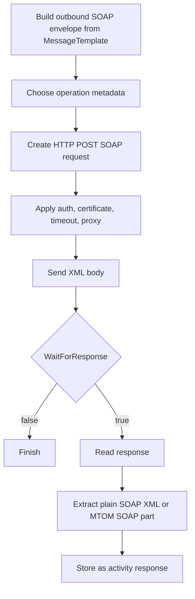

# **Web Service Sender (WebServiceSenderSetting)**

## What this setting controls

`WebServiceSenderSetting` defines a SOAP client activity. It sends a SOAP envelope to a remote service, optionally uses credentials, proxy settings, and client certificates, and optionally captures the SOAP response.

This document is about the serialized workflow JSON contract and the runtime effects of those fields.

## Operational model



Important non-obvious points:

- This sender is always SOAP over HTTP. It is not a general REST sender.
- `MessageTemplate` must already be a valid SOAP envelope.
- `Operation` is a serialized object that can materially drive runtime behavior.
- In automatic mode, the root-level `Action`, `UseSoap12`, and `PassAuthenticationInSoapHeader` do not drive the request directly; the `Operation` object does.

## JSON shape

```json
{
  "$type": "HL7Soup.Functions.Settings.Senders.WebServiceSenderSetting, HL7SoupWorkflow",
  "Id": "bda00408-a98e-4d92-9bc0-176e38415bcb",
  "Name": "Submit Order",
  "MessageType": 4,
  "MessageTemplate": "<s:Envelope>...</s:Envelope>",
  "ResponseMessageTemplate": "<s:Envelope>...</s:Envelope>",
  "Server": "https://partner.example.com/service.svc",
  "Wsdl": "https://partner.example.com/service.svc?wsdl",
  "ServiceName": "OrderService",
  "Action": "http://tempuri.org/IOrderService/SubmitOrder",
  "UseSoap12": false,
  "PassAuthenticationInSoapHeader": false,
  "Operation": {
    "Name": "SubmitOrder",
    "Action": "http://tempuri.org/IOrderService/SubmitOrder",
    "RequestSoap": "<s:Envelope>...</s:Envelope>",
    "ResponseSoap": "<s:Envelope>...</s:Envelope>",
    "IsOneWay": false,
    "UseSoap12": false,
    "PassAuthenticationInSoapHeader": false,
    "UseCertificateForAuthentication": false,
    "AuthenticationCertificate": false
  },
  "ManualConfiguration": false,
  "Authentication": false,
  "UserName": "",
  "Password": "",
  "UseAuthenticationCertificate": false,
  "AuthenticationCertificateThumbprint": "",
  "PreAuthenticate": false,
  "UseProxy": 0,
  "ProxyAddress": "",
  "ProxyUserName": "",
  "ProxyPassword": "",
  "TimeoutSeconds": 30,
  "UseDefaultCredentials": false,
  "WaitForResponse": true,
  "Filters": "00000000-0000-0000-0000-000000000000",
  "Transformers": "00000000-0000-0000-0000-000000000000"
}
```

## Endpoint and discovery fields

### `Server`

Actual endpoint URL used for the SOAP POST.

### `Wsdl`

WSDL address used by the editor for discovery.

Important outcome:

- Runtime sends to `Server`, not to `Wsdl`.

### `ServiceName`

Name of the discovered service.

## Operation selection fields

### `ManualConfiguration`

Controls whether runtime uses the root-level manual fields or the serialized `Operation` object.

Behavior:

- `false`: use `Operation`
- `true`: use `Action`, `UseSoap12`, and `PassAuthenticationInSoapHeader`

### `Operation`

Serialized web service operation descriptor.

Meaningful JSON-level fields:

- `Name`
- `Action`
- `RequestSoap`
- `ResponseSoap`
- `IsOneWay`
- `UseSoap12`
- `PassAuthenticationInSoapHeader`

Important outcomes:

- In automatic mode, this object is the effective source of action name and SOAP version.
- The editor can overwrite the request and response templates from this object when they still look like defaults.

### `Action`

SOAP action used in manual mode.

### `UseSoap12`

Used directly in manual mode.

- `false`: SOAP 1.1
- `true`: SOAP 1.2

### `PassAuthenticationInSoapHeader`

Used directly in manual mode.

- `false`: HTTP/network credentials
- `true`: inject WS-Security UsernameToken into the SOAP header if needed

## Authentication, certificate, and proxy fields

### `Authentication`

Enable username/password authentication.

### `UserName`

Username when `Authentication = true`.

### `Password`

Password when `Authentication = true`.

### `UseAuthenticationCertificate`

Attach a client certificate to the HTTP request.

### `AuthenticationCertificateThumbprint`

Thumbprint of the client certificate.

Important outcome:

- Runtime looks in `LocalMachine\My`.

### `PreAuthenticate`

Controls whether auth information is sent eagerly on later requests.

### `UseDefaultCredentials`

Use the host process/default user credentials when requested.

### `UseProxy`

JSON enum values:

- `0` = `UseDefaultProxy`
- `1` = `ManualProxy`
- `2` = `None`

### `ProxyAddress`

Proxy URL when `UseProxy = 1`.

### `ProxyUserName`

Manual proxy username when `UseProxy = 1`.

### `ProxyPassword`

Manual proxy password when `UseProxy = 1`.

### `TimeoutSeconds`

HTTP request timeout.

## Message fields

### `MessageType`

For this sender, the meaningful JSON value is:

- `4` = `XML`

### `MessageTemplate`

Outbound SOAP envelope.

### `ResponseMessageTemplate`

Serialized design-time sample response.

Important outcome:

- It does not control the actual response from the remote service.

## Response field

### `WaitForResponse`

Controls whether the sender waits for and captures the SOAP response.

Important outcome:

- MTOM responses are reduced to the SOAP XML part. Attachments are not surfaced as standalone workflow payload objects by this sender.

## Workflow linkage fields

### `Filters`

GUID of sender filters.

### `Transformers`

GUID of sender transformers.

### `Disabled`

If `true`, the activity is disabled.

### `Id`

GUID of this sender setting.

### `Name`

User-facing name of this sender setting.

## Defaults for a new `WebServiceSenderSetting`

- `TimeoutSeconds = 30`
- `UseProxy = 0`
- `WaitForResponse = true`

## Pitfalls and hidden outcomes

- `Wsdl` is not the runtime target URL.
- In automatic mode, the `Operation` object is runtime-significant.
- `ResponseMessageTemplate` serializes but does not drive the actual response content.
- MTOM attachments are not exposed as standalone workflow objects here.
- Client certificate lookup is fixed to the machine personal store.

## Useful public references

- [Integration Soup](https://www.integrationsoup.com/)
- [HL7 Interfacer Blog](https://hl7interfacer.blogspot.com/)
